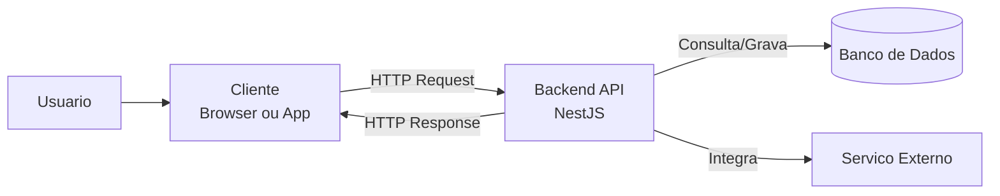
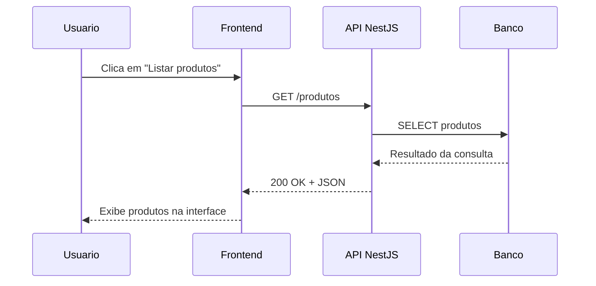
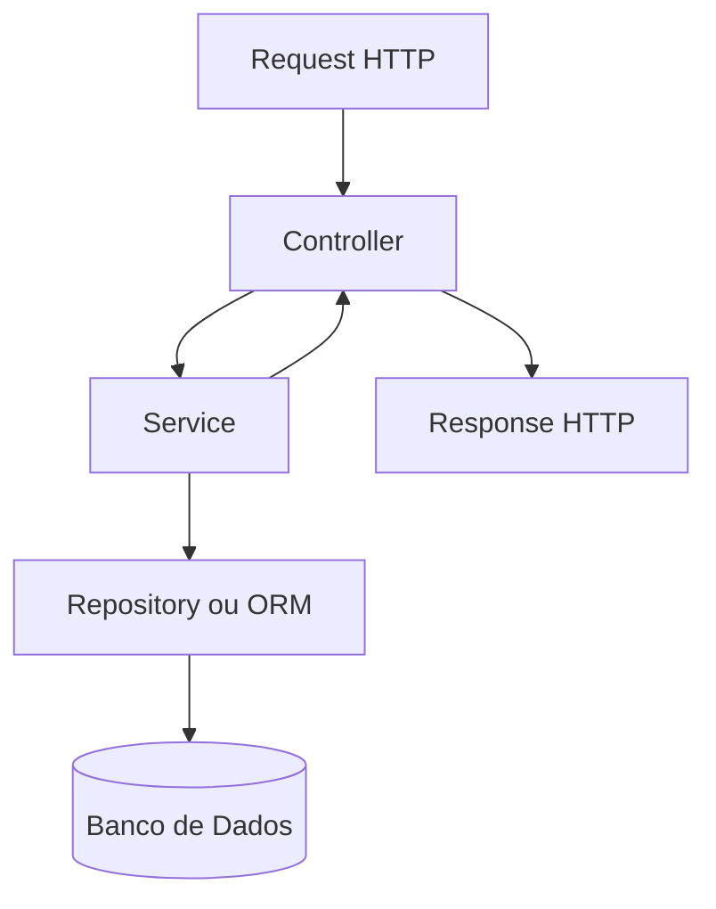

# Encontro 01

## Tema

Apresentação da disciplina, ementa, NestJS e fluxo cliente-servidor.

## Objetivos

- Apresentar a disciplina, a organização do semestre e os produtos esperados.
- Situar o papel do backend no ecossistema Web.
- Compreender o fluxo cliente-servidor em aplicações modernas.
- Introduzir o NestJS como framework-base.

## Visão geral

Este encontro inaugura a disciplina e estabelece a base conceitual que sustenta
todo o restante do semestre. Antes de programar APIs, autenticação, persistência
ou deploy, é necessário responder com clareza:

- O que é backend?
- Qual a diferença entre cliente e servidor?
- Como uma requisição HTTP percorre o sistema?
- Onde o NestJS entra nessa arquitetura?
- O que será construído ao longo da disciplina?

Ao final da leitura e das atividades deste roteiro, o estudante deverá ser capaz
de explicar o fluxo de uma aplicação Web, identificar o papel do backend e
reconhecer a estrutura inicial de um projeto NestJS.

## Pergunta central: o que é backend?

O backend é a parte do sistema responsável por processar regras de negócio,
receber requisições, validar dados, acessar bancos, integrar serviços externos e
devolver respostas para clientes.

Em uma aplicação Web, o usuário normalmente interage com o frontend. O frontend
envia requisições ao backend. O backend:

1. recebe a requisição;
2. interpreta o que foi pedido;
3. valida os dados;
4. executa a regra de negócio;
5. consulta ou grava dados;
6. devolve uma resposta.

### Exemplos de responsabilidades do backend

- cadastrar usuários;
- autenticar login;
- listar produtos;
- calcular frete;
- emitir relatórios;
- salvar pedidos;
- consultar banco de dados;
- chamar APIs externas.

### O que normalmente não é responsabilidade do backend

- renderizar botões e menus visuais da interface;
- controlar animações da tela;
- aplicar estilos CSS.

Essas responsabilidades são tipicamente do frontend.

## Cliente, servidor, API e banco de dados

Antes de detalhar esses elementos, vale definir `HTTP` de forma breve: HTTP
(`HyperText Transfer Protocol`) é o protocolo de comunicação usado para troca
de requisições e respostas entre clientes e servidores na Web. Ele define como
um pedido é enviado, como a resposta retorna e quais métodos, cabeçalhos e
códigos de status participam dessa comunicação.

### Cliente

É quem consome o sistema. Pode ser:

- navegador;
- aplicativo mobile;
- sistema externo;
- script automatizado.

### Servidor

É o ambiente ou aplicação que recebe requisições e fornece respostas. O backend
roda no servidor.

### API

API significa `Application Programming Interface`. No contexto Web, geralmente
é o conjunto de rotas e contratos que permite a comunicação entre sistemas.

Exemplo:

- `GET /produtos` lista produtos;
- `POST /usuarios` cria um usuário;
- `POST /auth/login` autentica um usuário.

### Banco de dados

É onde os dados persistem após o fim da execução de uma requisição.

Exemplos:

- `PostgreSQL`
- `Neon DB` como oferta gerenciada baseada em Postgres
- `MongoDB`

## Imagem conceitual: arquitetura básica



Leitura do diagrama:

- o usuário interage com um cliente;
- o cliente envia uma requisição HTTP ao backend;
- o backend pode consultar banco e serviços externos;
- o backend responde ao cliente com dados e status.

## Fluxo cliente-servidor passo a passo

Imagine a seguinte ação: um usuário abre a tela de produtos de um e-commerce.

### Passo 1: o cliente faz a requisição

O navegador chama:

```http
GET /produtos HTTP/1.1
Host: api.loja.com
Accept: application/json
```

### Passo 2: o servidor recebe e roteia

O backend identifica:

- método: `GET`
- rota: `/produtos`
- formato esperado: `JSON`

### Passo 3: a regra de negócio é executada

O backend decide:

- se o usuário precisa estar autenticado;
- quais filtros serão aplicados;
- quais dados devem ser retornados.

### Passo 4: o banco é consultado

Exemplo de consulta:

```sql
SELECT id, nome, preco
FROM produtos
ORDER BY nome;
```

### Passo 5: o servidor monta a resposta

```http
HTTP/1.1 200 OK
Content-Type: application/json

[
  { "id": 1, "nome": "Teclado", "preco": 120.00 },
  { "id": 2, "nome": "Mouse", "preco": 80.00 }
]
```

### Passo 6: o cliente interpreta a resposta

O frontend recebe os dados e renderiza a lista na tela.

## Imagem do ciclo de requisição e resposta



## Fundamentos de HTTP

HTTP é o protocolo de comunicação mais comum entre cliente e servidor na Web.

### Métodos HTTP mais usados

| Método | Uso comum |
|---|---|
| `GET` | buscar dados |
| `POST` | criar recurso |
| `PUT` | atualizar recurso completo |
| `PATCH` | atualizar parte do recurso |
| `DELETE` | remover recurso |

### Códigos de status importantes

| Código | Significado |
|---|---|
| `200` | sucesso |
| `201` | recurso criado |
| `204` | sucesso sem corpo de resposta |
| `400` | requisição inválida |
| `401` | não autenticado |
| `403` | sem permissão |
| `404` | recurso não encontrado |
| `500` | erro interno do servidor |

### Exemplo de criação de usuário

Requisição:

```http
POST /usuarios HTTP/1.1
Content-Type: application/json

{
  "nome": "Ana",
  "email": "ana@email.com"
}
```

Resposta:

```http
HTTP/1.1 201 Created
Content-Type: application/json

{
  "id": 1,
  "nome": "Ana",
  "email": "ana@email.com"
}
```

## O que é Node.js?

`Node.js` é um ambiente de execução JavaScript fora do navegador. Ele permite
usar JavaScript no servidor.

Com `Node.js`, é possível:

- criar servidores HTTP;
- manipular arquivos;
- acessar bancos de dados;
- integrar APIs externas;
- executar aplicações backend com JavaScript ou TypeScript.

### Exemplo mínimo de servidor com Node.js puro

```js
const http = require('http');

const server = http.createServer((req, res) => {
  if (req.url === '/ola' && req.method === 'GET') {
    res.writeHead(200, { 'Content-Type': 'application/json' });
    res.end(JSON.stringify({ mensagem: 'Ola, mundo!' }));
    return;
  }

  res.writeHead(404, { 'Content-Type': 'application/json' });
  res.end(JSON.stringify({ erro: 'Rota nao encontrada' }));
});

server.listen(3000, () => {
  console.log('Servidor executando em http://localhost:3000');
});
```

Esse código funciona, mas rapidamente fica difícil de manter quando a aplicação
cresce. É aqui que frameworks entram.

## Por que usar framework no backend?

Um framework organiza o projeto e evita reinventar a base da aplicação.

### Problemas comuns sem framework

- código espalhado;
- rotas desorganizadas;
- dificuldade de testar;
- pouca padronização;
- dependências acopladas;
- manutenção mais custosa.

### O que um framework oferece

- estrutura de projeto;
- padrão arquitetural;
- injeção de dependências;
- suporte a testes;
- integração com bibliotecas;
- melhor escalabilidade do código.

## O que é NestJS?

`NestJS` é um framework backend para `Node.js`, construído com `TypeScript`,
inspirado em arquitetura modular e fortemente orientado a boas práticas.

Ele usa conceitos como:

- módulos;
- controladores;
- serviços;
- decorators;
- injeção de dependência;
- pipes, guards, interceptors e filters.

### Por que o NestJS foi escolhido para a disciplina

- estrutura clara para projetos grandes e pequenos;
- excelente integração com `TypeScript`;
- favorece organização em camadas;
- possui ecossistema maduro;
- facilita testes;
- aproxima o estudante de padrões usados no mercado.

## Imagem conceitual do NestJS



Leitura:

- o `controller` recebe a requisição;
- o `service` concentra a regra de negócio;
- a camada de dados acessa a persistência;
- a resposta retorna ao cliente.

## Conceitos iniciais do NestJS

### Module

Organiza partes da aplicação em blocos coesos.

Exemplo mental:

- módulo de usuários;
- módulo de autenticação;
- módulo de produtos.

### Controller

Recebe requisições HTTP e define as rotas.

Exemplo:

- `GET /usuarios`
- `POST /usuarios`

### Service

Contém a regra de negócio.

Exemplo:

- validar se email já existe;
- calcular total do pedido;
- chamar banco de dados.

## Exemplo básico em NestJS

### Controller

```ts
import { Controller, Get } from '@nestjs/common';

@Controller('hello')
export class HelloController {
  @Get()
  getHello() {
    return { message: 'Hello, NestJS!' };
  }
}
```

### O que esse código faz

- `@Controller('hello')` define o prefixo da rota;
- `@Get()` define que o método responde a `GET`;
- ao acessar `/hello`, a API retorna um objeto JSON.

### Resposta esperada

```json
{
  "message": "Hello, NestJS!"
}
```

### Service

```ts
import { Injectable } from '@nestjs/common';

@Injectable()
export class HelloService {
  getMessage() {
    return 'Hello, NestJS!';
  }
}
```

### Controller usando Service

```ts
import { Controller, Get } from '@nestjs/common';
import { HelloService } from './hello.service';

@Controller('hello')
export class HelloController {
  constructor(private readonly helloService: HelloService) {}

  @Get()
  getHello() {
    return { message: this.helloService.getMessage() };
  }
}
```

Esse segundo exemplo já mostra uma ideia importante: o controlador recebe a
requisição, mas delega o trabalho para o serviço.

## Comparando Node.js puro e NestJS

| Aspecto | Node.js puro | NestJS |
|---|---|---|
| Organização | manual | padronizada |
| Escalabilidade | depende muito do programador | favorecida pela arquitetura |
| Testabilidade | mais trabalhosa | facilitada |
| Reuso | variável | incentivado |
| Injeção de dependência | manual | nativa |

## Exemplo prático de leitura de rota

Considere a rota:

```http
GET /alunos/15
```

Perguntas:

- Qual é o método HTTP?
- Qual é o recurso acessado?
- O que representa `15`?

Respostas:

- método: `GET`
- recurso: `alunos`
- `15` representa o identificador do aluno

## Exemplo prático com JSON

Entrada:

```json
{
  "nome": "Carlos",
  "matricula": "2026001",
  "email": "carlos@ifrn.edu.br"
}
```

Esse corpo pode ser enviado em uma requisição `POST /alunos`.

O backend pode:

- validar campos obrigatórios;
- verificar formato do email;
- armazenar os dados;
- responder com `201 Created`.

## Conceitos-chave para memorizar

- `cliente` consome um serviço;
- `servidor` processa a requisição;
- `backend` implementa regras e dados;
- `API` expõe pontos de acesso;
- `HTTP` define a comunicação;
- `JSON` é um formato comum de troca de dados;
- `NestJS` organiza o backend em módulos, controladores e serviços.

## Erros conceituais comuns no início da disciplina

### Confundir backend com banco de dados

Backend não é apenas banco. Banco é uma parte da aplicação backend.

### Confundir API com interface gráfica

API não é a tela. API é a interface de comunicação entre sistemas.

### Achar que toda rota precisa acessar banco

Algumas rotas apenas processam ou validam dados sem persistência.

### Achar que `GET` pode ser usado para qualquer ação

`GET` deve buscar dados. Criar ou alterar recursos usa outros métodos.

## Exercícios de fixação

### Exercício 1

Explique com suas palavras a diferença entre frontend e backend.

### Exercício 2

Descreva o caminho de uma requisição quando um usuário faz login em um sistema.

Dica: cite cliente, servidor, validação, banco e resposta.

### Exercício 3

Classifique a melhor opção de método HTTP:

- listar cursos;
- cadastrar curso;
- atualizar nome de curso;
- remover curso.

### Exercício 4

Associe o código de status ao cenário:

- recurso criado com sucesso;
- usuário não autenticado;
- rota inexistente;
- falha inesperada no servidor.

### Exercício 5

Analise o trecho abaixo e diga o que ele faz:

```ts
@Controller('users')
export class UsersController {
  @Get()
  findAll() {
    return [{ id: 1, nome: 'Maria' }];
  }
}
```

## Mini laboratório guiado

### Objetivo

Treinar leitura de requisições, respostas e responsabilidade de cada camada.

### Situação-problema

Um aplicativo de biblioteca precisa listar livros disponíveis.

### Etapa 1

Defina uma rota adequada.

Sugestão esperada:

```http
GET /livros
```

### Etapa 2

Defina uma resposta JSON coerente.

Exemplo:

```json
[
  { "id": 1, "titulo": "Clean Code", "disponivel": true },
  { "id": 2, "titulo": "Domain-Driven Design", "disponivel": false }
]
```

### Etapa 3

Explique o papel de cada elemento:

- cliente;
- backend;
- banco;
- resposta.

### Etapa 4

Pense como isso seria organizado no NestJS:

- `BooksModule`
- `BooksController`
- `BooksService`

## Questões para debate em sala

- Por que não faz sentido um frontend acessar diretamente o banco?
- Em quais situações uma API atende mais de um tipo de cliente?
- O que acontece se o backend não validar os dados recebidos?
- Por que organização arquitetural importa desde aplicações pequenas?

## Checklist de aprendizagem

Ao final deste encontro, você deve conseguir responder "sim" para as perguntas
abaixo:

- Sei explicar o que é backend.
- Sei diferenciar cliente, servidor, API e banco.
- Sei descrever o fluxo básico de uma requisição HTTP.
- Reconheço os métodos HTTP mais comuns.
- Entendo por que usamos `NestJS` na disciplina.
- Identifico a função de `controller` e `service`.

## Resumo final

Neste encontro, você viu que o backend é a camada responsável por processar
requisições e implementar regras de negócio. Também estudou o fluxo
cliente-servidor, a base do protocolo HTTP e a função de uma API. Por fim, teve
o primeiro contato com o `NestJS`, framework escolhido para estruturar as
aplicações da disciplina de forma modular, organizada e escalável.

Esse conhecimento é pré-requisito para praticamente todos os encontros
seguintes.

## Material complementar sugerido

- Documentação oficial do `NestJS`
- Documentação do `Node.js`
- Material de apoio sobre HTTP e JSON

## Entrega

- Sem entrega formal.
- Recomenda-se registrar por escrito:
  - definição de backend;
  - exemplo de fluxo cliente-servidor;
  - diferença entre `controller` e `service`.
