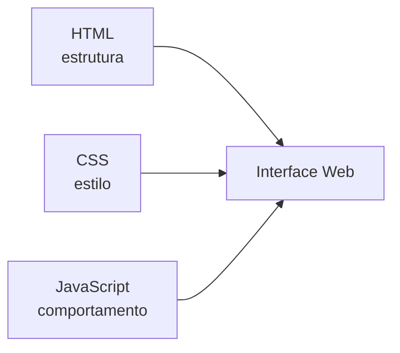

# Encontro 02

## Tema

Revisão de frontend com HTML, CSS, JavaScript e introdução prática ao Vue.js.

## Objetivos

- Retomar os papéis de HTML, CSS e JavaScript na construção de interfaces Web.
- Revisar como o frontend organiza estrutura, estilo e comportamento.
- Introduzir o Vue.js como framework progressivo para interfaces reativas.
- Preparar os estudantes para integrar frontend e backend nos próximos encontros.
- Desenvolver uma pequena prática guiada em laboratório com foco em revisão.

## Visão geral

No primeiro encontro, a disciplina apresentou o papel do backend, o fluxo
cliente-servidor e a ideia de API. Agora, antes de avançar para implementação
de serviços e rotas no backend, é importante revisar o lado do cliente.

Isso é necessário porque o frontend é a parte da aplicação que:

- coleta dados do usuário;
- envia requisições;
- recebe respostas;
- apresenta informações na interface.

Mesmo em uma disciplina com foco em backend, compreender como a interface é
estruturada ajuda o estudante a enxergar com mais clareza:

- o que o cliente precisa enviar;
- como os dados chegam ao servidor;
- por que contratos de API precisam ser bem definidos;
- como uma resposta do backend será utilizada na tela.

Ao final deste encontro, o estudante deverá ser capaz de diferenciar HTML, CSS
e JavaScript, compreender a proposta do Vue.js e construir uma interface simples
e interativa que poderá futuramente consumir dados de uma API em NestJS.

## Pergunta central: por que revisar frontend em uma disciplina de backend?

Porque sistemas Web não são compostos apenas pelo servidor. O backend responde
a necessidades concretas do cliente. Se o estudante não entende minimamente a
interface que consome a API, torna-se mais difícil projetar:

- entradas de dados;
- validações;
- formatos de resposta;
- mensagens de erro;
- estados de carregamento;
- organização de recursos.

Em termos simples: um bom backend resolve problemas reais de uma interface real.

## HTML, CSS e JavaScript: o trio fundamental do frontend

Antes de falar em frameworks, vale retomar a base.

### HTML: estrutura

HTML (`HyperText Markup Language`) organiza o conteúdo da página.

Ele define elementos como:

- títulos;
- parágrafos;
- formulários;
- botões;
- listas;
- links;
- seções.

Exemplo:

```html
<section>
  <h1>Painel de Estudos</h1>
  <p>Organize tarefas da semana.</p>
  <button>Adicionar tarefa</button>
</section>
```

Sem HTML, não existe conteúdo estruturado na página.

### CSS: apresentação

CSS (`Cascading Style Sheets`) controla a aparência visual da interface.

Com CSS, podemos definir:

- cores;
- espaçamentos;
- bordas;
- tipografia;
- posicionamento;
- responsividade.

Exemplo:

```css
section {
  background: #ffffff;
  padding: 24px;
  border-radius: 16px;
}
```

Sem CSS, a página funciona, mas sua aparência é simples e pouco organizada.

### JavaScript: comportamento

JavaScript adiciona lógica e interatividade.

É com JavaScript que podemos:

- reagir a cliques;
- validar formulários;
- alterar dados na tela;
- consumir APIs;
- atualizar componentes sem recarregar a página.

Exemplo:

```js
const botao = document.querySelector('button');

botao.addEventListener('click', () => {
  alert('Tarefa adicionada com sucesso.');
});
```

Sem JavaScript, a interface é majoritariamente estática.

## Como essas três tecnologias trabalham juntas



Leitura do diagrama:

- o HTML organiza o conteúdo;
- o CSS melhora a apresentação;
- o JavaScript torna a interface dinâmica.

## O problema do JavaScript puro em interfaces maiores

Quando a interface cresce, manipular o DOM manualmente com JavaScript pode se
tornar repetitivo e difícil de manter.

Exemplos de dificuldades comuns:

- atualizar listas na tela após cada alteração;
- sincronizar campos de formulário com variáveis;
- esconder ou mostrar elementos dependendo do estado;
- reaproveitar trechos da interface;
- controlar eventos e renderização.

É nesse ponto que frameworks frontend se tornam úteis.

## O que é Vue.js?

Vue.js é um framework progressivo para construção de interfaces de usuário.

A ideia de "progressivo" significa que ele pode ser adotado aos poucos. É
possível usar Vue:

- em uma página simples com CDN;
- em componentes pequenos;
- em projetos maiores com ferramentas modernas.

No Vue, a interface é declarativa. Em vez de manipular manualmente cada trecho
do DOM, descrevemos a interface em função dos dados.

Se os dados mudam, a tela é atualizada automaticamente.

## Conceitos básicos do Vue para este encontro

### Reatividade

Os dados definidos na aplicação controlam o que aparece na tela.

### `v-model`

Cria ligação entre campo de formulário e variável.

### `v-for`

Repete elementos com base em uma lista.

### `v-if`

Renderiza algo apenas quando uma condição for verdadeira.

### `@click`

Associa eventos, como clique em botão.

## Exemplo mínimo com Vue

```html
<div id="app">
  <h1>{{ titulo }}</h1>
  <input v-model="novaTarefa" placeholder="Digite uma tarefa">
  <button @click="adicionarTarefa">Adicionar</button>

  <ul>
    <li v-for="tarefa in tarefas" :key="tarefa.id">
      {{ tarefa.texto }}
    </li>
  </ul>
</div>
```

```html
<script src="https://unpkg.com/vue@3/dist/vue.global.js"></script>
<script>
  const { createApp } = Vue;

  createApp({
    data() {
      return {
        titulo: 'Minhas tarefas',
        novaTarefa: '',
        tarefas: [],
      };
    },
    methods: {
      adicionarTarefa() {
        if (!this.novaTarefa.trim()) return;

        this.tarefas.push({
          id: Date.now(),
          texto: this.novaTarefa,
        });

        this.novaTarefa = '';
      },
    },
  }).mount('#app');
</script>
```

Nesse exemplo:

- `{{ titulo }}` exibe dados na interface;
- `v-model` conecta o input à variável `novaTarefa`;
- `@click` chama a função `adicionarTarefa`;
- `v-for` renderiza a lista.

## Relação com o backend

Embora a prática de hoje foque no frontend, ela prepara o terreno para os
próximos encontros. Mais adiante, em vez de usar dados locais, a interface
passará a:

- buscar dados de uma API;
- enviar dados de formulários ao backend;
- exibir respostas, erros e estados de carregamento.

Ou seja, o que hoje funciona com dados simulados poderá depois ser ligado a
rotas reais do NestJS.

## Prática de laboratório: tutorial guiado

### Proposta

Construir uma aplicação chamada `Painel de Estudos`, com:

- título e descrição;
- formulário para cadastrar tarefas de revisão;
- listagem dinâmica das tarefas;
- filtro por status;
- destaque visual com CSS;
- interação feita com Vue.js.

### Resultado esperado

Ao final da prática, o estudante terá uma pequena interface que:

- usa HTML para estruturar a página;
- aplica CSS para melhorar o layout;
- usa JavaScript por meio do Vue.js para reagir às ações do usuário.

## Passo 1: criar a estrutura dos arquivos

Crie uma pasta para a prática com os seguintes arquivos:

```text
pratica-encontro-02/
├── index.html
├── styles.css
└── app.js
```

## Passo 2: montar a estrutura HTML

No arquivo `index.html`, use o seguinte ponto de partida:

```html
<!DOCTYPE html>
<html lang="pt-BR">
  <head>
    <meta charset="UTF-8">
    <meta name="viewport" content="width=device-width, initial-scale=1.0">
    <title>Painel de Estudos</title>
    <link rel="stylesheet" href="styles.css">
  </head>
  <body>
    <div id="app" class="container">
      <header class="hero">
        <p class="tag">Revisao Frontend</p>
        <h1>{{ titulo }}</h1>
        <p>{{ descricao }}</p>
      </header>

      <section class="card">
        <h2>Nova tarefa</h2>

        <form @submit.prevent="adicionarTarefa" class="formulario">
          <input
            v-model="novaTarefa"
            type="text"
            placeholder="Ex.: Revisar estrutura basica do HTML"
          >

          <select v-model="categoria">
            <option value="HTML">HTML</option>
            <option value="CSS">CSS</option>
            <option value="JavaScript">JavaScript</option>
            <option value="Vue">Vue</option>
          </select>

          <button type="submit">Adicionar</button>
        </form>
      </section>

      <section class="card">
        <div class="barra">
          <h2>Minhas tarefas</h2>

          <select v-model="filtro">
            <option value="Todas">Todas</option>
            <option value="Pendentes">Pendentes</option>
            <option value="Concluidas">Concluidas</option>
          </select>
        </div>

        <p v-if="tarefasFiltradas.length === 0" class="vazio">
          Nenhuma tarefa encontrada para esse filtro.
        </p>

        <ul class="lista" v-else>
          <li
            v-for="tarefa in tarefasFiltradas"
            :key="tarefa.id"
            class="item"
            :class="{ concluida: tarefa.concluida }"
          >
            <div>
              <strong>{{ tarefa.texto }}</strong>
              <span>{{ tarefa.categoria }}</span>
            </div>

            <button @click="alternarStatus(tarefa.id)">
              {{ tarefa.concluida ? 'Reabrir' : 'Concluir' }}
            </button>
          </li>
        </ul>
      </section>
    </div>

    <script src="https://unpkg.com/vue@3/dist/vue.global.js"></script>
    <script src="app.js"></script>
  </body>
</html>
```

### O que revisar nesse HTML

- uso de `<header>`, `<section>`, `<form>`, `<input>`, `<select>` e `<ul>`;
- presença de atributos do Vue, como `v-model`, `v-if`, `v-for` e `@click`;
- separação entre estrutura, estilo e comportamento.

## Passo 3: estilizar a interface com CSS

No arquivo `styles.css`, implemente um estilo simples:

```css
:root {
  font-family: Arial, sans-serif;
  color: #1f2937;
  background: #f3f4f6;
}

* {
  box-sizing: border-box;
}

body {
  margin: 0;
}

.container {
  width: min(900px, calc(100% - 32px));
  margin: 40px auto;
}

.hero,
.card {
  background: #ffffff;
  border-radius: 16px;
  padding: 24px;
  box-shadow: 0 10px 30px rgba(15, 23, 42, 0.08);
}

.hero {
  margin-bottom: 20px;
}

.tag {
  display: inline-block;
  padding: 6px 10px;
  border-radius: 999px;
  background: #dbeafe;
  color: #1d4ed8;
  font-size: 12px;
  font-weight: bold;
  text-transform: uppercase;
}

.formulario,
.barra {
  display: grid;
  gap: 12px;
}

.formulario {
  grid-template-columns: 1fr 180px 140px;
}

input,
select,
button {
  padding: 12px;
  border-radius: 10px;
  border: 1px solid #d1d5db;
  font-size: 16px;
}

button {
  border: none;
  background: #2563eb;
  color: #ffffff;
  cursor: pointer;
}

.lista {
  list-style: none;
  padding: 0;
  margin: 20px 0 0;
  display: grid;
  gap: 12px;
}

.item {
  display: flex;
  justify-content: space-between;
  align-items: center;
  gap: 16px;
  padding: 16px;
  border-radius: 12px;
  background: #f9fafb;
}

.item span {
  display: block;
  margin-top: 6px;
  color: #6b7280;
  font-size: 14px;
}

.item.concluida strong {
  text-decoration: line-through;
  color: #6b7280;
}

.vazio {
  color: #6b7280;
}

@media (max-width: 720px) {
  .formulario {
    grid-template-columns: 1fr;
  }
}
```

### O que revisar nesse CSS

- seletores por classe;
- espaçamento com `padding`, `margin` e `gap`;
- estilização de formulário e lista;
- responsividade básica com `@media`.

## Passo 4: implementar a lógica com Vue.js

No arquivo `app.js`, adicione:

```js
const { createApp } = Vue;

createApp({
  data() {
    return {
      titulo: 'Painel de Estudos',
      descricao: 'Organize tarefas de revisao de HTML, CSS, JavaScript e Vue.',
      novaTarefa: '',
      categoria: 'HTML',
      filtro: 'Todas',
      tarefas: [
        {
          id: 1,
          texto: 'Revisar estrutura semantica do HTML',
          categoria: 'HTML',
          concluida: false,
        },
        {
          id: 2,
          texto: 'Praticar seletores e box model',
          categoria: 'CSS',
          concluida: true,
        },
        {
          id: 3,
          texto: 'Relembrar eventos e arrays em JavaScript',
          categoria: 'JavaScript',
          concluida: false,
        },
      ],
    };
  },
  computed: {
    tarefasFiltradas() {
      if (this.filtro === 'Pendentes') {
        return this.tarefas.filter((tarefa) => !tarefa.concluida);
      }

      if (this.filtro === 'Concluidas') {
        return this.tarefas.filter((tarefa) => tarefa.concluida);
      }

      return this.tarefas;
    },
  },
  methods: {
    adicionarTarefa() {
      if (!this.novaTarefa.trim()) {
        return;
      }

      this.tarefas.unshift({
        id: Date.now(),
        texto: this.novaTarefa.trim(),
        categoria: this.categoria,
        concluida: false,
      });

      this.novaTarefa = '';
      this.categoria = 'HTML';
    },
    alternarStatus(id) {
      this.tarefas = this.tarefas.map((tarefa) =>
        tarefa.id === id
          ? { ...tarefa, concluida: !tarefa.concluida }
          : tarefa,
      );
    },
  },
}).mount('#app');
```

### O que revisar nesse JavaScript

- objeto retornado em `data()`;
- uso de `computed` para filtrar lista;
- uso de `methods` para responder a eventos;
- atualização reativa da tela quando os dados mudam.

## Passo 5: testar a aplicação

Depois de abrir o arquivo no navegador, verifique se a interface permite:

1. adicionar uma nova tarefa;
2. selecionar a categoria;
3. concluir ou reabrir uma tarefa;
4. filtrar tarefas por status.

Se tudo estiver funcionando, a revisão prática foi concluída com sucesso.

## Desafio de ampliação

Se houver tempo no laboratório, proponha uma ou mais extensões:

- adicionar contagem de tarefas pendentes;
- incluir botão para remover tarefa;
- criar filtro por categoria;
- destacar visualmente tarefas da categoria `Vue`;
- salvar tarefas no `localStorage`.

## Fechamento conceitual

Ao construir essa prática, o estudante revisa:

- HTML para estruturar a aplicação;
- CSS para organizar a apresentação;
- JavaScript para definir comportamento;
- Vue.js para ligar dados e interface de forma reativa.

Mais importante ainda: começa a perceber que o frontend não é apenas "a tela",
mas a parte do sistema que coleta eventos, organiza dados do usuário e prepara a
comunicação com o backend.

## Estrutura sugerida de 90 minutos

1. Retomada do encontro anterior e objetivo da aula: 10 min
2. Revisão conceitual de HTML, CSS e JavaScript: 20 min
3. Introdução ao Vue.js com demonstração curta: 15 min
4. Laboratório guiado com a prática `Painel de Estudos`: 35 min
5. Socialização, dúvidas e checkpoint final: 10 min

## Entrega

- Interface funcional da prática proposta.
- Registro das principais dificuldades encontradas.
- Preparação para futura integração com API backend.
