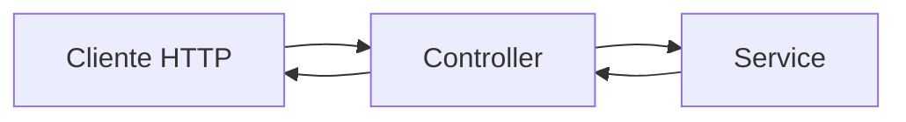

# Encontro 05

## Tema

Estrutura de projeto NestJS: modules, controllers e services.

## Objetivos

- Compreender como o NestJS organiza uma aplicação em módulos, controllers e services.
- Criar um projeto NestJS usando `npx`, `npm exec` ou `npm` (com CLI global).
- Explicar o papel de `npm`, `npm exec` e `npx` no fluxo de desenvolvimento.
- Implementar uma primeira funcionalidade modular com separação de responsabilidades.
- Executar a API localmente e validar endpoints básicos.

## Visão geral

No encontro anterior, o foco foi preparar o ambiente e validar o ciclo mínimo de execução com lint. Agora, o próximo passo é consolidar a estrutura interna do projeto NestJS.

Em projetos backend reais, não basta "ter rotas funcionando". É necessário organizar o código de forma que novas funcionalidades possam ser adicionadas sem gerar acoplamento excessivo e sem espalhar regra de negócio por toda a aplicação.

Neste encontro, você vai criar a base do projeto com `npx`, `npm exec` ou `npm`, entender a divisão de responsabilidades entre `module`, `controller` e `service`, e aplicar essa organização em uma funcionalidade inicial.

Ao final, a expectativa é que você consiga explicar onde cada parte da lógica deve ficar e por que essa separação melhora manutenção e evolução da API.

## Pergunta central

Como estruturar uma API em NestJS com organização profissional, usando `npm`, `npm exec` e `npx` desde a criação do projeto?

## Por que estrutura importa desde o início

Quando a aplicação cresce sem padrão de organização, surgem problemas recorrentes:

- regras de negócio misturadas com código HTTP;
- duplicação de lógica em múltiplos endpoints;
- dificuldade para testar partes isoladas;
- aumento de retrabalho a cada nova funcionalidade.

A proposta arquitetural do NestJS existe justamente para evitar esse cenário. Desde o início, ele incentiva separação clara de responsabilidades.

## Criação do projeto com `npx`, `npm exec` e `npm`

No terminal, escolha uma das alternativas:

Opção A (`npx`):

```bash
npx @nestjs/cli@latest new api-encontro-05
```

Opção B (`npm exec`):

```bash
npm exec --yes --package=@nestjs/cli@latest -- nest new api-encontro-05
```

Opção C (`npm` com CLI global):

```bash
npm install -g @nestjs/cli@latest
nest new api-encontro-05
```

Depois, acesse a pasta:

```bash
cd api-encontro-05
```

As opções A e B permitem usar a versão mais atual do CLI sem instalação global prévia. A opção C é útil quando você prefere manter o CLI instalado globalmente na máquina.

## O que é CLI

`CLI` significa *Command-Line Interface* (interface de linha de comando). É uma forma de interagir com ferramentas digitando comandos no terminal.

No contexto deste encontro, o `nest` é um CLI: ele cria projeto, gera arquivos e executa tarefas de desenvolvimento.

Exemplos de CLIs comuns:

- `nest` (NestJS CLI);
- `npm` (gerenciador de pacotes e scripts);
- `git` (controle de versão).

## O que é instalação global

Instalação global é quando uma ferramenta é instalada no sistema inteiro (e não só em um projeto específico), normalmente com `-g`.

Exemplo:

```bash
npm install -g @nestjs/cli@latest
```

Após isso, o comando `nest` pode ser usado em qualquer pasta no terminal.

Quando usar instalação global:

- quando você usa a mesma ferramenta com frequência;
- quando quer evitar baixar o pacote a cada execução pontual.

Quando evitar instalação global:

- quando precisa de versões diferentes da ferramenta em projetos distintos;
- quando quer máxima reprodutibilidade entre máquinas e equipe.

## O que são `npm`, `npm exec` e `npx`

`npm` é o gerenciador de pacotes e scripts do projeto. Com ele, você instala dependências e executa scripts definidos no `package.json`.

Exemplos com `npm`:

```bash
npm install
npm run start:dev
```

`npm exec` e `npx` executam binários de pacotes Node.js sem exigir instalação global permanente do CLI.

Na prática, quando você executa:

```bash
npx @nestjs/cli@latest new api-encontro-05
```

ou:

```bash
npm exec --yes --package=@nestjs/cli@latest -- nest new api-encontro-05
```

o fluxo de `npm exec`/`npx`:

- busca o pacote solicitado;
- executa o comando associado;
- finaliza sem exigir que o CLI fique instalado globalmente.

Com `npm` em modo global, o fluxo é diferente:

```bash
npm install -g @nestjs/cli@latest
nest new api-encontro-05
```

Nesse caso, o comando `nest` fica disponível no terminal após a instalação global.

## Diferença entre `npm`, `npm exec` e `npx`

| Ferramenta | Função principal | Exemplo |
|---|---|---|
| `npm` | gerenciar dependências/scripts e instalar CLI globalmente | `npm install`, `npm run start:dev`, `npm install -g @nestjs/cli@latest` |
| `npx` | executar binários de pacotes Node sob demanda | `npx @nestjs/cli@latest new api-encontro-05` |
| `npm exec` | executar binários com o ecossistema do `npm` | `npm exec --yes --package=@nestjs/cli@latest -- nest new api-encontro-05` |

Resumo prático:

- use `npm` para instalar, atualizar e executar scripts definidos no `package.json`;
- use `npx` ou `npm exec` para rodar ferramentas de CLI sem instalação global;
- use `npm install -g ...` quando quiser manter um CLI disponível globalmente;
- prefira `npm run ...` quando o comando já estiver em `scripts`;
- prefira `npx` ou `npm exec` quando quiser executar um CLI pontual sem alterar o projeto.

## Estrutura inicial gerada pelo NestJS

Ao criar o projeto, você encontrará arquivos-base como:

- `src/main.ts`: ponto de entrada da aplicação;
- `src/app.module.ts`: módulo raiz;
- `src/app.controller.ts`: controller inicial;
- `src/app.service.ts`: service inicial.

Essa estrutura já aplica separação de responsabilidades desde o início.

## Conceitos centrais: module, controller e service

### Module (`@Module`)

Agrupa partes relacionadas da aplicação. Um módulo organiza controllers e services de um domínio específico.

### Controller (`@Controller`)

Recebe requisições HTTP e define endpoints. O controller deve ficar focado em entrada e saída de dados.

### Service (`@Injectable`)

Concentra a regra de negócio. O service evita que o controller fique carregado de lógica.

### Injeção de Dependência (DI)

Injeção de dependência é um padrão em que uma classe recebe os objetos de que precisa, em vez de criá-los manualmente com `new`.

No NestJS, isso é feito pelo container interno de DI:

- o `service` é marcado com `@Injectable()`;
- o módulo registra esse service em `providers`;
- o controller declara a dependência no `constructor`;
- o NestJS instancia e injeta automaticamente o objeto correto.

Exemplo conceitual:

- sem DI: o controller cria o service manualmente (mais acoplamento);
- com DI: o NestJS entrega o service pronto (menos acoplamento e mais organização).

Benefícios práticos:

- facilita manutenção e evolução do código;
- melhora testabilidade (é mais simples substituir dependências);
- centraliza criação/gerenciamento de instâncias no framework.

## Fluxo interno de uma requisição no NestJS



Leitura do fluxo:

- o controller recebe a requisição;
- delega processamento para o service;
- devolve a resposta ao cliente.

## Passo a passo: criando um módulo de exemplo

Dentro do projeto criado, escolha uma das alternativas:

Opção A (`npx`):

```bash
npx nest g module tarefas
npx nest g service tarefas
npx nest g controller tarefas
```

Opção B (`npm exec`):

```bash
npm exec -- nest g module tarefas
npm exec -- nest g service tarefas
npm exec -- nest g controller tarefas
```

Esses comandos geram os arquivos básicos para um domínio `tarefas`.

## Exemplo mínimo de implementação

### `tarefas.service.ts`

```ts
import { Injectable } from '@nestjs/common';

@Injectable()
export class TarefasService {
  private readonly tarefas = [
    { id: 1, titulo: 'Configurar estrutura modular no NestJS' },
  ];

  listar() {
    return this.tarefas;
  }
}
```

Explicação do código do `service`:

1. `import { Injectable } from '@nestjs/common';`
Importa o decorator `@Injectable`, usado para marcar a classe como disponível para injeção de dependência.
2. `@Injectable()`
Indica ao NestJS que a classe pode ser gerenciada pelo container de injeção.
3. `export class TarefasService { ... }`
Define o service responsável pela regra de negócio do domínio `tarefas`.
4. `private readonly tarefas = [...]`
Cria uma lista em memória, privada e somente leitura por referência, usada como fonte de dados inicial.
5. `listar() { return this.tarefas; }`
Método público que retorna a lista de tarefas para quem consumir o service.

### `tarefas.controller.ts`

```ts
import { Controller, Get } from '@nestjs/common';
import { TarefasService } from './tarefas.service';

@Controller('tarefas')
export class TarefasController {
  constructor(private readonly tarefasService: TarefasService) {}

  @Get()
  listar() {
    return this.tarefasService.listar();
  }
}
```

Explicação do código do `controller`:

1. `import { Controller, Get } from '@nestjs/common';`
Importa os decorators de roteamento HTTP.
2. `import { TarefasService } from './tarefas.service';`
Importa o service que contém a regra de negócio.
3. `@Controller('tarefas')`
Define o prefixo da rota; os métodos desta classe responderão sob `/tarefas`.
4. `constructor(private readonly tarefasService: TarefasService) {}`
Solicita ao NestJS uma instância de `TarefasService`. O framework resolve essa dependência e entrega o objeto pronto, sem precisar criar manualmente com `new`.
5. `@Get()`
Mapeia o método logo abaixo para requisições HTTP `GET` em `/tarefas`.
6. `listar() { return this.tarefasService.listar(); }`
Delega o processamento ao service e retorna a resposta ao cliente.

Com isso, o endpoint `GET /tarefas` passa a responder dados do service.

## Executando e validando a API

Inicie a aplicação com script `npm`:

```bash
npm run start:dev
```

Alternativa via CLI (`npx`):

```bash
npx nest start --watch
```

Teste no navegador ou cliente HTTP:

```text
http://localhost:3000/tarefas
```

Resposta esperada:

```json
[
  { "id": 1, "titulo": "Configurar estrutura modular no NestJS" }
]
```

## Erros comuns e como corrigir

### Erro: `npx: command not found`

Causa provável:

- instalação do Node.js incompleta ou terminal sem atualização de `PATH`.

Ação:

- validar instalação com `node -v` e `npm -v`;
- usar `npm exec --yes --package=@nestjs/cli@latest -- nest --version` como alternativa ao `npx`;
- reiniciar terminal após corrigir ambiente.

### Erro: endpoint não encontrado (`404`)

Causa provável:

- rota no controller diferente da rota testada;
- controller ou service não registrado no módulo correto.

Ação:

- revisar `@Controller('tarefas')`;
- confirmar se os arquivos gerados pertencem ao módulo esperado.

### Erro de injeção de dependência no controller

Causa provável:

- service ausente em `providers` do módulo.

Ação:

- verificar se o service está registrado no `@Module`.

## Checklist de aprendizagem

Ao final, confirme se você consegue:

- criar projeto NestJS com `npx`, `npm exec` e `npm` (CLI global);
- explicar a diferença de finalidade entre `npm`, `npm exec` e `npx`;
- identificar o papel de `module`, `controller` e `service`;
- gerar artefatos com `npx nest g ...` e `npm exec -- nest g ...`;
- executar a API e validar uma rota modular.

## Prática de laboratório

### Proposta

Implementar uma API inicial de `alunos` com separação em módulo, controller e service.

### Requisitos da prática

- criar `alunos.module.ts`, `alunos.controller.ts` e `alunos.service.ts`;
- implementar endpoint `GET /alunos`;
- retornar uma lista com pelo menos 3 alunos em formato JSON;
- manter código organizado com regra de negócio no service;
- executar `npm run lint` e corrigir alertas relevantes;
- validar resposta da rota em `http://localhost:3000/alunos`.

### Instruções sugeridas

1. Gere os artefatos com uma das alternativas:

`npx`:

```bash
npx nest g module alunos
npx nest g service alunos
npx nest g controller alunos
```

`npm exec`:

```bash
npm exec -- nest g module alunos
npm exec -- nest g service alunos
npm exec -- nest g controller alunos
```

2. Implemente no `alunos.service.ts` uma lista em memória com três itens.
3. No `alunos.controller.ts`, crie o método `@Get()` que chama o service.
4. Execute a aplicação com `npm run start:dev` (ou `npx nest start --watch`).
5. Teste a rota `GET /alunos`.
6. Execute `npm run lint` antes da entrega.

### Entrega

Ao final, apresentar:

- código do módulo, controller e service de `alunos`;
- evidência de funcionamento da rota `GET /alunos`;
- evidência de execução de `lint`.

### Critérios de sucesso

Considere a prática concluída quando:

- a rota `GET /alunos` responde corretamente;
- o controller delega leitura de dados para o service;
- a estrutura modular está consistente;
- o projeto permanece executando sem regressões.

## Síntese do encontro

Você estudou que:

- organização de código em NestJS começa por `module`, `controller` e `service`;
- `npx` e `npm exec` permitem executar o CLI do NestJS sem instalação global permanente;
- `npm` também pode ser usado para instalar o CLI globalmente, quando essa estratégia fizer sentido no ambiente;
- `npm`, `npm exec` e `npx` têm papéis diferentes e complementares no fluxo de trabalho.

