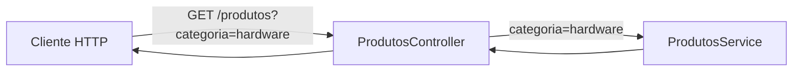
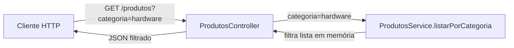

# Encontro 06

- https://github.com/luciano-alexandre/aula-backend 

## Tema

Rotas, parâmetros, query strings e verbos HTTP.

## Objetivos

- Diferenciar rotas, parâmetros de rota e query strings no contexto de APIs.
- Relacionar verbos HTTP (`GET`, `POST`, `PUT`, `PATCH`, `DELETE`) com intenção de uso.
- Implementar endpoints no NestJS com `@Controller`, `@Get`, `@Post`, `@Put`, `@Patch` e `@Delete`.
- Capturar e tratar `@Param()` e `@Query()` em controllers.
- Construir uma API em memória com rotas consistentes para o checkpoint **Prática 01**.

## Setup inicial com Docker 

Antes de iniciar os exemplos de rotas, garanta que o projeto NestJS esteja executando em container.

### O que é Docker e por que usar

Docker é uma plataforma que empacota a aplicação com suas dependências em **containers**, garantindo que ela rode do mesmo jeito em qualquer máquina.

Neste encontro, usar Docker ajuda a:

- padronizar o ambiente da turma (evitando "na minha máquina funciona");
- reduzir problemas de versão de Node e bibliotecas;
- facilitar subir, parar e reconstruir a API com comandos simples.

### Pré-requisitos

- Docker Desktop (Windows/macOS) ou Docker Engine + Docker Compose (Linux);
- projeto NestJS já criado (ex.: `api-encontro-05`);
- terminal na pasta raiz do projeto Nest (onde está o `package.json`).

### Passo 1: criar `Dockerfile`

No projeto Nest, crie o arquivo `Dockerfile`:

```dockerfile
FROM node:20-alpine

WORKDIR /app

COPY package*.json ./
RUN npm install

COPY . .

EXPOSE 3000

CMD ["npm", "run", "start:dev"]
```

### Passo 2: criar `.dockerignore`

Crie o arquivo `.dockerignore` para evitar copiar arquivos desnecessários para a imagem:

```text
node_modules
dist
.git
npm-debug.log
```

### Passo 3: criar `docker-compose.yml`

Na mesma pasta, crie o arquivo `docker-compose.yml`:

```yaml
services:
  api:
    build: .
    container_name: nest-encontro-06
    ports:
      - "3000:3000"
    volumes:
      - .:/app
      - /app/node_modules
    command: npm run start:dev
```

### Passo 4: subir a API

Execute:

```bash
docker compose up --build
```

Se tudo estiver correto, o Nest iniciará e ficará disponível em:

```text
http://localhost:3000
```

### Passo 5: comandos úteis no dia a dia

- subir em background: `docker compose up -d`;
- acompanhar logs: `docker compose logs -f api`;
- executar lint dentro do container: `docker compose exec api npm run lint`;
- parar os serviços: `docker compose down`.

### Passo 6: quando usar `docker compose run`

O comando `docker compose run` cria um container temporário do serviço para executar uma tarefa pontual (sem precisar manter a aplicação principal rodando no terminal atual).

Sintaxe base:

```bash
docker compose run --rm <servico> <comando>
```

Exemplos no projeto:

```bash
# instala dependências dentro do serviço "api"
docker compose run --rm api npm install

# executa lint em um container temporário
docker compose run --rm api npm run lint

# abre um shell dentro do serviço
docker compose run --rm api sh
```

Regra prática:

- use `run` para comandos pontuais (instalar, testar, abrir shell);
- use `exec` quando o container já estiver em execução e você quiser executar algo nele.

## Visão geral

No encontro anterior, a turma consolidou a estrutura de projeto com `module`, `controller` e `service`. Agora, o foco é evoluir essa base para o desenho de rotas HTTP com semântica correta.

Em backend, não basta "responder alguma URL". Precisamos definir contratos claros: qual caminho será usado, qual verbo representa a ação, quais dados vêm na rota e quais vêm como filtro na URL.

Quando esse contrato é bem definido, frontend e backend se comunicam com menos retrabalho, a API fica previsível e a manutenção se torna mais simples.

Ao final do encontro, a expectativa é que você consiga modelar endpoints de forma profissional em NestJS e justificar tecnicamente por que escolheu cada rota, cada verbo e cada tipo de parâmetro.

## Pergunta central

Como modelar rotas HTTP em NestJS com clareza, sem ambiguidades entre caminho, parâmetros e filtros?

## Conceitos-base do encontro

### O que é rota

Rota é a combinação entre:

- caminho da URL (ex.: `/produtos`, `/produtos/10`);
- verbo HTTP (ex.: `GET`, `POST`);
- função que tratará a requisição no backend.

Exemplo:

- `GET /produtos` -> listar produtos;
- `GET /produtos/10` -> obter produto de id `10`;
- `POST /produtos` -> criar novo produto.

## Verbos HTTP e intenção de uso

Os verbos HTTP representam intenção. Usar verbo incorreto gera API confusa e difícil de consumir.

| Verbo | Uso comum | Exemplo de rota |
|---|---|---|
| `GET` | leitura de dados | `GET /produtos` |
| `POST` | criação de recurso | `POST /produtos` |
| `PUT` | atualização completa | `PUT /produtos/:id` |
| `PATCH` | atualização parcial | `PATCH /produtos/:id` |
| `DELETE` | remoção de recurso | `DELETE /produtos/:id` |

Resumo prático:

- use `GET` para buscar dados;
- use `POST` para criar;
- use `PUT` quando o cliente enviar o estado completo do recurso;
- use `PATCH` quando o cliente enviar apenas campos que mudaram;
- use `DELETE` para remover.

## Parâmetro de rota x query string

### Parâmetro de rota (`:id`)

É parte obrigatória do caminho. Normalmente identifica um recurso específico.

Exemplo:

```text
GET /produtos/10
```

Nesse caso, `10` é parâmetro de rota.

### Query string (`?chave=valor`)

É usada para filtros, paginação e ordenação. Em geral é opcional.

Exemplo:

```text
GET /produtos?categoria=hardware&limite=5
```

Nesse caso:

- `categoria=hardware` é filtro;
- `limite=5` controla quantidade de itens retornados.

Regra simples de decisão:

- identifica **qual** recurso? -> parâmetro de rota;
- refina **como listar** recursos? -> query string.

## Rotas no NestJS com decorators

No NestJS, os decorators conectam classe/método ao contrato HTTP.

Exemplo conceitual:

```ts
import { Controller, Delete, Get, Param, Patch, Post, Put, Query } from '@nestjs/common';

@Controller('produtos')
export class ProdutosController {
  @Get()
  listar(@Query('categoria') categoria?: string) {
    return { categoria };
  }

  @Get(':id')
  buscarPorId(@Param('id') id: string) {
    return { id };
  }

  @Post()
  criar() {
    return { mensagem: 'Produto criado' };
  }

  @Put(':id')
  atualizarCompleto(@Param('id') id: string) {
    return { id, tipo: 'put' };
  }

  @Patch(':id')
  atualizarParcial(@Param('id') id: string) {
    return { id, tipo: 'patch' };
  }

  @Delete(':id')
  remover(@Param('id') id: string) {
    return { id, removido: true };
  }
}
```

Primeira aparição de `@Param` neste encontro:

- `@Param('id')` captura o valor dinâmico da rota (ex.: `:id` em `/produtos/:id`) e injeta esse valor no argumento do método do controller.

## Fluxo de leitura de uma requisição com parâmetros



Leitura do fluxo:

- o cliente chama uma rota com query string;
- o controller extrai `@Query`;
- o controller delega a lógica ao service;
- a resposta retorna ao cliente em JSON.

## Exemplo guiado: API de produtos em memória (evolução por passos)

### Passo 0: gerar artefatos

Escolha uma alternativa:

`npx`:

```bash
npx nest g module produtos
npx nest g service produtos
npx nest g controller produtos
```

`docker compose exec` (com a API rodando no container):

```bash
docker compose exec api npx nest g module produtos
docker compose exec api npx nest g service produtos
docker compose exec api npx nest g controller produtos
```

### Passo 1: criar o `service` inicial (somente listagem por categoria)

Neste primeiro momento, o método do service sempre recebe uma categoria e retorna a lista já filtrada.

Arquivo `produtos.service.ts`:

```ts
import { Injectable } from '@nestjs/common';

type Produto = {
  id: number;
  nome: string;
  categoria: string;
  preco: number;
  ativo: boolean;
};

@Injectable()
export class ProdutosService {
  private produtos: Produto[] = [
    { id: 1, nome: 'Notebook', categoria: 'hardware', preco: 3500, ativo: true },
    { id: 2, nome: 'Mouse', categoria: 'hardware', preco: 120, ativo: true },
    { id: 3, nome: 'Curso NestJS', categoria: 'educacao', preco: 89, ativo: false },
  ];

  listarPorCategoria(categoria: string) {
    return this.produtos.filter((p) => p.categoria === categoria);
  }
}
```

### Passo 2: criar a primeira rota `GET /produtos?categoria=...`

Agora o controller captura a query `categoria`, valida se foi enviada e delega para o service.

Arquivo `produtos.controller.ts`:

```ts
import { BadRequestException, Controller, Get, Query } from '@nestjs/common';
import { ProdutosService } from './produtos.service';

@Controller('produtos')
export class ProdutosController {
  constructor(private readonly produtosService: ProdutosService) {}

  @Get()
  listar(@Query('categoria') categoria?: string) {
    if (!categoria) {
      throw new BadRequestException('Query "categoria" é obrigatória');
    }

    return this.produtosService.listarPorCategoria(categoria);
  }
}
```

Fluxo completo desse primeiro endpoint:



Teste do passo 2:

```bash
curl "http://localhost:3000/produtos?categoria=hardware"
```

### Passo 3: adicionar `GET /produtos/:id`

Após validar o primeiro fluxo, evolua para busca por identificador.

No `service`, adicione:

```ts
import { Injectable, NotFoundException } from '@nestjs/common';

buscarPorId(id: number) {
  const produto = this.produtos.find((p) => p.id === id);

  if (!produto) {
    throw new NotFoundException('Produto não encontrado');
  }

  return produto;
}
```

No `controller`, adicione:

```ts
@Get(':id')
buscarPorId(@Param('id') id: string) {
  const idNumero = Number(id);

  if (Number.isNaN(idNumero)) {
    throw new BadRequestException('Parâmetro "id" deve ser numérico');
  }

  return this.produtosService.buscarPorId(idNumero);
}
```

### Passo 4: adicionar `POST /produtos`

No `service`, adicione:

```ts
criar(dados: Omit<Produto, 'id'>) {
  const novoId = this.produtos.length > 0
    ? Math.max(...this.produtos.map((p) => p.id)) + 1
    : 1;

  const novoProduto: Produto = { id: novoId, ...dados };
  this.produtos.push(novoProduto);

  return novoProduto;
}
```


- `Omit<Produto, 'id'>` cria um tipo igual a `Produto`, mas removendo o campo `id` (útil porque o `id` será gerado no service).
- `Math.max(...this.produtos.map((p) => p.id))` obtém o maior `id` já existente para gerar o próximo (`maior + 1`).

No `controller`, adicione:

```ts
@Post()
criar(
  @Body()
  body: {
    nome: string;
    categoria: string;
    preco: number;
    ativo: boolean;
  },
) {
  return this.produtosService.criar(body);
}
```


- `@Body()` lê o corpo JSON enviado na requisição HTTP e entrega esse conteúdo no parâmetro `body`.

### Passo 5: fechar CRUD com `PUT`, `PATCH` e `DELETE`

No `service`, adicione os métodos:

```ts
atualizarCompleto(id: number, dados: Omit<Produto, 'id'>) {
  const indice = this.produtos.findIndex((p) => p.id === id);

  if (indice === -1) {
    throw new NotFoundException('Produto não encontrado');
  }

  const atualizado: Produto = { id, ...dados };
  this.produtos[indice] = atualizado;
  return atualizado;
}

atualizarParcial(id: number, dados: Partial<Omit<Produto, 'id'>>) {
  const produto = this.buscarPorId(id);
  const atualizado = { ...produto, ...dados };

  this.produtos = this.produtos.map((p) => (p.id === id ? atualizado : p));
  return atualizado;
}

remover(id: number) {
  const existe = this.produtos.some((p) => p.id === id);

  if (!existe) {
    throw new NotFoundException('Produto não encontrado');
  }

  this.produtos = this.produtos.filter((p) => p.id !== id);
  return { mensagem: `Produto ${id} removido com sucesso` };
}
```

No `controller`, adicione os métodos:

```ts
@Put(':id')
atualizarCompleto(
  @Param('id') id: string,
  @Body()
  body: {
    nome: string;
    categoria: string;
    preco: number;
    ativo: boolean;
  },
) {
  const idNumero = Number(id);

  if (Number.isNaN(idNumero)) {
    throw new BadRequestException('Parâmetro "id" deve ser numérico');
  }

  return this.produtosService.atualizarCompleto(idNumero, body);
}

@Patch(':id')
atualizarParcial(
  @Param('id') id: string,
  @Body()
  body: {
    nome?: string;
    categoria?: string;
    preco?: number;
    ativo?: boolean;
  },
) {
  const idNumero = Number(id);

  if (Number.isNaN(idNumero)) {
    throw new BadRequestException('Parâmetro "id" deve ser numérico');
  }

  return this.produtosService.atualizarParcial(idNumero, body);
}

@Delete(':id')
remover(@Param('id') id: string) {
  const idNumero = Number(id);

  if (Number.isNaN(idNumero)) {
    throw new BadRequestException('Parâmetro "id" deve ser numérico');
  }

  return this.produtosService.remover(idNumero);
}
```

## Testando endpoints no dia a dia

Com a aplicação em execução (`npm run start:dev`), teste por etapa:

- no início, apenas `GET /produtos?categoria=hardware`;
- depois, avance para as demais rotas.

Ao final de todos os passos:

```text
GET    /produtos?categoria=hardware
GET    /produtos/1
POST   /produtos
PUT    /produtos/1
PATCH  /produtos/1
DELETE /produtos/3
```

Exemplo de criação com `curl`:

```bash
curl -X POST http://localhost:3000/produtos \
  -H "Content-Type: application/json" \
  -d '{"nome":"Teclado","categoria":"hardware","preco":180,"ativo":true}'
```

Exemplo de busca com filtro:

```bash
curl "http://localhost:3000/produtos?categoria=hardware"
```

## Erros comuns e como corrigir

### Erro: usar query para identificar recurso único

Exemplo ruim:

```text
GET /produtos?id=10
```

Prefira:

```text
GET /produtos/10
```

Motivo: `id` identifica recurso específico, então o caminho deve refletir isso.

### Erro: usar `GET` para criar dados

Exemplo inadequado:

```text
GET /produtos/criar
```

Prefira:

```text
POST /produtos
```

Motivo: criação deve usar verbo de criação para manter semântica da API.

### Erro: não validar conversão numérica de `id`

Quando `id` vem como texto e é convertido sem validação, podem surgir respostas incorretas ou erros silenciosos.

Ação:

- converter com `Number(id)`;
- verificar `Number.isNaN(...)`;
- retornar erro `400` quando inválido.

## Checklist de aprendizagem

Ao final, confirme se você consegue:

- explicar a diferença entre parâmetro de rota e query string;
- escolher corretamente entre `GET`, `POST`, `PUT`, `PATCH` e `DELETE`;
- mapear rotas no NestJS com decorators;
- capturar `@Param()` e `@Query()` no controller;
- implementar e testar um CRUD em memória com rotas consistentes.

## Prática de laboratório (Prática 01)

### Proposta

Implementar uma API de `tarefas` com foco em rotas e contrato HTTP.

### Requisitos da prática

- criar módulo, controller e service de `tarefas`;
- implementar as rotas:
  - `GET /tarefas`;
  - `GET /tarefas/:id`;
  - `GET /tarefas?status=aberta&prioridade=alta` (filtros opcionais);
  - `POST /tarefas`;
  - `PATCH /tarefas/:id`;
  - `DELETE /tarefas/:id`;
- usar lista em memória no service;
- validar `id` numérico no controller;
- executar `npm run lint`;
- validar respostas com cliente HTTP (Insomnia, Postman ou `curl`).

### Instruções sugeridas

1. Gere os artefatos com `npx nest g module tarefas`, `service` e `controller`.
2. No service, crie um array com pelo menos 4 tarefas iniciais.
3. No controller, implemente as rotas com os decorators corretos.
4. Use query string para filtros de listagem (`status` e `prioridade`).
5. Teste cada rota com exemplos reais de URL.
6. Execute `npm run lint` antes da entrega.

### Entrega

Apresentar:

- código do `tarefas.controller.ts`;
- código do `tarefas.service.ts`;
- evidência de funcionamento de pelo menos 4 rotas diferentes;
- evidência de execução de `lint`.

### Critérios de sucesso

Considere a prática concluída quando:

- os verbos HTTP estão semanticamente corretos;
- `:id` é usado para recurso único e query para filtros;
- a API retorna respostas coerentes para sucesso e erro;
- a estrutura segue padrão modular do NestJS.

## Síntese do encontro

Você estudou que:

- rota HTTP é combinação de caminho + verbo + handler;
- parâmetros de rota identificam recursos e query strings refinam listagens;
- semântica de verbos (`GET`, `POST`, `PUT`, `PATCH`, `DELETE`) melhora clareza e manutenção da API;
- o NestJS facilita esse mapeamento por decorators e separação entre controller e service.

Resposta final para a pergunta central:

Modelar rotas com clareza em NestJS exige separar identificação de recurso (`:id`) de critérios de busca (query string), escolher o verbo certo para cada ação e manter o controller responsável pelo contrato HTTP, delegando regra de negócio ao service.
