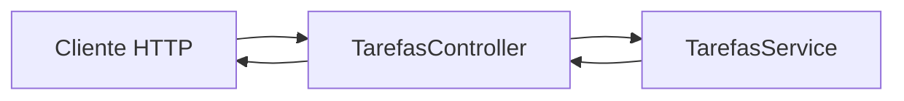

# Encontro 07

- https://github.com/luciano-alexandre/aula-backend

## Tema

Correção da Prática 01: API de tarefas com rotas, parâmetros e query strings.

## Objetivos

- Revisar os critérios de correção da Prática 01.
- Consolidar o uso de `@Controller`, `@Get`, `@Post`, `@Patch` e `@Delete`.
- Diferenciar corretamente `:id` de filtros opcionais via query string.
- Corrigir passo a passo a implementação da API de `tarefas`.
- Validar a solução final com cliente HTTP e preparar a base para o encontro 08.

## Setup inicial para a correção

Antes de iniciar a correção, garanta que o projeto criado a partir do encontro 06 esteja funcionando.

### Pré-requisitos

- projeto NestJS já criado e executando;
- módulo de `tarefas` iniciado ou pronto para ser criado;
- terminal na raiz do projeto;
- cliente HTTP disponível (`curl`, Thunder Client, Insomnia ou Postman).

### Passo 1: atualizar o projeto

Se estiver usando Git:

```bash
git pull
```

### Passo 2: subir a aplicação

Escolha a alternativa compatível com o seu projeto:

```bash
npm run start:dev
```

ou, se estiver usando Docker:

```bash
docker compose up
```

### Passo 3: validar o ambiente

Confirme que a API responde em:

```text
http://localhost:3000
```

## Visão geral

No encontro 06, a turma construiu a primeira prática com foco em rotas, parâmetros de rota, query strings e verbos HTTP.

Neste encontro, o foco não é apresentar conteúdo totalmente novo, mas revisar a prática com olhar técnico: onde o contrato HTTP ficou coerente, onde houve confusão entre caminho e filtro, onde o controller recebeu responsabilidades demais e como organizar a solução de forma mais estável.

Ao final, a expectativa é que você consiga comparar sua implementação com uma solução de referência e justificar cada rota da API de `tarefas`.

## Pergunta central

Como corrigir a Prática 01 de modo que a API de `tarefas` use rotas claras, filtros opcionais e semântica HTTP consistente?

## Critérios usados na correção

Durante a correção, vamos adotar as seguintes decisões:

- `GET /tarefas` lista recursos;
- `GET /tarefas/:id` busca um recurso específico;
- `status` e `prioridade` são filtros opcionais, então ficam na query string;
- `POST /tarefas` cria nova tarefa;
- `PATCH /tarefas/:id` altera parcialmente uma tarefa;
- `DELETE /tarefas/:id` remove uma tarefa;
- o controller cuida do contrato HTTP;
- o service concentra os dados em memória e a regra principal.

## Estrutura esperada da tarefa

Para a correção, vamos trabalhar com este formato de dados:

```ts
type Tarefa = {
  id: number;
  titulo: string;
  descricao: string;
  status: 'aberta' | 'em_andamento' | 'concluida';
  prioridade: 'baixa' | 'media' | 'alta';
};
```

## Fluxo da solução corrigida



Leitura do fluxo:

- o cliente chama a rota correta para a intenção desejada;
- o controller interpreta `params`, `query` e `body`;
- o service manipula a lista em memória;
- a resposta retorna em JSON com comportamento previsível.

## Correção passo a passo da Prática 01

### Passo 0: gerar os artefatos do módulo

Se ainda não criou o módulo de `tarefas`, gere os arquivos:

```bash
npx nest g module tarefas
npx nest g service tarefas
npx nest g controller tarefas
```

Se estiver usando container com a API em execução:

```bash
docker compose exec api npx nest g module tarefas
docker compose exec api npx nest g service tarefas
docker compose exec api npx nest g controller tarefas
```

### Passo 1: criar a base do `service`

Comece organizando os dados em memória no `service`.

Arquivo `src/tarefas/tarefas.service.ts`:

```ts
import { Injectable, NotFoundException } from '@nestjs/common';

type Tarefa = {
  id: number;
  titulo: string;
  descricao: string;
  status: 'aberta' | 'em_andamento' | 'concluida';
  prioridade: 'baixa' | 'media' | 'alta';
};

@Injectable()
export class TarefasService {
  private tarefas: Tarefa[] = [
    {
      id: 1,
      titulo: 'Configurar projeto',
      descricao: 'Instalar dependencias e validar o NestJS',
      status: 'concluida',
      prioridade: 'alta',
    },
    {
      id: 2,
      titulo: 'Criar modulo tarefas',
      descricao: 'Gerar module, controller e service',
      status: 'em_andamento',
      prioridade: 'alta',
    },
    {
      id: 3,
      titulo: 'Implementar listagem',
      descricao: 'Criar rota GET /tarefas',
      status: 'aberta',
      prioridade: 'media',
    },
    {
      id: 4,
      titulo: 'Testar no Thunder Client',
      descricao: 'Salvar requests da pratica',
      status: 'aberta',
      prioridade: 'baixa',
    },
  ];

  listar(status?: string, prioridade?: string) {
    let resultado = [...this.tarefas];

    if (status) {
      resultado = resultado.filter((t) => t.status === status);
    }

    if (prioridade) {
      resultado = resultado.filter((t) => t.prioridade === prioridade);
    }

    return resultado;
  }

  buscarPorId(id: number) {
    const tarefa = this.tarefas.find((item) => item.id === id);

    if (!tarefa) {
      throw new NotFoundException('Tarefa nao encontrada');
    }

    return tarefa;
  }
}
```

Por que começar pelo `service`:

- a prática pede lista em memória;
- o controller fica mais simples quando já existe uma camada de dados;
- filtrar e buscar por `id` são responsabilidades naturais do `service`.

### Passo 2: corrigir a listagem com filtros opcionais

Um erro comum na prática foi tratar `status` e `prioridade` como parte obrigatória da rota. A forma correta aqui é:

```text
GET /tarefas?status=aberta&prioridade=alta
```

Isso acontece porque `status` e `prioridade` refinam a listagem, mas não identificam uma tarefa específica.

Arquivo `src/tarefas/tarefas.controller.ts`:

```ts
import { Controller, Get, Query } from '@nestjs/common';
import { TarefasService } from './tarefas.service';

@Controller('tarefas')
export class TarefasController {
  constructor(private readonly tarefasService: TarefasService) {}

  @Get()
  listar(
    @Query('status') status?: string,
    @Query('prioridade') prioridade?: string,
  ) {
    return this.tarefasService.listar(status, prioridade);
  }
}
```

Teste esperado:

```bash
curl "http://localhost:3000/tarefas"
curl "http://localhost:3000/tarefas?status=aberta"
curl "http://localhost:3000/tarefas?status=aberta&prioridade=media"
```

### Passo 3: implementar `GET /tarefas/:id`

Agora entra o caso de recurso único. Aqui sim usamos parâmetro de rota.

No controller, adicione:

```ts
import { BadRequestException, Controller, Get, Param, Query } from '@nestjs/common';

@Get(':id')
buscarPorId(@Param('id') id: string) {
  const idNumero = Number(id);

  if (Number.isNaN(idNumero)) {
    throw new BadRequestException('Parametro "id" deve ser numerico');
  }

  return this.tarefasService.buscarPorId(idNumero);
}
```

O que esta etapa corrige:

- evita rota inadequada como `GET /tarefas?id=3` para recurso único;
- valida conversão numérica de `id`;
- mantém a busca da tarefa no `service`.

Teste esperado:

```bash
curl http://localhost:3000/tarefas/2
curl http://localhost:3000/tarefas/abc
curl http://localhost:3000/tarefas/999
```

Resultados esperados:

- `2` retorna a tarefa correspondente;
- `abc` retorna erro `400`;
- `999` retorna erro `404`.

### Passo 4: implementar `POST /tarefas`

Na prática, muitos envios funcionaram sem critério mínimo para o corpo da requisição. Neste encontro, como ainda não estamos em DTOs, vamos fazer uma validação manual simples.

No `service`, adicione:

```ts
criar(dados: Omit<Tarefa, 'id'>) {
  const novoId =
    this.tarefas.length > 0
      ? Math.max(...this.tarefas.map((item) => item.id)) + 1
      : 1;

  const novaTarefa: Tarefa = { id: novoId, ...dados };
  this.tarefas.push(novaTarefa);

  return novaTarefa;
}
```

No controller, adicione:

```ts
import { BadRequestException, Body, Controller, Get, Param, Post, Query } from '@nestjs/common';

@Post()
criar(
  @Body()
  body: {
    titulo: string;
    descricao: string;
    status: 'aberta' | 'em_andamento' | 'concluida';
    prioridade: 'baixa' | 'media' | 'alta';
  },
) {
  if (!body.titulo || !body.descricao || !body.status || !body.prioridade) {
    throw new BadRequestException('Campos obrigatorios: titulo, descricao, status e prioridade');
  }

  return this.tarefasService.criar(body);
}
```

Teste esperado:

```bash
curl -X POST http://localhost:3000/tarefas \
  -H "Content-Type: application/json" \
  -d '{"titulo":"Documentar API","descricao":"Escrever exemplos de uso","status":"aberta","prioridade":"alta"}'
```

### Passo 5: implementar `PATCH /tarefas/:id`

Aqui a ideia é atualizar parcialmente a tarefa, sem obrigar envio do objeto completo.

No `service`, adicione:

```ts
atualizarParcial(id: number, dados: Partial<Omit<Tarefa, 'id'>>) {
  const tarefa = this.buscarPorId(id);
  const tarefaAtualizada = { ...tarefa, ...dados };

  this.tarefas = this.tarefas.map((item) =>
    item.id === id ? tarefaAtualizada : item,
  );

  return tarefaAtualizada;
}
```

No controller, adicione:

```ts
import {
  BadRequestException,
  Body,
  Controller,
  Get,
  Param,
  Patch,
  Post,
  Query,
} from '@nestjs/common';

@Patch(':id')
atualizarParcial(
  @Param('id') id: string,
  @Body()
  body: {
    titulo?: string;
    descricao?: string;
    status?: 'aberta' | 'em_andamento' | 'concluida';
    prioridade?: 'baixa' | 'media' | 'alta';
  },
) {
  const idNumero = Number(id);

  if (Number.isNaN(idNumero)) {
    throw new BadRequestException('Parametro "id" deve ser numerico');
  }

  if (Object.keys(body).length === 0) {
    throw new BadRequestException('Envie ao menos um campo para atualizacao');
  }

  return this.tarefasService.atualizarParcial(idNumero, body);
}
```

Teste esperado:

```bash
curl -X PATCH http://localhost:3000/tarefas/3 \
  -H "Content-Type: application/json" \
  -d '{"status":"em_andamento","prioridade":"alta"}'
```

### Passo 6: implementar `DELETE /tarefas/:id`

No `service`, adicione:

```ts
remover(id: number) {
  const tarefa = this.buscarPorId(id);

  this.tarefas = this.tarefas.filter((item) => item.id !== id);

  return {
    mensagem: `Tarefa ${tarefa.id} removida com sucesso`,
  };
}
```

No controller, adicione:

```ts
import {
  BadRequestException,
  Body,
  Controller,
  Delete,
  Get,
  Param,
  Patch,
  Post,
  Query,
} from '@nestjs/common';

@Delete(':id')
remover(@Param('id') id: string) {
  const idNumero = Number(id);

  if (Number.isNaN(idNumero)) {
    throw new BadRequestException('Parametro "id" deve ser numerico');
  }

  return this.tarefasService.remover(idNumero);
}
```

Teste esperado:

```bash
curl -X DELETE http://localhost:3000/tarefas/4
```

## Solução final esperada

### `tarefas.service.ts`

```ts
import { Injectable, NotFoundException } from '@nestjs/common';

type Tarefa = {
  id: number;
  titulo: string;
  descricao: string;
  status: 'aberta' | 'em_andamento' | 'concluida';
  prioridade: 'baixa' | 'media' | 'alta';
};

@Injectable()
export class TarefasService {
  private tarefas: Tarefa[] = [
    {
      id: 1,
      titulo: 'Configurar projeto',
      descricao: 'Instalar dependencias e validar o NestJS',
      status: 'concluida',
      prioridade: 'alta',
    },
    {
      id: 2,
      titulo: 'Criar modulo tarefas',
      descricao: 'Gerar module, controller e service',
      status: 'em_andamento',
      prioridade: 'alta',
    },
    {
      id: 3,
      titulo: 'Implementar listagem',
      descricao: 'Criar rota GET /tarefas',
      status: 'aberta',
      prioridade: 'media',
    },
    {
      id: 4,
      titulo: 'Testar no Thunder Client',
      descricao: 'Salvar requests da pratica',
      status: 'aberta',
      prioridade: 'baixa',
    },
  ];

  listar(status?: string, prioridade?: string) {
    let resultado = [...this.tarefas];

    if (status) {
      resultado = resultado.filter((t) => t.status === status);
    }

    if (prioridade) {
      resultado = resultado.filter((t) => t.prioridade === prioridade);
    }

    return resultado;
  }

  buscarPorId(id: number) {
    const tarefa = this.tarefas.find((item) => item.id === id);

    if (!tarefa) {
      throw new NotFoundException('Tarefa nao encontrada');
    }

    return tarefa;
  }

  criar(dados: Omit<Tarefa, 'id'>) {
    const novoId =
      this.tarefas.length > 0
        ? Math.max(...this.tarefas.map((item) => item.id)) + 1
        : 1;

    const novaTarefa: Tarefa = { id: novoId, ...dados };
    this.tarefas.push(novaTarefa);

    return novaTarefa;
  }

  atualizarParcial(id: number, dados: Partial<Omit<Tarefa, 'id'>>) {
    const tarefa = this.buscarPorId(id);
    const tarefaAtualizada = { ...tarefa, ...dados };

    this.tarefas = this.tarefas.map((item) =>
      item.id === id ? tarefaAtualizada : item,
    );

    return tarefaAtualizada;
  }

  remover(id: number) {
    const tarefa = this.buscarPorId(id);

    this.tarefas = this.tarefas.filter((item) => item.id !== id);

    return {
      mensagem: `Tarefa ${tarefa.id} removida com sucesso`,
    };
  }
}
```

### `tarefas.controller.ts`

```ts
import {
  BadRequestException,
  Body,
  Controller,
  Delete,
  Get,
  Param,
  Patch,
  Post,
  Query,
} from '@nestjs/common';
import { TarefasService } from './tarefas.service';

type StatusTarefa = 'aberta' | 'em_andamento' | 'concluida';
type PrioridadeTarefa = 'baixa' | 'media' | 'alta';

@Controller('tarefas')
export class TarefasController {
  constructor(private readonly tarefasService: TarefasService) {}

  @Get()
  listar(
    @Query('status') status?: string,
    @Query('prioridade') prioridade?: string,
  ) {
    return this.tarefasService.listar(status, prioridade);
  }

  @Get(':id')
  buscarPorId(@Param('id') id: string) {
    const idNumero = this.converterId(id);
    return this.tarefasService.buscarPorId(idNumero);
  }

  @Post()
  criar(
    @Body()
    body: {
      titulo: string;
      descricao: string;
      status: StatusTarefa;
      prioridade: PrioridadeTarefa;
    },
  ) {
    if (!body.titulo || !body.descricao || !body.status || !body.prioridade) {
      throw new BadRequestException(
        'Campos obrigatorios: titulo, descricao, status e prioridade',
      );
    }

    return this.tarefasService.criar(body);
  }

  @Patch(':id')
  atualizarParcial(
    @Param('id') id: string,
    @Body()
    body: {
      titulo?: string;
      descricao?: string;
      status?: StatusTarefa;
      prioridade?: PrioridadeTarefa;
    },
  ) {
    const idNumero = this.converterId(id);

    if (Object.keys(body).length === 0) {
      throw new BadRequestException('Envie ao menos um campo para atualizacao');
    }

    return this.tarefasService.atualizarParcial(idNumero, body);
  }

  @Delete(':id')
  remover(@Param('id') id: string) {
    const idNumero = this.converterId(id);
    return this.tarefasService.remover(idNumero);
  }

  private converterId(id: string) {
    const idNumero = Number(id);

    if (Number.isNaN(idNumero)) {
      throw new BadRequestException('Parametro "id" deve ser numerico');
    }

    return idNumero;
  }
}
```

## Testando a correção na prática

Com a aplicação em execução, revise estes cenários:

```text
GET     /tarefas
GET     /tarefas?status=aberta
GET     /tarefas?status=aberta&prioridade=alta
GET     /tarefas/2
POST    /tarefas
PATCH   /tarefas/3
DELETE  /tarefas/4
```

Exemplo de criação:

```bash
curl -X POST http://localhost:3000/tarefas \
  -H "Content-Type: application/json" \
  -d '{"titulo":"Preparar entrega","descricao":"Organizar evidencias da pratica","status":"aberta","prioridade":"alta"}'
```

Exemplo de atualização parcial:

```bash
curl -X PATCH http://localhost:3000/tarefas/2 \
  -H "Content-Type: application/json" \
  -d '{"status":"concluida"}'
```

Exemplo de filtro:

```bash
curl "http://localhost:3000/tarefas?prioridade=alta"
```

## Utilizando Thunder Client no VS Code

O Thunder Client continua sendo uma boa opção para revisar a prática sem sair do editor.

Fluxo sugerido:

1. Criar uma coleção chamada `Encontro 07 - Correcao Pratica 01`.
2. Salvar uma requisição para cada rota da prática.
3. Testar um caso válido e um caso inválido para `GET /tarefas/:id`.
4. Comparar diferenças entre query string e parâmetro de rota.

## Erros comuns observados na prática

### Erro: usar rota para aquilo que deveria ser filtro

Exemplo inadequado:

```text
GET /tarefas/aberta/alta
```

Prefira:

```text
GET /tarefas?status=aberta&prioridade=alta
```

Motivo: `status` e `prioridade` refinam listagem; não identificam recurso único.

### Erro: buscar recurso único via query string

Exemplo inadequado:

```text
GET /tarefas?id=3
```

Prefira:

```text
GET /tarefas/3
```

Motivo: o `id` identifica uma tarefa específica, então deve ficar no caminho.

### Erro: não validar `id` numérico

Sintoma: `GET /tarefas/abc` quebra a lógica ou retorna resposta incoerente.

Correção:

- converter com `Number(id)`;
- validar com `Number.isNaN(...)`;
- responder erro `400` em caso inválido.

### Erro: usar `POST` para atualização

Exemplo inadequado:

```text
POST /tarefas/3
```

Prefira:

```text
PATCH /tarefas/3
```

Motivo: atualização parcial deve refletir a intenção do contrato HTTP.

## Checklist de aprendizagem

Ao final, confirme se você consegue:

- distinguir recurso único de filtro opcional;
- implementar `GET`, `POST`, `PATCH` e `DELETE` com semântica correta;
- validar `id` numérico no controller;
- manter os dados e a lógica principal no service;
- testar a API com casos válidos e inválidos.

## Encaminhamento após a correção

Antes do encontro 08, ajuste sua própria solução:

- compare sua versão com a correção guiada;
- corrija rotas incoerentes;
- revise nomes de propriedades da tarefa;
- execute `npm run lint`;
- faça um commit de correção, por exemplo:

```bash
git add .
git commit -m "fix: corrige pratica 01 de tarefas"
```

## Síntese do encontro

Você revisou que:

- rota é combinação de caminho, verbo e intenção;
- `:id` deve ser usado para recurso específico;
- query string deve ser usada para filtros e refinamento de listagem;
- controller e service precisam ter responsabilidades bem separadas;
- uma boa correção não é apenas "fazer funcionar", mas tornar o contrato da API claro e consistente.

Resposta final para a pergunta central:

Corrigir a Prática 01 exige alinhar cada endpoint com sua intenção HTTP, usar `:id` para identificar tarefas, reservar query strings para filtros e manter a lógica principal no service, para que a API fique previsível, legível e fácil de evoluir.
