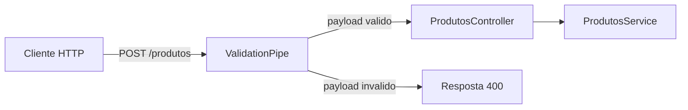

# Encontro 08

## Tema

DTOs, pipes e validação de dados.

## Objetivos

- Compreender o papel de DTOs na definição de contrato de entrada da API.
- Aplicar pipes no NestJS para transformação e validação de dados recebidos.
- Configurar validação global com `ValidationPipe`.
- Implementar validações de payload com `class-validator`.
- Evoluir a API de produtos com validação robusta para o checkpoint **Prática 02**.

## Setup inicial com Git e GitHub

Antes de iniciar DTOs e validação, organize o versionamento do projeto NestJS evoluído até a correção do encontro 07.

### Por que usar Git/GitHub neste ponto

Agora a API começa a ter mais arquivos, regras e dependências entre camadas. Versionar o projeto ajuda a:

- recuperar mudanças com segurança;
- registrar a evolução encontro a encontro;
- revisar correções com clareza;
- compartilhar a implementação da prática.

### Pré-requisitos

- Git instalado na máquina;
- conta no GitHub;
- projeto NestJS local já funcionando (ex.: `api-encontro-07`);
- terminal aberto na raiz do projeto.

### Passo 1: configurar identidade do Git

Se ainda não configurou no computador:

```bash
git config --global user.name "Seu Nome"
git config --global user.email "seu-email@exemplo.com"
```

Validação:

```bash
git config --global --list
```

### Passo 2: inicializar repositório local

Se o projeto ainda não está versionado:

```bash
git init
git branch -M main
```

### Passo 3: revisar `.gitignore`

Garanta que o projeto não versiona arquivos desnecessários:

```text
node_modules
dist
.env
```

### Passo 4: criar commit de base

```bash
git add .
git commit -m "chore: base da API apos correcao da pratica 01"
```

### Passo 5: publicar no GitHub

No GitHub, crie um repositório vazio e conecte o remoto:

```bash
git remote add origin https://github.com/<usuario>/<repositorio>.git
git push -u origin main
```

### Passo 6: fluxo mínimo recomendado

```bash
git pull
git add .
git commit -m "feat: adiciona dtos e validacao"
git push
```

## Visão geral

Nos encontros 06 e 07, a turma estruturou rotas, parâmetros, query strings e consolidou a correção da primeira prática. Agora surge um problema central de backend real: confiar cegamente nos dados enviados pelo cliente.

Quando a entrada não é validada, a aplicação aceita tipos errados, campos faltando e informações inconsistentes. Isso torna a API difícil de testar, manter e integrar com frontend.

Neste encontro, você vai usar DTOs para declarar o contrato de entrada e pipes para transformar e validar dados antes que eles cheguem à regra de negócio.

Ao final, a expectativa é que sua API rejeite entradas inválidas de forma previsível e padronizada.

## Pergunta central

Como garantir, no NestJS, que `params`, `query` e `body` respeitem o contrato da API antes da execução da regra de negócio?

## Conceitos-base do encontro

### O que é DTO

`DTO` (*Data Transfer Object*) é um objeto que define a estrutura esperada dos dados de entrada ou saída de uma operação.

Neste encontro, DTO será usado para:

- declarar campos obrigatórios e opcionais;
- definir tipos esperados;
- centralizar validações com decorators.

### O que é pipe no NestJS

Pipe é um componente executado antes do método do controller para:

- transformar dados;
- validar dados;
- rejeitar a requisição quando a entrada é inválida.

Exemplos úteis:

- `ParseIntPipe`: converte e valida inteiro;
- `ValidationPipe`: executa validações declaradas em DTOs;
- `DefaultValuePipe`: define valor padrão para query opcional.

## Tipagem TypeScript x validação em tempo de execução

TypeScript ajuda durante desenvolvimento, mas não protege a API sozinho.

Exemplo:

- no código, `preco: number` parece suficiente;
- na requisição real, o cliente pode enviar `"preco": "abc"`.

Sem validação em runtime, o dado inválido entra na aplicação.

Resumo:

- TypeScript protege no editor e na compilação;
- pipes e `class-validator` protegem a entrada real da API.

## Fluxo de validação de entrada



Leitura do fluxo:

- a requisição chega com `body`, `params` e `query`;
- pipes transformam e validam os dados;
- apenas dados válidos seguem para controller e service;
- em caso de erro, a API responde com `400`.

## Exemplo guiado: evoluindo a API de produtos

### Passo 1: instalar dependências de validação

Se o projeto ainda não tiver as bibliotecas:

```bash
npm install class-validator class-transformer
```

### Passo 2: habilitar `ValidationPipe` global

Arquivo `src/main.ts`:

```ts
import { ValidationPipe } from '@nestjs/common';
import { NestFactory } from '@nestjs/core';
import { AppModule } from './app.module';

async function bootstrap() {
  const app = await NestFactory.create(AppModule);

  app.useGlobalPipes(
    new ValidationPipe({
      whitelist: true,
      forbidNonWhitelisted: true,
      transform: true,
      transformOptions: { enableImplicitConversion: true },
    }),
  );

  await app.listen(3000);
}
bootstrap();
```

Pontos principais:

1. `whitelist: true` remove campos não declarados.
2. `forbidNonWhitelisted: true` transforma campos extras em erro `400`.
3. `transform: true` permite converter tipos automaticamente.
4. `enableImplicitConversion` ajuda em conversões simples.

### Passo 3: criar DTO de criação

Arquivo `src/produtos/dto/create-produto.dto.ts`:

```ts
import { IsBoolean, IsNotEmpty, IsNumber, IsString, Min } from 'class-validator';

export class CreateProdutoDto {
  @IsString()
  @IsNotEmpty()
  nome: string;

  @IsString()
  @IsNotEmpty()
  categoria: string;

  @IsNumber()
  @Min(0)
  preco: number;

  @IsBoolean()
  ativo: boolean;
}
```

### Passo 4: criar DTO de atualização parcial

Arquivo `src/produtos/dto/update-produto.dto.ts`:

```ts
import { IsBoolean, IsNumber, IsOptional, IsString, Min } from 'class-validator';

export class UpdateProdutoDto {
  @IsOptional()
  @IsString()
  nome?: string;

  @IsOptional()
  @IsString()
  categoria?: string;

  @IsOptional()
  @IsNumber()
  @Min(0)
  preco?: number;

  @IsOptional()
  @IsBoolean()
  ativo?: boolean;
}
```

### Passo 5: usar DTOs e pipes no controller

Arquivo `src/produtos/produtos.controller.ts`:

```ts
import {
  Body,
  Controller,
  DefaultValuePipe,
  Delete,
  Get,
  Param,
  ParseIntPipe,
  Patch,
  Post,
  Put,
  Query,
} from '@nestjs/common';
import { CreateProdutoDto } from './dto/create-produto.dto';
import { UpdateProdutoDto } from './dto/update-produto.dto';
import { ProdutosService } from './produtos.service';

@Controller('produtos')
export class ProdutosController {
  constructor(private readonly produtosService: ProdutosService) {}

  @Get()
  listar(
    @Query('categoria') categoria?: string,
    @Query('limite', new DefaultValuePipe(10), ParseIntPipe) limite?: number,
  ) {
    return this.produtosService.listar(categoria, limite);
  }

  @Get(':id')
  buscarPorId(@Param('id', ParseIntPipe) id: number) {
    return this.produtosService.buscarPorId(id);
  }

  @Post()
  criar(@Body() body: CreateProdutoDto) {
    return this.produtosService.criar(body);
  }

  @Put(':id')
  atualizarCompleto(
    @Param('id', ParseIntPipe) id: number,
    @Body() body: CreateProdutoDto,
  ) {
    return this.produtosService.atualizarCompleto(id, body);
  }

  @Patch(':id')
  atualizarParcial(
    @Param('id', ParseIntPipe) id: number,
    @Body() body: UpdateProdutoDto,
  ) {
    return this.produtosService.atualizarParcial(id, body);
  }

  @Delete(':id')
  remover(@Param('id', ParseIntPipe) id: number) {
    return this.produtosService.remover(id);
  }
}
```

### Passo 6: ajustar a assinatura do service

Arquivo `src/produtos/produtos.service.ts`:

```ts
import { Injectable, NotFoundException } from '@nestjs/common';
import { CreateProdutoDto } from './dto/create-produto.dto';
import { UpdateProdutoDto } from './dto/update-produto.dto';

type Produto = {
  id: number;
  nome: string;
  categoria: string;
  preco: number;
  ativo: boolean;
};

@Injectable()
export class ProdutosService {
  private produtos: Produto[] = [
    { id: 1, nome: 'Notebook', categoria: 'hardware', preco: 3500, ativo: true },
    { id: 2, nome: 'Mouse', categoria: 'hardware', preco: 120, ativo: true },
    { id: 3, nome: 'Curso NestJS', categoria: 'educacao', preco: 89, ativo: false },
  ];

  listar(categoria?: string, limite?: number) {
    let resultado = [...this.produtos];

    if (categoria) {
      resultado = resultado.filter((p) => p.categoria === categoria);
    }

    if (limite && limite > 0) {
      resultado = resultado.slice(0, limite);
    }

    return resultado;
  }

  buscarPorId(id: number) {
    const produto = this.produtos.find((p) => p.id === id);

    if (!produto) {
      throw new NotFoundException('Produto nao encontrado');
    }

    return produto;
  }

  criar(dados: CreateProdutoDto) {
    const novoId =
      this.produtos.length > 0
        ? Math.max(...this.produtos.map((p) => p.id)) + 1
        : 1;

    const novoProduto: Produto = { id: novoId, ...dados };
    this.produtos.push(novoProduto);
    return novoProduto;
  }

  atualizarCompleto(id: number, dados: CreateProdutoDto) {
    const indice = this.produtos.findIndex((p) => p.id === id);

    if (indice === -1) {
      throw new NotFoundException('Produto nao encontrado');
    }

    const atualizado: Produto = { id, ...dados };
    this.produtos[indice] = atualizado;
    return atualizado;
  }

  atualizarParcial(id: number, dados: UpdateProdutoDto) {
    const produto = this.buscarPorId(id);
    const atualizado = { ...produto, ...dados };

    this.produtos = this.produtos.map((p) => (p.id === id ? atualizado : p));
    return atualizado;
  }

  remover(id: number) {
    const existe = this.produtos.some((p) => p.id === id);

    if (!existe) {
      throw new NotFoundException('Produto nao encontrado');
    }

    this.produtos = this.produtos.filter((p) => p.id !== id);
    return { mensagem: `Produto ${id} removido com sucesso` };
  }
}
```

## Testando validação na prática

Com a aplicação em execução, teste:

```text
POST   /produtos
PUT    /produtos/1
PATCH  /produtos/1
GET    /produtos/abc
GET    /produtos?limite=texto
```

Exemplo válido:

```bash
curl -X POST http://localhost:3000/produtos \
  -H "Content-Type: application/json" \
  -d '{"nome":"Teclado","categoria":"hardware","preco":180,"ativo":true}'
```

Exemplo inválido com preço negativo:

```bash
curl -X POST http://localhost:3000/produtos \
  -H "Content-Type: application/json" \
  -d '{"nome":"Teclado","categoria":"hardware","preco":-10,"ativo":true}'
```

Exemplo inválido com campo extra:

```bash
curl -X POST http://localhost:3000/produtos \
  -H "Content-Type: application/json" \
  -d '{"nome":"Teclado","categoria":"hardware","preco":180,"ativo":true,"cor":"preto"}'
```

## Utilizando Thunder Client no VS Code

O Thunder Client ajuda a validar rapidamente casos válidos e inválidos sem sair do editor.

### Fluxo rápido de uso no encontro 08

1. Clique em **New Request**.
2. Escolha método e URL.
3. Em **Body > JSON**, envie os dados do produto.
4. Observe `status`, corpo de resposta e mensagens de validação.
5. Salve os testes em uma coleção da aula.

## Erros comuns e como corrigir

### Erro: confiar só na tipagem do TypeScript

Sintoma: o código compila, mas a API aceita payload inválido.

Correção:

- criar DTO com decorators do `class-validator`;
- habilitar `ValidationPipe` global.

### Erro: converter `id` manualmente em todo método

Sintoma: repetição de `Number(id)` e validação duplicada.

Correção:

- usar `@Param('id', ParseIntPipe) id: number`.

### Erro: aceitar campos não previstos no payload

Sintoma: cliente envia propriedades extras e a API aceita silenciosamente.

Correção:

- configurar `whitelist: true` e `forbidNonWhitelisted: true`.

## Checklist de aprendizagem

Ao final, confirme se você consegue:

- explicar a diferença entre tipagem estática e validação em runtime;
- criar DTOs de criação e atualização;
- aplicar `ValidationPipe` global no `main.ts`;
- usar `ParseIntPipe` e `DefaultValuePipe` no controller;
- testar cenários válidos e inválidos com respostas coerentes.

## Prática de laboratório (Prática 02)

### Proposta

Evoluir a API de `tarefas` com DTOs e pipes para validação completa de entrada.

### Requisitos da prática

- criar `CreateTarefaDto` e `UpdateTarefaDto`;
- validar:
  - `titulo` obrigatório e não vazio;
  - `descricao` opcional;
  - `status` com valores permitidos (`aberta`, `em_andamento`, `concluida`);
  - `prioridade` entre `1` e `5`;
- aplicar `ValidationPipe` global;
- usar `ParseIntPipe` em `:id`;
- manter estrutura modular (`module`, `controller`, `service`);
- executar `npm run lint`;
- registrar commits no Git com mensagens semânticas.

### Instruções sugeridas

1. Crie pasta `dto` dentro do módulo `tarefas`.
2. Implemente os decorators de validação no DTO de criação.
3. Crie DTO de atualização com campos opcionais.
4. Substitua tipos inline do `@Body()` pelos DTOs.
5. Use pipe de conversão em `@Param('id', ParseIntPipe)`.
6. Teste erros de validação com `curl`, Insomnia ou Postman.
7. Faça ao menos 2 commits no processo.

### Entrega

Apresentar:

- código de `tarefas.controller.ts`;
- DTOs de `tarefas`;
- evidência de resposta `400` em payload inválido;
- evidência de execução do `lint`;
- link do repositório GitHub com histórico de commits.

### Critérios de sucesso

Considere a prática concluída quando:

- entradas inválidas são bloqueadas antes do service;
- rotas usam pipes de forma consistente;
- DTOs refletem o contrato da API com clareza;
- commits mostram evolução incremental e rastreável.

## Síntese do encontro

Você estudou que:

- DTOs formalizam o contrato de entrada;
- validação em runtime é essencial mesmo com TypeScript;
- pipes transformam e validam dados antes da regra de negócio;
- `ValidationPipe` global padroniza a proteção da API;
- Git e GitHub ajudam a registrar a evolução técnica com segurança.
