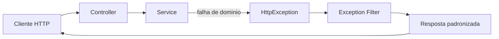

# Encontro 09

## Tema

Tratamento de erros, filtros e códigos de resposta.

## Objetivos

- Compreender por que tratamento de erros é parte do contrato da API.
- Diferenciar erros de validação, recurso não encontrado, conflito e falha interna.
- Aplicar exceções HTTP do NestJS (`BadRequestException`, `NotFoundException`, `ConflictException`, `InternalServerErrorException`).
- Criar e registrar um filtro global de exceções para padronizar respostas de erro.
- Usar códigos de status HTTP coerentes em respostas de sucesso e falha para o checkpoint **Prática 03**.

## Setup inicial para a Prática 03

Antes de iniciar, prepare o projeto evoluído até o encontro 08.

### Pré-requisitos

- projeto NestJS com DTOs e `ValidationPipe` já funcionando;
- API executando localmente em `http://localhost:3000`;
- cliente HTTP disponível (`curl`, Thunder Client, Insomnia ou Postman);
- repositório Git configurado.

### Passo 1: atualizar branch local

```bash
git pull
```

### Passo 2: criar branch do encontro

```bash
git checkout -b feat/encontro-09-tratamento-erros
```

### Passo 3: subir a aplicação

```bash
npm run start:dev
```

### Passo 4: validar endpoint base

Teste uma rota existente, como `GET /produtos`, antes de iniciar as mudanças.

## Visão geral

No encontro 08, a turma garantiu que dados inválidos fossem bloqueados na entrada da API. Agora, o próximo passo é tornar o comportamento de erro previsível e profissional.

Em backend real, não basta "dar erro". A API precisa indicar corretamente o tipo do problema com código HTTP coerente e payload padronizado, para que frontend e demais consumidores saibam como reagir.

Neste encontro, você vai estruturar tratamento de erros com exceções do NestJS, aplicar filtros globais e revisar códigos de resposta para sucesso e falha.

Ao final, a expectativa é que sua API responda erros de forma consistente, legível e alinhada ao contrato HTTP.

## Pergunta central

Como projetar respostas de erro em NestJS com códigos HTTP corretos e formato padronizado, sem espalhar tratamento manual por toda a aplicação?

## Conceitos-base do encontro

### O que é tratamento de erros em API

Tratar erro em API é transformar falhas esperadas do domínio em respostas HTTP claras.

Exemplos comuns:

- cliente enviou dado inválido;
- recurso solicitado não existe;
- tentativa de criar recurso duplicado;
- falha inesperada no processamento.

### Exceções HTTP no NestJS

O NestJS oferece classes prontas para representar cenários comuns:

- `BadRequestException` (`400`);
- `NotFoundException` (`404`);
- `ConflictException` (`409`);
- `InternalServerErrorException` (`500`).

Em geral, essas exceções ficam mais bem localizadas no `service`, perto da regra que detecta o problema.

### O que é Exception Filter

`Exception Filter` é um componente do NestJS usado para interceptar exceções e definir o formato final da resposta de erro.

Com filtro global, a API pode responder sempre com campos como:

- `statusCode`;
- `error`;
- `message`;
- `timestamp`;
- `path`;
- `method`.

## Códigos HTTP mais usados neste encontro

| Código | Uso no contexto da API |
|---|---|
| `200 OK` | leitura e atualização com retorno de conteúdo |
| `201 Created` | criação bem-sucedida |
| `204 No Content` | remoção bem-sucedida sem corpo |
| `400 Bad Request` | erro de validação ou entrada inválida |
| `404 Not Found` | recurso solicitado não existe |
| `409 Conflict` | conflito de estado, como duplicidade |
| `500 Internal Server Error` | falha não tratada internamente |

## Fluxo de erro no NestJS



Leitura do fluxo:

- o cliente chama a rota;
- o controller delega ao service;
- o service lança exceção apropriada;
- o filtro transforma a exceção em resposta padrão;
- o cliente recebe status e mensagem claros.

## Exemplo guiado: padronizando erros na API de produtos

### Passo 1: lançar exceções semânticas no service

Arquivo `src/produtos/produtos.service.ts`:

```ts
import {
  BadRequestException,
  ConflictException,
  Injectable,
  NotFoundException,
} from '@nestjs/common';
import { CreateProdutoDto } from './dto/create-produto.dto';
import { UpdateProdutoDto } from './dto/update-produto.dto';

type Produto = {
  id: number;
  nome: string;
  categoria: string;
  preco: number;
  ativo: boolean;
};

@Injectable()
export class ProdutosService {
  private produtos: Produto[] = [
    { id: 1, nome: 'Notebook', categoria: 'hardware', preco: 3500, ativo: true },
    { id: 2, nome: 'Mouse', categoria: 'hardware', preco: 120, ativo: true },
    { id: 3, nome: 'Curso NestJS', categoria: 'educacao', preco: 89, ativo: false },
  ];

  listar(categoria?: string, limite?: number) {
    let resultado = [...this.produtos];

    if (categoria) {
      resultado = resultado.filter((p) => p.categoria === categoria);
    }

    if (limite && limite > 0) {
      resultado = resultado.slice(0, limite);
    }

    return resultado;
  }

  buscarPorId(id: number) {
    const produto = this.produtos.find((p) => p.id === id);

    if (!produto) {
      throw new NotFoundException('Produto nao encontrado');
    }

    return produto;
  }

  criar(dados: CreateProdutoDto) {
    const duplicado = this.produtos.some(
      (p) => p.nome.toLowerCase() === dados.nome.toLowerCase(),
    );

    if (duplicado) {
      throw new ConflictException('Ja existe produto com esse nome');
    }

    if (dados.preco <= 0) {
      throw new BadRequestException('Preco deve ser maior que zero');
    }

    const novoId =
      this.produtos.length > 0
        ? Math.max(...this.produtos.map((p) => p.id)) + 1
        : 1;

    const novoProduto: Produto = { id: novoId, ...dados };
    this.produtos.push(novoProduto);

    return novoProduto;
  }

  atualizarParcial(id: number, dados: UpdateProdutoDto) {
    const produto = this.buscarPorId(id);

    if (dados.preco !== undefined && dados.preco <= 0) {
      throw new BadRequestException('Preco deve ser maior que zero');
    }

    const atualizado = { ...produto, ...dados };
    this.produtos = this.produtos.map((p) => (p.id === id ? atualizado : p));

    return atualizado;
  }
}
```

Pontos de atenção:

1. `NotFoundException` comunica ausência de recurso.
2. `ConflictException` comunica duplicidade.
3. `BadRequestException` comunica entrada inválida.
4. A exceção é lançada perto da regra que detecta o problema.

### Passo 2: criar filtro global de exceções HTTP

Arquivo `src/common/filters/http-exception.filter.ts`:

```ts
import {
  ArgumentsHost,
  Catch,
  ExceptionFilter,
  HttpException,
  HttpStatus,
} from '@nestjs/common';
import { Request, Response } from 'express';

@Catch(HttpException)
export class HttpExceptionFilter implements ExceptionFilter {
  catch(exception: HttpException, host: ArgumentsHost) {
    const ctx = host.switchToHttp();
    const response = ctx.getResponse<Response>();
    const request = ctx.getRequest<Request>();

    const status = exception.getStatus();
    const exceptionResponse = exception.getResponse();

    let message: string | string[] = 'Erro inesperado';
    let error = HttpStatus[status] ?? 'HttpException';

    if (typeof exceptionResponse === 'string') {
      message = exceptionResponse;
    }

    if (typeof exceptionResponse === 'object' && exceptionResponse !== null) {
      const body = exceptionResponse as {
        message?: string | string[];
        error?: string;
      };

      if (body.message) {
        message = body.message;
      }

      if (body.error) {
        error = body.error;
      }
    }

    response.status(status).json({
      statusCode: status,
      error,
      message,
      timestamp: new Date().toISOString(),
      path: request.url,
      method: request.method,
    });
  }
}
```

### Passo 3: registrar filtro no `main.ts`

Arquivo `src/main.ts`:

```ts
import { ValidationPipe } from '@nestjs/common';
import { NestFactory } from '@nestjs/core';
import { AppModule } from './app.module';
import { HttpExceptionFilter } from './common/filters/http-exception.filter';

async function bootstrap() {
  const app = await NestFactory.create(AppModule);

  app.useGlobalPipes(
    new ValidationPipe({
      whitelist: true,
      forbidNonWhitelisted: true,
      transform: true,
      transformOptions: { enableImplicitConversion: true },
    }),
  );

  app.useGlobalFilters(new HttpExceptionFilter());

  await app.listen(3000);
}
bootstrap();
```

### Passo 4: revisar códigos de sucesso no controller

Arquivo `src/produtos/produtos.controller.ts`:

```ts
import {
  Body,
  Controller,
  DefaultValuePipe,
  Delete,
  Get,
  HttpCode,
  Param,
  ParseIntPipe,
  Patch,
  Post,
  Query,
} from '@nestjs/common';
import { CreateProdutoDto } from './dto/create-produto.dto';
import { UpdateProdutoDto } from './dto/update-produto.dto';
import { ProdutosService } from './produtos.service';

@Controller('produtos')
export class ProdutosController {
  constructor(private readonly produtosService: ProdutosService) {}

  @Get()
  listar(
    @Query('categoria') categoria?: string,
    @Query('limite', new DefaultValuePipe(10), ParseIntPipe) limite?: number,
  ) {
    return this.produtosService.listar(categoria, limite);
  }

  @Get(':id')
  buscarPorId(@Param('id', ParseIntPipe) id: number) {
    return this.produtosService.buscarPorId(id);
  }

  @Post()
  criar(@Body() body: CreateProdutoDto) {
    return this.produtosService.criar(body);
  }

  @Patch(':id')
  atualizarParcial(
    @Param('id', ParseIntPipe) id: number,
    @Body() body: UpdateProdutoDto,
  ) {
    return this.produtosService.atualizarParcial(id, body);
  }

  @Delete(':id')
  @HttpCode(204)
  remover(@Param('id', ParseIntPipe) id: number) {
    this.produtosService.remover(id);
  }
}
```

Ponto de atenção:

- `@HttpCode(204)` em `DELETE` indica remoção bem-sucedida sem corpo de resposta.

## Testando tratamento de erros na prática

Com a aplicação em execução, teste:

```text
GET     /produtos/999
POST    /produtos (nome duplicado)
POST    /produtos (payload invalido)
PATCH   /produtos/1 (preco <= 0)
DELETE  /produtos/999
```

Exemplo `404`:

```bash
curl -i http://localhost:3000/produtos/999
```

Exemplo `409`:

```bash
curl -i -X POST http://localhost:3000/produtos \
  -H "Content-Type: application/json" \
  -d '{"nome":"Notebook","categoria":"hardware","preco":3000,"ativo":true}'
```

Exemplo `400`:

```bash
curl -i -X PATCH http://localhost:3000/produtos/1 \
  -H "Content-Type: application/json" \
  -d '{"preco":0}'
```

Resposta esperada:

```json
{
  "statusCode": 400,
  "error": "Bad Request",
  "message": "Preco deve ser maior que zero",
  "timestamp": "2026-04-24T12:00:00.000Z",
  "path": "/produtos/1",
  "method": "PATCH"
}
```

## Utilizando Thunder Client para validar erros

No Thunder Client, confira em cada requisição:

- método e URL corretos;
- status retornado (`400`, `404`, `409` etc.);
- corpo de resposta no padrão do filtro;
- diferença entre respostas de sucesso e falha.

Fluxo recomendado para a aula:

1. Criar coleção `Encontro 09 - Erros e Filtros`.
2. Salvar requisições de sucesso e falha lado a lado.
3. Comparar os status HTTP e discutir por que cada código foi usado.

## Erros comuns e como corrigir

### Erro: retornar `200` quando o recurso não existe

Sintoma: endpoint responde com objeto vazio, `null` ou mensagem genérica.

Correção:

- lançar `NotFoundException` quando não encontrar o recurso.

### Erro: usar sempre `BadRequestException`

Sintoma: a API perde semântica e dificulta tratamento no frontend.

Correção:

- escolher a exceção específica para cada cenário.

### Erro: padronizar manualmente em cada controller

Sintoma: duplicação de código e respostas inconsistentes.

Correção:

- criar `Exception Filter` global.

### Erro: ignorar status corretos de sucesso

Sintoma: `DELETE` retorna `200` com payload arbitrário sem necessidade.

Correção:

- usar `@HttpCode(204)` quando a remoção não precisa devolver conteúdo.

## Checklist de aprendizagem

Ao final, confirme se você consegue:

- explicar diferença entre erro de validação, não encontrado e conflito;
- mapear cenários para códigos HTTP adequados;
- lançar exceções semânticas no service;
- criar e registrar filtro global de exceções;
- validar respostas de erro com payload padronizado;
- justificar quando usar `200`, `201` e `204`.

## Prática de laboratório (Prática 03)

### Proposta

Evoluir a API de `tarefas` com tratamento de erros semântico e padronizado.

### Requisitos da prática

- implementar exceções adequadas no `tarefas.service.ts`;
- usar `NotFoundException` para `id` inexistente;
- usar `BadRequestException` para transições inválidas de status;
- usar `ConflictException` para duplicidade de título;
- criar filtro global para padronizar resposta de erro;
- aplicar `@HttpCode(204)` em remoção bem-sucedida;
- testar cenários de sucesso e erro com cliente HTTP;
- executar `npm run lint`;
- registrar commits com mensagens semânticas.

### Instruções sugeridas

1. Revise as rotas atuais de `tarefas` e liste cenários de falha esperados.
2. Aplique exceções semânticas no service, próximas às regras de negócio.
3. Crie filtro global em `src/common/filters`.
4. Registre o filtro no `main.ts`.
5. Ajuste códigos de sucesso no controller.
6. Teste com Thunder Client ou `curl` e salve evidências.
7. Execute lint e faça commits incrementais.

### Entrega

Apresentar:

- código de `tarefas.controller.ts` e `tarefas.service.ts`;
- arquivo do filtro global de exceções;
- evidência de respostas `400`, `404` e `409`;
- evidência de remoção com `204`;
- evidência de execução do `lint`;
- link do repositório GitHub com histórico dos commits.

### Critérios de sucesso

Considere a prática concluída quando:

- cada cenário de erro retorna status HTTP coerente;
- payload de erro segue padrão único;
- tratamento de erro está centralizado e sem duplicação desnecessária;
- endpoints de sucesso usam códigos adequados ao contrato da operação.

## Síntese do encontro

Você estudou que:

- tratar erro é parte do contrato da API, não detalhe de implementação;
- exceções semânticas tornam respostas mais úteis para frontend e testes;
- filtros globais padronizam formato de erro e reduzem repetição;
- códigos HTTP corretos melhoram legibilidade, depuração e manutenção;
- uma API profissional comunica sucesso e falha com consistência.
