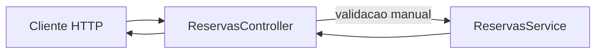

# Encontro 09

## Tema

Correção da Atividade Avaliativa 01.

## Objetivos

- Revisar os critérios técnicos cobrados na Atividade Avaliativa 01.
- Corrigir passo a passo a implementação de `POST /reservas` e `PATCH /reservas/:id`.
- Aplicar apenas organização em `module`, `controller` e `service`.
- Realizar validações de entrada manualmente no `controller` (sem DTOs e sem `ValidationPipe`).
- Garantir regras de negócio no `service` com respostas HTTP coerentes.

## Setup inicial para a correção

Antes de iniciar a correção, vamos preparar do zero o ambiente da API usada na prova.

### Pré-requisitos

- Node.js e npm instalados;
- Docker e Docker Compose instalados;
- terminal na raiz do projeto;
- cliente HTTP disponível (`curl`, Thunder Client, Insomnia ou Postman).

### Passo 1: criação do projeto

Crie um novo projeto NestJS para reproduzir a correção da atividade:

```bash
npx @nestjs/cli new api-correcao-avaliativa-01
cd api-correcao-avaliativa-01
```

### Passo 2: configuração do Docker

Crie os arquivos de containerização do projeto.

Arquivo `Dockerfile`:

```dockerfile
FROM node:20-alpine

WORKDIR /app

COPY package*.json ./
RUN npm install

COPY . .

EXPOSE 3000

CMD ["npm", "run", "start:dev"]
```

Arquivo `docker-compose.yml`:

```yaml
services:
  api:
    build: .
    container_name: api-correcao-avaliativa-01
    ports:
      - "3000:3000"
    volumes:
      - .:/app
      - /app/node_modules
    command: npm run start:dev
```

### Passo 3: subir aplicação com Docker

```bash
docker compose up --build
```

### Passo 4: validar ambiente

Confirme que a API responde em:

```text
http://localhost:3000
```


## Critérios usados na correção

Durante a correção, adotaremos estas decisões:

- a API mantém separação entre `controller` (contrato HTTP) e `service` (regra de negócio);
- `POST /reservas` cria reserva com status inicial `ativa`;
- `PATCH /reservas/:id` permite atualizar apenas `status` e `integrantes`;
- o `id` da rota é validado manualmente no `controller`;
- os dados do corpo são validados manualmente no `controller`;
- o `service` aplica regras de estado da reserva;
- erros são retornados com `BadRequestException` e `NotFoundException`.

## Estrutura esperada da reserva

```ts
type Reserva = {
  id: number;
  responsavel: string;
  sala: 'azul' | 'verde' | 'vermelha';
  turno: 'manha' | 'tarde' | 'noite';
  integrantes: number;
  status: 'ativa' | 'confirmada' | 'cancelada' | 'encerrada';
};
```

## Fluxo da solução corrigida



Leitura do fluxo:

- o cliente envia `body` e `id`;
- o `controller` valida formato e campos permitidos;
- o `service` aplica regras de negócio e atualiza dados em memória;
- a API responde com sucesso ou erro coerente.

## Correção passo a passo

### Passo 0: gerar artefatos do módulo

Se ainda não criou o módulo `reservas`:

```bash
npx nest g module reservas
npx nest g service reservas
npx nest g controller reservas
```

Se estiver usando container:

```bash
docker compose exec api npx nest g module reservas
docker compose exec api npx nest g service reservas
docker compose exec api npx nest g controller reservas
```

### Passo 1: definir o tipo da reserva no `service`

Ponto do enunciado atendido: estrutura de `Reserva`.

Arquivo `src/reservas/reservas.service.ts`:

```ts
type Reserva = {
  id: number;
  responsavel: string;
  sala: 'azul' | 'verde' | 'vermelha';
  turno: 'manha' | 'tarde' | 'noite';
  integrantes: number;
  status: 'ativa' | 'confirmada' | 'cancelada' | 'encerrada';
};
```

### Passo 2: criar lista em memória e método de busca por id

Ponto do enunciado atendido: base para o `PATCH` localizar a reserva por `id` (`AV7`).

```ts
import { Injectable, NotFoundException, BadRequestException } from '@nestjs/common';

@Injectable()
export class ReservasService {
  private reservas: Reserva[] = [
    { id: 1, responsavel: 'Ana', sala: 'azul', turno: 'manha', integrantes: 3, status: 'ativa' },
    { id: 2, responsavel: 'Bruno', sala: 'verde', turno: 'tarde', integrantes: 5, status: 'confirmada' },
    { id: 3, responsavel: 'Carla', sala: 'vermelha', turno: 'noite', integrantes: 2, status: 'cancelada' },
  ];

  buscarPorId(id: number) {
    const reserva = this.reservas.find((r) => r.id === id);

    if (!reserva) {
      throw new NotFoundException('Reserva não encontrada');
    }

    return reserva;
  }
}
```

### Passo 3: implementar criação no `service` com status inicial fixo

Ponto do enunciado atendido: “criar a reserva com status inicial ativa” (`AV6`).

```ts
criar(dados: {
  responsavel: string;
  sala: 'azul' | 'verde' | 'vermelha';
  turno: 'manha' | 'tarde' | 'noite';
  integrantes: number;
}) {
  const novoId =
    this.reservas.length > 0
      ? Math.max(...this.reservas.map((r) => r.id)) + 1
      : 1;

  const novaReserva: Reserva = {
    id: novoId,
    responsavel: dados.responsavel,
    sala: dados.sala,
    turno: dados.turno,
    integrantes: dados.integrantes,
    status: 'ativa',
  };

  this.reservas.push(novaReserva);
  return novaReserva;
}
```

### Passo 4: criar rota `POST /reservas`

Ponto do enunciado atendido: rota obrigatória `POST /reservas` (`AV1`).

Arquivo `src/reservas/reservas.controller.ts`:

```ts
import { BadRequestException, Body, Controller, Param, Patch, Post } from '@nestjs/common';
import { ReservasService } from './reservas.service';

@Controller('reservas')
export class ReservasController {
  constructor(private readonly reservasService: ReservasService) {}

  @Post()
  criar(
    @Body()
    body: {
      responsavel?: string;
      sala?: string;
      turno?: string;
      integrantes?: number;
    },
  ) {
    // validações entram nos próximos passos
    return this.reservasService.criar(body as {
      responsavel: string;
      sala: 'azul' | 'verde' | 'vermelha';
      turno: 'manha' | 'tarde' | 'noite';
      integrantes: number;
    });
  }
```

### Passo 5: validar campos obrigatórios no `POST`

Ponto do enunciado atendido: “exigir os campos responsavel, sala, turno e integrantes” (`AV2`).

Dentro do método `criar` do controller:

```ts
if (!body.responsavel || !body.sala || !body.turno || body.integrantes === undefined) {
  throw new BadRequestException(
    'Campos obrigatórios: responsavel, sala, turno e integrantes',
  );
}
```

### Passo 6: validar tipo de `integrantes` no `POST`

Ponto do enunciado atendido: parte da consistência de entrada do `POST` (apoio ao `AV2`).

```ts
if (typeof body.integrantes !== 'number' || !Number.isInteger(body.integrantes)) {
  throw new BadRequestException('Integrantes deve ser um número inteiro');
}
```

### Passo 7: validar domínio de `sala` no `POST`

Ponto do enunciado atendido: “aceitar apenas as salas azul, verde e vermelha” (`AV3`).

```ts
const salasPermitidas = ['azul', 'verde', 'vermelha'];
if (!salasPermitidas.includes(body.sala)) {
  throw new BadRequestException('Sala inválida. Use: azul, verde ou vermelha');
}
```

### Passo 8: validar domínio de `turno` e faixa de integrantes no `POST`

Pontos do enunciado atendidos:

- “aceitar apenas os turnos manha, tarde e noite” (`AV4`);
- “aceitar apenas valores de integrantes entre 1 e 6” (`AV5`).

```ts
const turnosPermitidos = ['manha', 'tarde', 'noite'];
if (!turnosPermitidos.includes(body.turno)) {
  throw new BadRequestException('Turno inválido. Use: manha, tarde ou noite');
}

if (body.integrantes < 1 || body.integrantes > 6) {
  throw new BadRequestException('Integrantes deve ser um número inteiro entre 1 e 6');
}
```

### Passo 9: criar rota `PATCH /reservas/:id` e validar parâmetro

Pontos do enunciado atendidos:

- rota obrigatória `PATCH /reservas/:id` (`AV1`);
- localizar por `id` com base em identificador válido (`AV7`).

```ts
@Patch(':id')
atualizarParcial(
  @Param('id') id: string,
  @Body()
  body: {
    status?: string;
    integrantes?: number;
    responsavel?: string;
    sala?: string;
    turno?: string;
  },
) {
  const idNumero = Number(id);

  if (Number.isNaN(idNumero)) {
    throw new BadRequestException('Parâmetro "id" deve ser numérico');
  }

  // demais validações entram nos próximos passos
}
```

### Passo 10: rejeitar corpo vazio no `PATCH`

Ponto do enunciado atendido: “rejeitar requisições com corpo vazio” (`AV8`).

```ts
if (Object.keys(body).length === 0) {
  throw new BadRequestException('Corpo da requisição não pode ser vazio');
}
```

### Passo 11: aceitar apenas `status` e `integrantes` no `PATCH`

Pontos do enunciado atendidos:

- “permitir atualização apenas dos campos status e integrantes” (`AV9`);
- “rejeitar tentativas de alterar responsavel, sala ou turno” (`AV10`).

```ts
const camposPermitidos = ['status', 'integrantes'];
const campoNaoPermitido = Object.keys(body).find(
  (campo) => !camposPermitidos.includes(campo),
);

if (campoNaoPermitido) {
  throw new BadRequestException(
    `Campo "${campoNaoPermitido}" não pode ser atualizado nesta rota`,
  );
}
```

### Passo 12: localizar reserva por id no `service`

Ponto do enunciado atendido: “localizar a reserva pelo id e retornar erro caso ela não exista” (`AV7`).

No `service`, dentro de `atualizarParcial`:

```ts
const reservaAtual = this.buscarPorId(id);
```

### Passo 13: validar `status` e `integrantes` recebidos no `PATCH`

Ponto do enunciado atendido: “aceitar integrantes apenas entre 1 e 6” (`AV11`).

Também mantemos `status` restrito ao domínio da entidade.

```ts
if (body.status !== undefined) {
  const statusPermitidos = ['ativa', 'confirmada', 'cancelada', 'encerrada'];
  if (!statusPermitidos.includes(body.status)) {
    throw new BadRequestException(
      'Status inválido. Use: ativa, confirmada, cancelada ou encerrada',
    );
  }
}

if (body.integrantes !== undefined) {
  if (
    typeof body.integrantes !== 'number' ||
    !Number.isInteger(body.integrantes) ||
    body.integrantes < 1 ||
    body.integrantes > 6
  ) {
    throw new BadRequestException('Integrantes deve ser um número inteiro entre 1 e 6');
  }
}
```

### Passo 14: bloquear atualização de reserva cancelada/encerrada

Ponto do enunciado atendido: “rejeitar qualquer alteração em reservas com status cancelada ou encerrada” (`AV12`).

No `service`, dentro de `atualizarParcial`:

```ts
if (reservaAtual.status === 'cancelada' || reservaAtual.status === 'encerrada') {
  throw new BadRequestException(
    'Reservas canceladas ou encerradas não podem ser alteradas',
  );
}

const reservaAtualizada: Reserva = { ...reservaAtual, ...dados };
this.reservas = this.reservas.map((r) => (r.id === id ? reservaAtualizada : r));
return reservaAtualizada;
```

### Passo 15: versão consolidada dos arquivos

`src/reservas/reservas.service.ts`:

```ts
import { BadRequestException, Injectable, NotFoundException } from '@nestjs/common';

type Reserva = {
  id: number;
  responsavel: string;
  sala: 'azul' | 'verde' | 'vermelha';
  turno: 'manha' | 'tarde' | 'noite';
  integrantes: number;
  status: 'ativa' | 'confirmada' | 'cancelada' | 'encerrada';
};

@Injectable()
export class ReservasService {
  private reservas: Reserva[] = [
    { id: 1, responsavel: 'Ana', sala: 'azul', turno: 'manha', integrantes: 3, status: 'ativa' },
    { id: 2, responsavel: 'Bruno', sala: 'verde', turno: 'tarde', integrantes: 5, status: 'confirmada' },
    { id: 3, responsavel: 'Carla', sala: 'vermelha', turno: 'noite', integrantes: 2, status: 'cancelada' },
  ];

  buscarPorId(id: number) {
    const reserva = this.reservas.find((r) => r.id === id);

    if (!reserva) {
      throw new NotFoundException('Reserva não encontrada');
    }

    return reserva;
  }

  criar(dados: {
    responsavel: string;
    sala: 'azul' | 'verde' | 'vermelha';
    turno: 'manha' | 'tarde' | 'noite';
    integrantes: number;
  }) {
    const novoId =
      this.reservas.length > 0
        ? Math.max(...this.reservas.map((r) => r.id)) + 1
        : 1;

    const novaReserva: Reserva = {
      id: novoId,
      responsavel: dados.responsavel,
      sala: dados.sala,
      turno: dados.turno,
      integrantes: dados.integrantes,
      status: 'ativa',
    };

    this.reservas.push(novaReserva);
    return novaReserva;
  }

  atualizarParcial(
    id: number,
    dados: {
      status?: 'ativa' | 'confirmada' | 'cancelada' | 'encerrada';
      integrantes?: number;
    },
  ) {
    const reservaAtual = this.buscarPorId(id);

    if (reservaAtual.status === 'cancelada' || reservaAtual.status === 'encerrada') {
      throw new BadRequestException(
        'Reservas canceladas ou encerradas não podem ser alteradas',
      );
    }

    const reservaAtualizada: Reserva = {
      ...reservaAtual,
      ...dados,
    };

    this.reservas = this.reservas.map((r) =>
      r.id === id ? reservaAtualizada : r,
    );

    return reservaAtualizada;
  }
}
```

`src/reservas/reservas.controller.ts`:

```ts
import { BadRequestException, Body, Controller, Param, Patch, Post } from '@nestjs/common';
import { ReservasService } from './reservas.service';

@Controller('reservas')
export class ReservasController {
  constructor(private readonly reservasService: ReservasService) {}

  @Post()
  criar(
    @Body()
    body: {
      responsavel?: string;
      sala?: string;
      turno?: string;
      integrantes?: number;
    },
  ) {
    if (!body.responsavel || !body.sala || !body.turno || body.integrantes === undefined) {
      throw new BadRequestException(
        'Campos obrigatórios: responsavel, sala, turno e integrantes',
      );
    }

    if (typeof body.integrantes !== 'number' || !Number.isInteger(body.integrantes)) {
      throw new BadRequestException('Integrantes deve ser um número inteiro');
    }

    const salasPermitidas = ['azul', 'verde', 'vermelha'];
    if (!salasPermitidas.includes(body.sala)) {
      throw new BadRequestException('Sala inválida. Use: azul, verde ou vermelha');
    }

    const turnosPermitidos = ['manha', 'tarde', 'noite'];
    if (!turnosPermitidos.includes(body.turno)) {
      throw new BadRequestException('Turno inválido. Use: manha, tarde ou noite');
    }

    if (body.integrantes < 1 || body.integrantes > 6) {
      throw new BadRequestException('Integrantes deve ser um número inteiro entre 1 e 6');
    }

    return this.reservasService.criar({
      responsavel: body.responsavel,
      sala: body.sala as 'azul' | 'verde' | 'vermelha',
      turno: body.turno as 'manha' | 'tarde' | 'noite',
      integrantes: body.integrantes,
    });
  }

  @Patch(':id')
  atualizarParcial(
    @Param('id') id: string,
    @Body()
    body: {
      status?: string;
      integrantes?: number;
      responsavel?: string;
      sala?: string;
      turno?: string;
    },
  ) {
    const idNumero = Number(id);

    if (Number.isNaN(idNumero)) {
      throw new BadRequestException('Parâmetro "id" deve ser numérico');
    }

    if (Object.keys(body).length === 0) {
      throw new BadRequestException('Corpo da requisição não pode ser vazio');
    }

    const camposPermitidos = ['status', 'integrantes'];
    const campoNaoPermitido = Object.keys(body).find(
      (campo) => !camposPermitidos.includes(campo),
    );

    if (campoNaoPermitido) {
      throw new BadRequestException(
        `Campo "${campoNaoPermitido}" não pode ser atualizado nesta rota`,
      );
    }

    if (body.status !== undefined) {
      const statusPermitidos = ['ativa', 'confirmada', 'cancelada', 'encerrada'];
      if (!statusPermitidos.includes(body.status)) {
        throw new BadRequestException(
          'Status inválido. Use: ativa, confirmada, cancelada ou encerrada',
        );
      }
    }

    if (body.integrantes !== undefined) {
      if (
        typeof body.integrantes !== 'number' ||
        !Number.isInteger(body.integrantes) ||
        body.integrantes < 1 ||
        body.integrantes > 6
      ) {
        throw new BadRequestException('Integrantes deve ser um número inteiro entre 1 e 6');
      }
    }

    return this.reservasService.atualizarParcial(idNumero, {
      status: body.status as 'ativa' | 'confirmada' | 'cancelada' | 'encerrada' | undefined,
      integrantes: body.integrantes,
    });
  }
}
```

### Passo 16: teste final com rastreio por critério

Com a API em execução, valide cada ponto da avaliação:

```text
AV1  POST   /reservas
AV1  PATCH  /reservas/1
AV2  POST   /reservas            (faltando campos obrigatórios)
AV3  POST   /reservas            (sala inválida)
AV4  POST   /reservas            (turno inválido)
AV5  POST   /reservas            (integrantes = 0 ou 7)
AV7  PATCH  /reservas/999        (id inexistente)
AV8  PATCH  /reservas/1          (body vazio)
AV9  PATCH  /reservas/1          (somente status/integrantes)
AV10 PATCH  /reservas/1          (tentando alterar responsavel)
AV11 PATCH  /reservas/1          (integrantes fora de 1..6)
AV12 PATCH  /reservas/3          (reserva cancelada)
```

Exemplo válido de criação:

```bash
curl -X POST http://localhost:3000/reservas \
  -H "Content-Type: application/json" \
  -d '{"responsavel":"Diego","sala":"azul","turno":"noite","integrantes":4}'
```

Exemplo inválido (`AV2` - campos obrigatórios):

```bash
curl -i -X POST http://localhost:3000/reservas \
  -H "Content-Type: application/json" \
  -d '{"responsavel":"Diego"}'
```

Exemplo inválido (`AV10` - campo proibido no `PATCH`):

```bash
curl -i -X PATCH http://localhost:3000/reservas/1 \
  -H "Content-Type: application/json" \
  -d '{"responsavel":"Novo Nome"}'
```
## Erros comuns e como corrigir

### Erro: aceitar `status` no `POST`

Sintoma: cliente define qualquer status na criação.

Correção:

- ignorar status enviado no corpo;
- criar sempre com `status: 'ativa'` no `service`.

### Erro: permitir atualização de `responsavel`, `sala` e `turno`

Sintoma: `PATCH` altera campos que a prova não permite.

Correção:

- validar manualmente os campos recebidos;
- aceitar apenas `status` e `integrantes`.

### Erro: não tratar `id` inválido

Sintoma: rota aceita `PATCH /reservas/abc` sem resposta clara.

Correção:

- converter `id` com `Number(id)`;
- retornar `400` quando `id` não for numérico.

### Erro: permitir alteração de reserva cancelada/encerrada

Sintoma: API altera reserva que deveria estar bloqueada.

Correção:

- validar status atual da reserva no `service`;
- retornar erro quando status atual for `cancelada` ou `encerrada`.

## Checklist de aprendizagem

Ao final, confirme se você consegue:

- implementar `POST` e `PATCH` sem DTOs, com validação manual;
- separar responsabilidades entre `controller` e `service`;
- validar parâmetros de rota e corpo da requisição;
- aplicar regras de negócio de estado no `service`;
- justificar cada erro HTTP retornado pela API.

## Síntese do encontro

Você corrigiu a atividade avaliativa usando apenas os conceitos dos encontros 01 a 07: estrutura modular, rotas, parâmetros, validação manual e regras de negócio em memória com NestJS.
