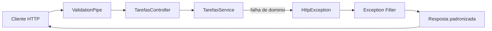

# Encontro 11

## Tema

Correção da Prática 02: API de tarefas com filtros, tratamento de erros e códigos de resposta.

## Objetivos

- Revisar os critérios técnicos da Prática 02 (DTOs, pipes e validação).
- Corrigir o uso de filtros na listagem de tarefas (`status` e `prioridade`).
- Aplicar tratamento de erros com exceções HTTP semânticas no NestJS.
- Criar e registrar um filtro global para padronizar respostas de erro.
- Consolidar o uso de códigos de resposta HTTP coerentes em sucesso e falha.

## Setup inicial para a correção da Prática 02

Antes de iniciar a correção, prepare o projeto evoluído até o encontro 10.

## Visão geral

No encontro 10, foi contruída a Prática 02 com foco em DTOs, pipes e validação de entrada.

Neste encontro, a proposta é corrigir essa prática passo a passo e, durante a correção, incorporar os tópicos de encontro 11: filtros de listagem, tratamento de erros e códigos de resposta HTTP.

Ao final, a expectativa é que a API de `tarefas` esteja validando entradas, aplicando regras de negócio com exceções semânticas e respondendo com payload de erro padronizado.

## Pergunta central

Como corrigir a Prática 02 para que a API de `tarefas` combine validação de entrada, filtros úteis e tratamento de erros consistente com o contrato HTTP?

## Critérios usados na correção

Durante a correção, vamos adotar as seguintes decisões:

- `GET /tarefas` lista tarefas com filtros opcionais via query string;
- `GET /tarefas/:id` busca recurso específico;
- `POST /tarefas` cria tarefa com `201 Created`;
- `PATCH /tarefas/:id` altera parcialmente uma tarefa;
- `DELETE /tarefas/:id` remove tarefa com `204 No Content`;
- erros de domínio usam exceções semânticas (`400`, `404`, `409`);
- filtro global padroniza o payload de erro.

## Códigos HTTP trabalhados nesta correção

| Código | Uso no contexto da API |
|---|---|
| `200 OK` | leitura e atualização com retorno de conteúdo |
| `201 Created` | criação bem-sucedida |
| `204 No Content` | remoção bem-sucedida sem corpo |
| `400 Bad Request` | entrada inválida ou regra inválida |
| `404 Not Found` | tarefa não encontrada |
| `409 Conflict` | duplicidade de título |
| `500 Internal Server Error` | falha não tratada internamente |

## Fluxo da correção no NestJS



Leitura do fluxo:

- a entrada é validada antes da regra de negócio;
- o `controller` delega para o `service`;
- o `service` lança exceções adequadas ao cenário;
- o filtro global devolve erro em formato único.

## Correção passo a passo da Prática 02

### Passo 1: revisar DTOs e contrato da tarefa

Estrutura esperada da tarefa:

Antes de avançar na correção, definimos com precisão qual estrutura uma `tarefa` deve ter. Esse contrato é a base para conferir se os DTOs do encontro 10 estão aceitando apenas o que faz sentido e bloqueando entradas inconsistentes.

```ts
type Tarefa = {
  id: number;
  titulo: string;
  descricao?: string;
  status: 'aberta' | 'em_andamento' | 'concluida';
  prioridade: number;
};
```

Checklist rápido dos DTOs:

- `CreateTarefaDto` com `titulo` obrigatório e não vazio;
- `descricao` opcional;
- `status` restrito aos valores permitidos;
- `prioridade` validada entre `1` e `5`;
- `UpdateTarefaDto` com campos opcionais.

### Passo 2: corrigir filtros no controller

Arquivo `src/tarefas/tarefas.controller.ts`:

Neste trecho, ajustamos o `controller` para responder corretamente aos cenários da prática: listar com filtros opcionais, buscar por `id`, criar, atualizar e remover tarefas. Também reforçamos o uso de pipes para tratar entrada (`ParseIntPipe`) e o retorno adequado no `DELETE` com `204 No Content`.

```ts
import {
  Body,
  Controller,
  DefaultValuePipe,
  Delete,
  Get,
  HttpCode,
  Param,
  ParseIntPipe,
  Patch,
  Post,
  Query,
} from '@nestjs/common';
import { CreateTarefaDto } from './dto/create-tarefa.dto';
import { UpdateTarefaDto } from './dto/update-tarefa.dto';
import { TarefasService } from './tarefas.service';

@Controller('tarefas')
export class TarefasController {
  constructor(private readonly tarefasService: TarefasService) {}

  @Get()
  listar(
    @Query('status') status?: string,
    @Query('prioridade', new DefaultValuePipe(5), ParseIntPipe)
    prioridadeMaxima?: number,
  ) {
    return this.tarefasService.listar(status, prioridadeMaxima);
  }

  @Get(':id')
  buscarPorId(@Param('id', ParseIntPipe) id: number) {
    return this.tarefasService.buscarPorId(id);
  }

  @Post()
  criar(@Body() body: CreateTarefaDto) {
    return this.tarefasService.criar(body);
  }

  @Patch(':id')
  atualizarParcial(
    @Param('id', ParseIntPipe) id: number,
    @Body() body: UpdateTarefaDto,
  ) {
    return this.tarefasService.atualizarParcial(id, body);
  }

  @Delete(':id')
  @HttpCode(204)
  remover(@Param('id', ParseIntPipe) id: number) {
    this.tarefasService.remover(id);
  }
}
```

Pontos de atenção:

- filtros de listagem ficam na query string;
- `ParseIntPipe` evita conversão manual de `id`;
- `@HttpCode(204)` deixa o `DELETE` sem corpo de resposta.

### Passo 3: aplicar exceções semânticas no service

Arquivo `src/tarefas/tarefas.service.ts`:

Aqui concentramos no `service` a lógica que realmente decide o comportamento da API. A correção transforma cada cenário de falha em uma exceção semântica (`404`, `409`, `400`), facilitando o teste da prática e deixando claro para o cliente o motivo de cada erro.

```ts
import {
  BadRequestException,
  ConflictException,
  Injectable,
  NotFoundException,
} from '@nestjs/common';
import { CreateTarefaDto } from './dto/create-tarefa.dto';
import { UpdateTarefaDto } from './dto/update-tarefa.dto';

@Injectable()
export class TarefasService {
  private tarefas: {
    id: number;
    titulo: string;
    descricao?: string;
    status: 'aberta' | 'em_andamento' | 'concluida';
    prioridade: number;
  }[] = [];

  listar(status?: string, prioridadeMaxima?: number) {
    let resultado = [...this.tarefas];

    if (status) {
      resultado = resultado.filter((t) => t.status === status);
    }

    if (prioridadeMaxima !== undefined) {
      resultado = resultado.filter((t) => t.prioridade <= prioridadeMaxima);
    }

    return resultado;
  }

  buscarPorId(id: number) {
    const tarefa = this.tarefas.find((t) => t.id === id);

    if (!tarefa) {
      throw new NotFoundException('Tarefa nao encontrada');
    }

    return tarefa;
  }

  criar(dados: CreateTarefaDto) {
    const duplicada = this.tarefas.some(
      (t) => t.titulo.toLowerCase() === dados.titulo.toLowerCase(),
    );

    if (duplicada) {
      throw new ConflictException('Ja existe tarefa com esse titulo');
    }

    const novoId =
      this.tarefas.length > 0
        ? Math.max(...this.tarefas.map((t) => t.id)) + 1
        : 1;

    const novaTarefa = { id: novoId, ...dados };
    this.tarefas.push(novaTarefa);

    return novaTarefa;
  }

  atualizarParcial(id: number, dados: UpdateTarefaDto) {
    const tarefa = this.buscarPorId(id);

    if (dados.prioridade !== undefined && (dados.prioridade < 1 || dados.prioridade > 5)) {
      throw new BadRequestException('Prioridade deve estar entre 1 e 5');
    }

    const atualizada = { ...tarefa, ...dados };
    this.tarefas = this.tarefas.map((t) => (t.id === id ? atualizada : t));

    return atualizada;
  }

  remover(id: number) {
    const existe = this.tarefas.some((t) => t.id === id);

    if (!existe) {
      throw new NotFoundException('Tarefa nao encontrada');
    }

    this.tarefas = this.tarefas.filter((t) => t.id !== id);
  }
}
```

### Passo 4: criar filtro global de exceções

Arquivo `src/common/filters/http-exception.filter.ts`:

Em vez de montar respostas de erro manualmente em cada rota, criamos um filtro global para centralizar esse trabalho. Com isso, toda falha HTTP passa a sair no mesmo formato, o que melhora leitura, depuração e integração com frontend.

```ts
import {
  ArgumentsHost,
  Catch,
  ExceptionFilter,
  HttpException,
  HttpStatus,
} from '@nestjs/common';
import { Request, Response } from 'express';

@Catch(HttpException)
export class HttpExceptionFilter implements ExceptionFilter {
  catch(exception: HttpException, host: ArgumentsHost) {
    const ctx = host.switchToHttp();
    const response = ctx.getResponse<Response>();
    const request = ctx.getRequest<Request>();

    const status = exception.getStatus();
    const exceptionResponse = exception.getResponse();

    let message: string | string[] = 'Erro inesperado';
    let error = HttpStatus[status] ?? 'HttpException';

    if (typeof exceptionResponse === 'string') {
      message = exceptionResponse;
    }

    if (typeof exceptionResponse === 'object' && exceptionResponse !== null) {
      const body = exceptionResponse as {
        message?: string | string[];
        error?: string;
      };

      if (body.message) {
        message = body.message;
      }

      if (body.error) {
        error = body.error;
      }
    }

    response.status(status).json({
      statusCode: status,
      error,
      message,
      timestamp: new Date().toISOString(),
      path: request.url,
      method: request.method,
    });
  }
}
```

### Passo 5: registrar filtro no `main.ts`

Arquivo `src/main.ts`:

Este passo fecha a correção ao registrar, no ponto de entrada da aplicação, tanto a validação quanto a padronização de erros. Na prática, isso garante que qualquer rota de `tarefas` siga o mesmo contrato de entrada e saída.

```ts
import { ValidationPipe } from '@nestjs/common';
import { NestFactory } from '@nestjs/core';
import { AppModule } from './app.module';
import { HttpExceptionFilter } from './common/filters/http-exception.filter';

async function bootstrap() {
  const app = await NestFactory.create(AppModule);

  app.useGlobalPipes(
    new ValidationPipe({
      whitelist: true,
      forbidNonWhitelisted: true,
      transform: true,
      transformOptions: { enableImplicitConversion: true },
    }),
  );

  app.useGlobalFilters(new HttpExceptionFilter());

  await app.listen(3000);
}
bootstrap();
```

## Testes recomendados durante a correção

Com a aplicação em execução, teste:

```text
GET     /tarefas?status=aberta&prioridade=3
GET     /tarefas/999
POST    /tarefas (titulo duplicado)
POST    /tarefas (payload invalido)
PATCH   /tarefas/1 (prioridade fora de 1..5)
DELETE  /tarefas/999
DELETE  /tarefas/1
```

Exemplo de `404`:

```bash
curl -i http://localhost:3000/tarefas/999
```

Exemplo de `409`:

```bash
curl -i -X POST http://localhost:3000/tarefas \
  -H "Content-Type: application/json" \
  -d '{"titulo":"Revisar DTO","descricao":"Ajustar validacoes","status":"aberta","prioridade":3}'
```

Exemplo de `400`:

```bash
curl -i -X PATCH http://localhost:3000/tarefas/1 \
  -H "Content-Type: application/json" \
  -d '{"prioridade":9}'
```

## Erros comuns e como corrigir

### Erro: usar filtro como parte da rota

Sintoma: endpoints como `GET /tarefas/aberta` para listar por status.

Correção:

- usar query string (`GET /tarefas?status=aberta`).

### Erro: retornar `200` para tudo, inclusive remoção

Sintoma: `DELETE` responde `200` com payload irrelevante.

Correção:

- usar `@HttpCode(204)` quando não há conteúdo de retorno.

### Erro: lançar sempre `BadRequestException`

Sintoma: frontend não distingue duplicidade de item inexistente.

Correção:

- usar `404` para ausência de recurso e `409` para conflito.

### Erro: padronizar erro manualmente em cada endpoint

Sintoma: respostas de erro inconsistentes entre rotas.

Correção:

- centralizar no `Exception Filter` global.

## Checklist de aprendizagem

Ao final, confirme se você consegue:

- explicar como filtros de query refinam listagens;
- mapear cada cenário de falha para status HTTP adequado;
- lançar exceções semânticas no `service`;
- aplicar filtro global para padronizar payload de erro;
- justificar quando usar `200`, `201` e `204`.

## Entrega da correção (Encontro 11)

Apresentar:

- código atualizado de `tarefas.controller.ts` e `tarefas.service.ts`;
- DTOs utilizados na Prática 02;
- arquivo do filtro global de exceções;
- evidências de respostas `400`, `404` e `409`;
- evidência de remoção com `204`;
- evidência de execução do `lint`;
- link do repositório GitHub com histórico de commits da correção.

## Critérios de sucesso

Considere a correção concluída quando:

- os filtros de listagem funcionam por query string;
- entradas inválidas são bloqueadas antes da regra de negócio;
- erros retornam status HTTP coerente e payload padronizado;
- endpoints de sucesso usam códigos adequados ao contrato;
- a solução final está organizada em `module`, `controller`, `service`, DTOs e filtro global.

## Síntese do encontro

Você consolidou que:

- a Prática 02 pode ser corrigida com ganhos reais de robustez;
- filtros, tratamento de erros e códigos HTTP fazem parte do contrato da API;
- exceções semânticas e filtros globais reduzem ambiguidades;
- uma API profissional comunica sucesso e falha de forma previsível.
