# Encontro 13

## Tema

Formulários, serialização e payloads vindos do cliente.

## Objetivos

- Compreender como campos de formulário são representados antes de chegar ao backend.
- Diferenciar objeto JavaScript, JSON, `FormData` e dados codificados em URL.
- Relacionar o formato do corpo da requisição ao header `Content-Type`.
- Serializar um formulário em JSON e enviá-lo com `fetch`.
- Receber, transformar e validar o payload no NestJS com DTOs e `ValidationPipe`.
- Identificar problemas comuns com números, checkboxes, listas e campos ausentes.
- Preparar a base conceitual para o tratamento de `multipart/form-data` e upload de arquivos no encontro 14.

## Setup inicial

Antes de iniciar a integração, use como base um projeto NestJS com a validação estudada nos encontros 10 e 11.

### Pré-requisitos

- projeto NestJS executando em `http://localhost:3000`;
- `class-validator` e `class-transformer` instalados;
- `ValidationPipe` global configurado;
- navegador com DevTools;
- editor de código;
- cliente HTTP opcional (`curl`, Thunder Client, Insomnia ou Postman).

### Estrutura usada no encontro

Vamos trabalhar com duas partes:

```text
encontro-13/
├── api-inscricoes/
│   └── src/
└── cliente-inscricoes/
    ├── index.html
    └── app.js
```

A API receberá inscrições em uma oficina. O cliente terá um formulário HTML que coleta os dados e os envia ao NestJS.

## Visão geral

Nos encontros 10 e 11, a turma definiu contratos com DTOs, aplicou pipes e tratou erros HTTP. Até aquele momento, os payloads foram enviados principalmente por clientes de teste, como Thunder Client e `curl`.

Neste encontro, o mesmo contrato será observado a partir de um cliente real: um formulário executado no navegador.

Um formulário não envia automaticamente um objeto TypeScript. Antes de atravessar a rede, seus valores precisam ser organizados em um formato de transporte. Nesse processo, números podem chegar como texto, checkboxes desmarcados podem desaparecer e campos repetidos podem representar listas.

Ao final, a expectativa é que você consiga acompanhar o dado desde o campo HTML até o DTO do NestJS, explicando cada transformação realizada no caminho.

## Pergunta central

Como transformar dados preenchidos em um formulário em um payload que o backend consiga interpretar, transformar e validar de forma previsível?

## Retomada: o DTO define o contrato, não a origem do dado

O DTO declara o formato aceito pela API, mas o cliente ainda precisa construir uma requisição compatível com esse contrato.

Considere este corpo esperado:

```json
{
  "nome": "Ana Lima",
  "email": "ana@example.com",
  "idade": 22,
  "aceitaTermos": true,
  "interesses": ["backend", "docker"],
  "observacoes": "Primeira participação"
}
```

O backend espera:

- textos em `nome`, `email` e `observacoes`;
- número em `idade`;
- booleano em `aceitaTermos`;
- lista de textos em `interesses`.

O formulário, porém, trabalha inicialmente com controles HTML e valores que, na maioria dos casos, são lidos como texto. Por isso, existe uma etapa de preparação do payload antes do envio.

## Conceitos-base do encontro

### Formulário

Um formulário HTML agrupa controles usados para coletar dados:

- `input`;
- `select`;
- `textarea`;
- `button`.

Para participar da coleta por `FormData`, o controle precisa ter o atributo `name`.

Exemplo:

```html
<input id="nome" name="nome" type="text">
```

Nesse caso:

- `id` ajuda a associar o campo a um `label` ou encontrá-lo no DOM;
- `name` define a chave usada no conjunto de dados do formulário;
- `value` representa o valor atual do campo.

### Payload

Payload é o conteúdo útil transportado no corpo de uma requisição ou resposta.

Em uma requisição `POST`, o payload pode conter os dados necessários para criar um recurso.

Exemplo conceitual:

```text
POST /inscricoes
Content-Type: application/json

{"nome":"Ana Lima","idade":22}
```

### Serialização

Serialização é a conversão de um valor em memória para um formato que possa ser armazenado ou transmitido.

No navegador:

```js
const dados = { nome: 'Ana Lima', idade: 22 };
const json = JSON.stringify(dados);
```

Resultado:

```json
{"nome":"Ana Lima","idade":22}
```

O objeto JavaScript foi convertido em uma string JSON que pode ser enviada no corpo da requisição.

`JSON.stringify` não valida o objeto nem corrige seus tipos. Ele apenas realiza a serialização do valor que recebeu.

### Desserialização

Desserialização é o processo inverso: transformar os dados recebidos em uma estrutura utilizável pela aplicação.

No fluxo da requisição:

- o cliente serializa o objeto com `JSON.stringify`;
- o servidor interpreta o JSON recebido;
- o NestJS disponibiliza o objeto em `@Body()`;
- o `ValidationPipe` transforma e valida esse objeto conforme o DTO.

Na resposta:

- o NestJS serializa o objeto retornado pelo controller;
- o navegador lê o corpo;
- `response.json()` produz novamente um valor JavaScript.

### `Content-Type`

O header `Content-Type` informa qual é o formato do corpo enviado.

| `Content-Type` | Representação | Uso comum |
|---|---|---|
| `application/json` | texto em formato JSON | APIs Web |
| `application/x-www-form-urlencoded` | pares `chave=valor` | envio tradicional de formulários simples |
| `multipart/form-data` | partes separadas por um delimitador | formulários com arquivos |

O formato declarado no header precisa corresponder ao conteúdo real do corpo.

## Como os campos do formulário representam valores

Os controles HTML não preservam automaticamente os tipos desejados pelo backend.

| Campo HTML | Valor observado no cliente | Atenção |
|---|---|---|
| `input type="text"` | string | pode conter apenas espaços |
| `input type="number"` | string ao ler `.value` | converter antes de montar JSON |
| `input type="date"` | string | não se torna objeto `Date` automaticamente |
| `input type="checkbox"` | valor configurado ou `"on"` | se desmarcado, pode não aparecer no envio |
| checkboxes com mesmo `name` | múltiplos valores | usar `FormData.getAll()` |
| campo sem `name` | não entra no `FormData` | `id` não substitui `name` |
| campo `disabled` | não entra no `FormData` | desabilitado não significa somente leitura |

Exemplo:

```html
<input name="idade" type="number" value="22">
```

Mesmo com `type="number"`, a leitura abaixo retorna texto:

```js
const idade = document.querySelector('[name="idade"]').value;
console.log(typeof idade); // string
```

Para montar um payload JSON com número:

```js
const idade = Number(document.querySelector('[name="idade"]').value);
```

## Fluxo completo: do formulário ao DTO

```mermaid
flowchart LR
    U[Usuario preenche formulario] --> FD[FormData coleta campos]
    FD --> O[JavaScript monta objeto tipado]
    O --> J[JSON.stringify serializa]
    J --> H[Requisicao HTTP]
    H --> B[NestJS interpreta body]
    B --> VP[ValidationPipe transforma e valida]
    VP --> CT[Controller recebe DTO]
    CT --> SV[Service aplica regra]
    SV --> R[Resposta JSON]
    R --> RJ[response.json desserializa]
    RJ --> T[Cliente atualiza a tela]
```



Leitura do fluxo:

- o formulário coleta a entrada do usuário;
- `FormData` organiza os pares de chave e valor;
- o JavaScript converte os campos que precisam de tipos específicos;
- `JSON.stringify` prepara o corpo da requisição;
- o NestJS interpreta o JSON recebido;
- o DTO valida o contrato;
- o service executa a regra de negócio;
- o cliente interpreta a resposta e apresenta o resultado.

## Exemplo guiado: formulário de inscrição em oficina

### Passo 1: gerar o módulo da API

No projeto NestJS:

```bash
npx nest g module inscricoes
npx nest g service inscricoes
npx nest g controller inscricoes
```

Crie também a pasta de DTOs:

```text
src/inscricoes/dto/
```

### Passo 2: criar o DTO de entrada

Arquivo `src/inscricoes/dto/create-inscricao.dto.ts`:

```ts
import { Transform, Type } from 'class-transformer';
import {
  ArrayNotEmpty,
  Equals,
  IsArray,
  IsBoolean,
  IsEmail,
  IsInt,
  IsNotEmpty,
  IsOptional,
  IsString,
  Max,
  Min,
} from 'class-validator';

export class CreateInscricaoDto {
  @IsString()
  @IsNotEmpty()
  nome: string;

  @IsEmail()
  email: string;

  @Type(() => Number)
  @IsInt()
  @Min(16)
  @Max(120)
  idade: number;

  @Transform(({ value }) => {
    if (value === true || value === 'true' || value === 'on') return true;
    if (value === false || value === 'false') return false;
    return value;
  })
  @IsBoolean()
  @Equals(true, { message: 'aceitaTermos deve ser verdadeiro' })
  aceitaTermos: boolean;

  @Transform(({ value }) => {
    if (Array.isArray(value)) return value;
    if (typeof value === 'string' && value.length > 0) return [value];
    return value;
  })
  @IsArray()
  @ArrayNotEmpty()
  @IsString({ each: true })
  interesses: string[];

  @IsOptional()
  @IsString()
  observacoes?: string;
}
```

Pontos principais:

- `@Type(() => Number)` transforma a idade antes da validação;
- `@Transform` normaliza representações conhecidas do checkbox;
- `@Equals(true)` exige que os termos tenham sido aceitos;
- `@IsString({ each: true })` valida cada item da lista;
- valores desconhecidos não são silenciosamente convertidos para `false`;
- os decorators validam o payload em tempo de execução.

### Passo 3: implementar o service em memória

Arquivo `src/inscricoes/inscricoes.service.ts`:

```ts
import { Injectable } from '@nestjs/common';
import { CreateInscricaoDto } from './dto/create-inscricao.dto';

type Inscricao = CreateInscricaoDto & {
  id: number;
  criadaEm: string;
};

@Injectable()
export class InscricoesService {
  private inscricoes: Inscricao[] = [];

  criar(dados: CreateInscricaoDto) {
    const novaInscricao: Inscricao = {
      id: this.inscricoes.length + 1,
      ...dados,
      criadaEm: new Date().toISOString(),
    };

    this.inscricoes.push(novaInscricao);
    return novaInscricao;
  }

  listar() {
    return this.inscricoes;
  }
}
```

O service recebe dados já transformados e validados. Ele não precisa conhecer detalhes do formulário HTML nem executar `JSON.parse`.

### Passo 4: implementar o controller

Arquivo `src/inscricoes/inscricoes.controller.ts`:

```ts
import { Body, Controller, Get, Post } from '@nestjs/common';
import { CreateInscricaoDto } from './dto/create-inscricao.dto';
import { InscricoesService } from './inscricoes.service';

@Controller('inscricoes')
export class InscricoesController {
  constructor(private readonly inscricoesService: InscricoesService) {}

  @Post()
  criar(@Body() body: CreateInscricaoDto) {
    return this.inscricoesService.criar(body);
  }

  @Get()
  listar() {
    return this.inscricoesService.listar();
  }
}
```

O `POST` responde `201 Created` por padrão no NestJS.

### Passo 5: revisar validação global e habilitar CORS

Se o cliente estiver em uma origem diferente da API, o navegador aplicará a política de mesma origem. Para o laboratório local, habilite apenas as origens usadas pelo servidor do frontend.

Arquivo `src/main.ts`:

```ts
import { ValidationPipe } from '@nestjs/common';
import { NestFactory } from '@nestjs/core';
import { AppModule } from './app.module';

async function bootstrap() {
  const app = await NestFactory.create(AppModule);

  app.enableCors({
    origin: ['http://localhost:5500', 'http://127.0.0.1:5500'],
  });

  app.useGlobalPipes(
    new ValidationPipe({
      whitelist: true,
      forbidNonWhitelisted: true,
      transform: true,
    }),
  );

  await app.listen(3000);
}
bootstrap();
```

Pontos de atenção:

- CORS é uma regra aplicada pelo navegador;
- clientes como `curl` não dependem de CORS;
- em produção, não libere origens sem necessidade;
- ajuste a porta caso o frontend seja servido em outro endereço.

### Passo 6: criar o formulário HTML

Arquivo `cliente-inscricoes/index.html`:

```html
<!DOCTYPE html>
<html lang="pt-BR">
  <head>
    <meta charset="UTF-8">
    <meta name="viewport" content="width=device-width, initial-scale=1.0">
    <title>Inscrição em oficina</title>
  </head>
  <body>
    <main>
      <h1>Inscrição em oficina</h1>

      <form id="form-inscricao">
        <div>
          <label for="nome">Nome</label>
          <input id="nome" name="nome" type="text" required>
        </div>

        <div>
          <label for="email">E-mail</label>
          <input id="email" name="email" type="email" required>
        </div>

        <div>
          <label for="idade">Idade</label>
          <input id="idade" name="idade" type="number" min="16" required>
        </div>

        <fieldset>
          <legend>Interesses</legend>

          <label>
            <input name="interesses" type="checkbox" value="backend">
            Backend
          </label>

          <label>
            <input name="interesses" type="checkbox" value="docker">
            Docker
          </label>

          <label>
            <input name="interesses" type="checkbox" value="testes">
            Testes
          </label>
        </fieldset>

        <div>
          <label for="observacoes">Observações</label>
          <textarea id="observacoes" name="observacoes"></textarea>
        </div>

        <label>
          <input id="aceitaTermos" name="aceitaTermos" type="checkbox" required>
          Aceito os termos da oficina
        </label>

        <button type="submit">Enviar inscrição</button>
      </form>

      <pre id="resultado" aria-live="polite"></pre>
    </main>

    <script src="app.js"></script>
  </body>
</html>
```

Cada campo possui `name` compatível com a propriedade esperada no DTO.

### Passo 7: interceptar o envio e montar o payload

Arquivo `cliente-inscricoes/app.js`:

```js
// Localiza o formulário e a área usada para mostrar respostas.
const formulario = document.querySelector('#form-inscricao');
const resultado = document.querySelector('#resultado');

formulario.addEventListener('submit', async (event) => {
  // Impede o envio tradicional, que recarregaria a página.
  event.preventDefault();

  // Coleta os campos do formulário usando seus atributos "name".
  const dadosFormulario = new FormData(formulario);

  // Lê um campo como texto, remove espaços extras e evita valor nulo.
  const lerTexto = (campo) =>
    String(dadosFormulario.get(campo) ?? '').trim();
  const observacoes = lerTexto('observacoes');

  // Monta o objeto com os tipos esperados pelo DTO da API.
  const payload = {
    nome: lerTexto('nome'),
    email: lerTexto('email'),
    // Campos numéricos chegam como texto e precisam ser convertidos.
    idade: Number(dadosFormulario.get('idade')),
    // A propriedade "checked" fornece um booleano real.
    aceitaTermos: formulario.elements.aceitaTermos.checked,
    // getAll preserva todos os checkboxes selecionados.
    interesses: dadosFormulario.getAll('interesses'),
    // Inclui observações somente quando o campo não está vazio.
    ...(observacoes && { observacoes }),
  };

  console.log('Objeto JavaScript:', payload);
  console.log('JSON serializado:', JSON.stringify(payload));

  try {
    // Envia o payload serializado como JSON para a API.
    const resposta = await fetch('http://localhost:3000/inscricoes', {
      method: 'POST',
      headers: {
        'Content-Type': 'application/json',
        Accept: 'application/json',
      },
      body: JSON.stringify(payload),
    });

    // Converte o corpo JSON da resposta em um valor JavaScript.
    const corpo = await resposta.json();

    // fetch não lança erro automaticamente para respostas 400 ou 500.
    if (!resposta.ok) {
      resultado.textContent = JSON.stringify(
        {
          status: resposta.status,
          erro: corpo,
        },
        null,
        2,
      );
      return;
    }

    // Exibe a resposta formatada e limpa o formulário após o sucesso.
    resultado.textContent = JSON.stringify(corpo, null, 2);
    formulario.reset();
  } catch (erro) {
    // Trata falhas de rede, CORS ou indisponibilidade da API.
    resultado.textContent = JSON.stringify(
      {
        mensagem: 'Não foi possível acessar a API',
        detalhe: erro.message,
      },
      null,
      2,
    );
  }
});
```

Leitura do código:

1. `event.preventDefault()` impede o recarregamento da página.
2. `new FormData(formulario)` coleta os controles que possuem `name`.
3. `Number(...)` converte a idade para número.
4. `.checked` produz um booleano real para o aceite dos termos.
5. `getAll('interesses')` preserva os valores dos checkboxes selecionados.
6. `JSON.stringify(payload)` serializa o objeto.
7. `Content-Type: application/json` declara o formato enviado.
8. `response.json()` interpreta o corpo da resposta.
9. `response.ok` diferencia respostas `2xx` de respostas de erro.

### Passo 8: servir o frontend

Não abra o arquivo apenas com `file://`. Use um servidor HTTP local.

Uma opção simples, quando `npm` e `npx` podem ser executados:

```bash
npx serve cliente-inscricoes -l 5500
```

Depois, acesse o endereço exibido no terminal e confirme se ele corresponde a uma origem liberada no CORS da API.

#### Alternativa com Docker

Em computadores Windows nos quais a política de execução do PowerShell impede o
uso de scripts como `npx.ps1`, o cliente estático pode ser servido por um
container Nginx. Essa opção não exige instalar dependências JavaScript nem
executar scripts `npm` no computador.

Na pasta que contém `cliente-inscricoes`, crie o arquivo
`docker-compose.yml`:

```yaml
services:
  cliente:
    image: nginx:alpine
    ports:
      - "5500:80"
    volumes:
      - ./cliente-inscricoes:/usr/share/nginx/html:ro
```

Inicie o servidor:

```bash
docker compose up -d cliente
```

Acesse:

```text
http://localhost:5500
```

Para encerrar:

```bash
docker compose down
```

Nesse cenário:

- o Nginx executa dentro do container e serve `index.html` e `app.js`;
- a pasta do cliente é montada no container, portanto basta atualizar o
  navegador após editar os arquivos;
- a porta `5500` continua compatível com as origens liberadas no CORS;
- `http://localhost:3000` permanece correto no `fetch`, pois o JavaScript é
  executado pelo navegador, não pelo container.

O comando `docker compose` normalmente não é afetado pela política do
PowerShell que bloqueia arquivos `.ps1`. Entretanto, essa alternativa depende
de o Docker Desktop estar instalado, em execução e autorizado no computador.
Se a instituição bloquear qualquer comando de terminal ou o acesso ao Docker,
o container não contornará essa restrição administrativa.

## Comparando formas de envio

### Envio como JSON

```js
fetch('http://localhost:3000/inscricoes', {
  method: 'POST',
  headers: {
    'Content-Type': 'application/json',
  },
  body: JSON.stringify(payload),
});
```

Vantagens:

- representa números, booleanos, objetos e listas de forma explícita;
- combina bem com DTOs de APIs REST;
- facilita leitura do payload no DevTools e em clientes HTTP.

### Envio como `application/x-www-form-urlencoded`

Representação:

```text
nome=Ana+Lima&email=ana%40example.com&idade=22
```

Exemplo no cliente:

```js
const parametros = new URLSearchParams();
parametros.set('nome', 'Ana Lima');
parametros.set('email', 'ana@example.com');
parametros.set('idade', '22');
parametros.set('aceitaTermos', 'true');
parametros.append('interesses', 'backend');
parametros.append('interesses', 'docker');

fetch('http://localhost:3000/inscricoes', {
  method: 'POST',
  body: parametros,
});
```

Esse formato trabalha com pares de texto. O backend ainda precisa transformar e validar os valores.

### Envio como `FormData`

```js
const dadosFormulario = new FormData(formulario);

fetch('http://localhost:3000/inscricoes', {
  method: 'POST',
  body: dadosFormulario,
});
```

Ao usar `FormData`:

- o navegador monta `multipart/form-data`;
- valores que não são arquivos são representados como texto;
- o header inclui um `boundary` gerado pelo navegador;
- não se deve definir manualmente `Content-Type`;
- o NestJS precisa de tratamento próprio para multipart.

O trecho acima é uma prévia conceitual: a rota atual foi preparada para JSON e ainda não possui interceptor para multipart. No encontro 14, esse fluxo será implementado com interceptors e upload de arquivos.

## Inspecionando a requisição no DevTools

No navegador:

1. Abra as ferramentas de desenvolvimento.
2. Acesse a aba **Network**.
3. Envie o formulário.
4. Selecione a requisição `POST /inscricoes`.
5. Confira **Headers**, **Payload**, **Response** e **Status**.

Perguntas para orientar a inspeção:

- qual `Content-Type` foi enviado?
- o corpo está em JSON ou em campos de formulário?
- `idade` aparece como número ou string?
- `aceitaTermos` aparece como booleano?
- `interesses` aparece como lista?
- qual status HTTP foi retornado?
- a resposta de erro contém as mensagens do DTO?

## Testando a API sem o formulário

Antes de investigar o frontend, confirme o contrato diretamente na API.

### Payload válido

```bash
curl -i -X POST http://localhost:3000/inscricoes \
  -H "Content-Type: application/json" \
  -d '{
    "nome":"Ana Lima",
    "email":"ana@example.com",
    "idade":22,
    "aceitaTermos":true,
    "interesses":["backend","docker"]
  }'
```

Resultado esperado:

- status `201 Created`;
- corpo com `id`, dados da inscrição e `criadaEm`.

### Número enviado como texto

```bash
curl -i -X POST http://localhost:3000/inscricoes \
  -H "Content-Type: application/json" \
  -d '{
    "nome":"Ana Lima",
    "email":"ana@example.com",
    "idade":"22",
    "aceitaTermos":true,
    "interesses":["backend"]
  }'
```

Com `@Type(() => Number)`, a idade pode ser transformada antes da validação.

### Payload inválido

```bash
curl -i -X POST http://localhost:3000/inscricoes \
  -H "Content-Type: application/json" \
  -d '{
    "nome":"",
    "email":"email-invalido",
    "idade":12,
    "aceitaTermos":"sim",
    "interesses":[]
  }'
```

Resultado esperado:

- status `400 Bad Request`;
- mensagens para os campos que não respeitam o DTO.

### Campo não permitido

```bash
curl -i -X POST http://localhost:3000/inscricoes \
  -H "Content-Type: application/json" \
  -d '{
    "nome":"Ana Lima",
    "email":"ana@example.com",
    "idade":22,
    "aceitaTermos":true,
    "interesses":["backend"],
    "perfil":"administrador"
  }'
```

Com `whitelist` e `forbidNonWhitelisted`, o campo `perfil` deve gerar erro `400`.

## Validação do cliente x validação do servidor

O HTML pode bloquear alguns erros antes do envio:

```html
<input type="email" required>
<input type="number" min="16" required>
```

Essa validação melhora a experiência do usuário, mas não protege a API.

Um cliente pode:

- desabilitar validações no navegador;
- alterar a requisição no DevTools;
- chamar a API com outro programa;
- enviar campos que não existem no formulário.

Regra do encontro:

- o cliente ajuda o usuário;
- o servidor protege o contrato e a regra de negócio.

## Erros comuns e como corrigir

### Erro: enviar objeto diretamente no `body` do `fetch`

Código incorreto:

```js
fetch(url, {
  method: 'POST',
  body: payload,
});
```

Correção:

```js
fetch(url, {
  method: 'POST',
  headers: { 'Content-Type': 'application/json' },
  body: JSON.stringify(payload),
});
```

### Erro: declarar JSON e enviar outro formato

Sintoma: o header informa `application/json`, mas o corpo contém `FormData` ou texto incompatível.

Correção:

- fazer o header refletir o corpo real;
- usar `JSON.stringify` quando o formato for JSON.

### Erro: confiar no `type="number"` para produzir número

Sintoma: `idade` chega como `"22"`.

Correção:

- converter no cliente ao montar JSON;
- transformar novamente no limite da API;
- validar com `@IsInt`, `@Min` e `@Max`.

### Erro: interpretar qualquer string como booleano

Sintoma: valores como `"false"` ou `"nao"` produzem resultado inesperado.

Correção:

- usar `.checked` no navegador para obter booleano;
- aceitar apenas representações conhecidas no DTO;
- rejeitar valores ambíguos.

### Erro: usar `get()` em campo repetido

Sintoma: apenas um interesse chega ao backend.

Correção:

- usar `dadosFormulario.getAll('interesses')`.

### Erro: campo sem `name`

Sintoma: o campo aparece na tela, mas não entra no `FormData`.

Correção:

- adicionar um `name` compatível com a chave do payload.

### Erro: definir manualmente `Content-Type` com `FormData`

Sintoma: o servidor não consegue separar as partes do corpo multipart.

Correção:

- enviar apenas `body: formData`;
- permitir que o navegador gere o header com o `boundary`.

### Erro: tratar qualquer resposta do `fetch` como sucesso

Sintoma: a API retorna `400`, mas a interface exibe confirmação.

Correção:

- verificar `response.ok` ou `response.status`;
- interpretar e mostrar o payload de erro.

### Erro: considerar CORS um erro do DTO

Sintoma: a requisição funciona no `curl`, mas é bloqueada no navegador.

Correção:

- conferir a origem do frontend;
- configurar CORS no NestJS;
- observar a mensagem do console e a aba Network.

## Laboratório guiado

### Proposta

Integrar um formulário Web à API de inscrições e observar como cada campo atravessa o ciclo cliente-servidor.

### Etapas

1. Crie o módulo `inscricoes`.
2. Implemente o DTO, o controller e o service apresentados.
3. Configure `ValidationPipe` e CORS.
4. Crie o formulário com todos os atributos `name`.
5. Monte o objeto JavaScript com tipos coerentes.
6. Serialize o payload com `JSON.stringify`.
7. Envie a requisição com `fetch`.
8. Mostre respostas de sucesso e erro na página.
9. Inspecione a requisição no DevTools.
10. Compare o payload do navegador com o payload enviado por `curl`.

### Variações para investigação

Faça uma alteração por vez e registre o resultado:

- remova o `name` de um campo;
- retire a conversão `Number(...)`;
- troque `getAll()` por `get()`;
- desmarque o checkbox de termos;
- adicione um campo extra ao payload;
- envie e-mail inválido;
- remova o header `Content-Type`;
- interrompa a API e observe o erro de rede.

Para cada caso, responda:

1. O problema aconteceu no formulário, na serialização, na rede ou na validação?
2. A requisição chegou ao controller?
3. Qual status ou mensagem foi apresentado?
4. Qual correção mantém o contrato mais claro?

## Checklist de aprendizagem

Ao final, confirme se você consegue:

- explicar o que é payload;
- diferenciar objeto JavaScript de texto JSON;
- usar `JSON.stringify` e `response.json()`;
- relacionar o corpo ao `Content-Type`;
- explicar por que campos de formulário frequentemente chegam como texto;
- converter números e ler checkboxes corretamente;
- coletar múltiplos valores com `FormData.getAll`;
- receber o payload com `@Body()` e DTO;
- diferenciar validação no cliente e no servidor;
- diagnosticar erros de rede, CORS e validação;
- justificar por que multipart exige tratamento específico.

## Fechamento e verificação

Sem entrega formal no cronograma, demonstre ao final do encontro:

- formulário enviando uma inscrição válida;
- evidência da requisição na aba Network;
- resposta `201` exibida na página;
- resposta `400` provocada por payload inválido;
- explicação breve de onde ocorreram serialização, transformação e validação.

## Critérios de sucesso

Considere o encontro concluído quando:

- o formulário envia JSON compatível com o DTO;
- números, booleanos e listas mantêm tipos coerentes;
- a API rejeita campos extras e valores inválidos;
- a interface diferencia sucesso, erro HTTP e falha de rede;
- o estudante consegue rastrear o payload do campo HTML até o service;
- a diferença entre JSON e `FormData` está clara para o próximo encontro.

## Síntese do encontro

Você estudou que:

- formulários coletam valores, mas não definem sozinhos o contrato da API;
- serialização prepara dados para transporte e desserialização reconstrói valores utilizáveis;
- `Content-Type` informa ao servidor como interpretar o corpo;
- JSON é adequado para representar payloads estruturados de APIs;
- números, checkboxes e listas exigem atenção na montagem do payload;
- DTOs e pipes continuam sendo necessários mesmo quando o formulário possui validação;
- `FormData` prepara o caminho para `multipart/form-data` e upload de arquivos no encontro 14.
