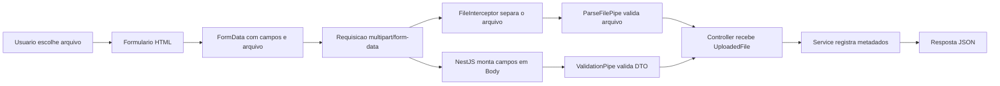

# Encontro 14

## Tema

Upload de arquivos e tratamento `multipart/form-data`.

## Objetivos

- Compreender por que upload de arquivos exige `multipart/form-data`.
- Diferenciar envio JSON de envio com `FormData`.
- Usar `FileInterceptor` para receber um arquivo em uma rota NestJS.
- Receber campos textuais e arquivo na mesma requisição.
- Validar metadados do arquivo, como tamanho e tipo.
- Relacionar o nome do campo do formulário ao nome esperado pelo interceptor.
- Testar upload pelo navegador, pelo DevTools e por `curl`.
- Identificar riscos comuns no upload de arquivos.
- Realizar a Prática 05 com evidências de funcionamento.

## Setup inicial

Use como base o projeto construído no encontro 13, com a API de inscrições e o formulário HTML já funcionando.

### Pré-requisitos

- projeto NestJS executando em `http://localhost:3000`;
- módulo `inscricoes` criado no encontro 13;
- `class-validator` e `class-transformer` instalados;
- `ValidationPipe` global configurado com `transform`, `whitelist` e `forbidNonWhitelisted`;
- CORS liberado para o cliente em `http://localhost:5500` e `http://127.0.0.1:5500`;
- cliente estático do encontro 13 servido por HTTP;
- navegador com DevTools;
- um arquivo pequeno para teste, preferencialmente PDF, PNG ou JPEG.

### Estrutura usada no encontro

Vamos evoluir a estrutura do encontro anterior:

```text
encontro-14/
├── api-inscricoes/
│   └── src/
│       └── inscricoes/
│           ├── dto/
│           ├── inscricoes.controller.ts
│           └── inscricoes.service.ts
└── cliente-inscricoes/
    ├── index.html
    └── app.js
```

A API continuará registrando inscrições, mas agora receberá também um comprovante enviado pelo usuário.

## Visão geral

No encontro 13, o formulário foi convertido em um objeto JavaScript, serializado com `JSON.stringify` e enviado como `application/json`.

Esse fluxo funciona bem para textos, números, booleanos, listas e objetos. Arquivos, porém, não cabem naturalmente em JSON. Um arquivo possui nome original, tipo MIME, tamanho e conteúdo binário. Para enviar campos textuais e arquivo na mesma requisição, o navegador usa `multipart/form-data`.

Neste encontro, o foco não é apenas "fazer upload". O objetivo é compreender como a requisição muda quando existe um arquivo, como o NestJS separa as partes do corpo e por que o backend precisa validar o arquivo com o mesmo cuidado aplicado aos DTOs.

## Pergunta central

Como receber, validar e processar um arquivo enviado por formulário sem perder o contrato dos demais campos da requisição?

## Retomada: `FormData` deixa de ser prévia e vira formato real de envio

No encontro 13, este trecho apareceu como prévia conceitual:

```js
const dadosFormulario = new FormData(formulario);

fetch('http://localhost:3000/inscricoes', {
  method: 'POST',
  body: dadosFormulario,
});
```

Agora esse formato será usado de fato.

Ao enviar `FormData`:

- o corpo da requisição passa a ser `multipart/form-data`;
- cada campo vira uma parte da requisição;
- o arquivo é enviado como uma parte com nome, tipo e conteúdo;
- o navegador gera automaticamente um `boundary`;
- o header `Content-Type` não deve ser definido manualmente;
- o NestJS precisa de um interceptor para processar multipart.

## Conceitos-base do encontro

### Upload

Upload é o envio de um arquivo do cliente para o servidor.

Exemplos comuns:

- foto de perfil;
- comprovante em PDF;
- imagem de capa;
- planilha;
- anexo de formulário.

No backend, o arquivo recebido não deve ser tratado como "só mais uma string". Ele precisa de validação própria.

### `multipart/form-data`

`multipart/form-data` é um formato de corpo HTTP dividido em partes.

Exemplo conceitual:

```text
POST /inscricoes/com-arquivo
Content-Type: multipart/form-data; boundary=----abc123

------abc123
Content-Disposition: form-data; name="nome"

Ana Lima
------abc123
Content-Disposition: form-data; name="comprovante"; filename="comprovante.pdf"
Content-Type: application/pdf

...conteúdo binário...
------abc123--
```

Cada parte possui metadados próprios. O `boundary` informa onde uma parte termina e a próxima começa.

### `boundary`

`boundary` é o delimitador usado para separar as partes do corpo multipart.

Quando o navegador envia `FormData`, ele monta um header parecido com:

```text
Content-Type: multipart/form-data; boundary=----WebKitFormBoundary...
```

Por isso, não defina manualmente:

```js
headers: {
  'Content-Type': 'multipart/form-data',
}
```

Se esse header for definido manualmente, o `boundary` pode não ser incluído corretamente e o servidor não conseguirá interpretar o corpo.

### Interceptor de arquivo

No NestJS, o `FileInterceptor` intercepta a requisição antes do método do controller e extrai um arquivo de um campo específico.

Exemplo:

```ts
@UseInterceptors(FileInterceptor('comprovante'))
```

Nesse caso, o arquivo precisa chegar em um campo chamado `comprovante`.

No HTML:

```html
<input name="comprovante" type="file">
```

No JavaScript:

```js
const formData = new FormData(formulario);
```

O nome do campo é parte do contrato.

## Fluxo completo: do arquivo ao controller



Leitura do fluxo:

- o formulário coleta campos textuais e arquivo;
- `FormData` preserva o arquivo como arquivo;
- o navegador envia uma requisição multipart;
- o `FileInterceptor` extrai o arquivo;
- o `ValidationPipe` valida os campos textuais;
- o `ParseFilePipe` valida o arquivo;
- o service registra a inscrição com metadados do arquivo.

## Diferença entre campos e arquivo

Em `multipart/form-data`, os campos textuais continuam chegando como texto.

| Parte da requisição | Onde aparece no NestJS | Atenção |
|---|---|---|
| `nome` | `@Body()` | string |
| `email` | `@Body()` | string |
| `idade` | `@Body()` | string antes da transformação |
| `aceitaTermos` | `@Body()` | string como `"true"` ou `"on"` |
| `interesses` | `@Body()` | string ou lista |
| `comprovante` | `@UploadedFile()` | objeto com metadados e conteúdo |

O DTO continua cuidando dos campos. O arquivo precisa de validação própria.

## Exemplo guiado: inscrição com comprovante

### Passo 1: instalar tipos do Multer

O NestJS usa Multer para processar `multipart/form-data` quando a aplicação roda com Express, que é o adaptador padrão.

Instale os tipos para ter `Express.Multer.File` no TypeScript:

```bash
npm i -D @types/multer
```

Se o projeto não possuir as dependências de validação do encontro 10, instale também:

```bash
npm i class-validator class-transformer
```

### Passo 2: reutilizar o DTO do encontro 13

O arquivo `src/inscricoes/dto/create-inscricao.dto.ts`, criado no encontro 13, já descreve o contrato dos campos textuais da inscrição:

- `nome`;
- `email`;
- `idade`;
- `aceitaTermos`;
- `interesses`;
- `observacoes`.

Esse contrato não muda apenas porque a requisição agora usa `multipart/form-data`.

A diferença do encontro 14 está no transporte da requisição e no tratamento do arquivo:

- os campos textuais continuam sendo recebidos por `@Body()` e validados pelo mesmo `CreateInscricaoDto`;
- o arquivo passa a ser recebido separadamente por `@UploadedFile()`;
- a validação do arquivo fica no `ParseFilePipeBuilder`, não no DTO.

Portanto, não crie um novo DTO idêntico. Reutilize o DTO já existente para manter o contrato mais simples e evitar duplicação.

### Passo 3: atualizar o service

Arquivo `src/inscricoes/inscricoes.service.ts`:

```ts
import { Injectable } from '@nestjs/common';
import { CreateInscricaoDto } from './dto/create-inscricao.dto';

type ArquivoRecebido = {
  nomeOriginal: string;
  tipo: string;
  tamanho: number;
};

type Inscricao = CreateInscricaoDto & {
  id: number;
  criadaEm: string;
  comprovante?: ArquivoRecebido;
};

@Injectable()
export class InscricoesService {
  private inscricoes: Inscricao[] = [];

  criar(dados: CreateInscricaoDto) {
    const novaInscricao: Inscricao = {
      id: this.inscricoes.length + 1,
      ...dados,
      criadaEm: new Date().toISOString(),
    };

    this.inscricoes.push(novaInscricao);
    return novaInscricao;
  }

  criarComArquivo(
    dados: CreateInscricaoDto,
    comprovante: Express.Multer.File,
  ) {
    const novaInscricao: Inscricao = {
      id: this.inscricoes.length + 1,
      ...dados,
      comprovante: {
        nomeOriginal: comprovante.originalname,
        tipo: comprovante.mimetype,
        tamanho: comprovante.size,
      },
      criadaEm: new Date().toISOString(),
    };

    this.inscricoes.push(novaInscricao);
    return novaInscricao;
  }

  listar() {
    return this.inscricoes;
  }
}
```

Neste encontro, o service registra apenas metadados do arquivo. O conteúdo binário não será salvo em banco nem em disco.

Em produção, a decisão de armazenamento precisa ser explícita:

- disco local;
- serviço de objetos, como S3 ou equivalente;
- banco de dados, apenas em casos específicos;
- armazenamento temporário para processamento.

### Passo 4: implementar a rota multipart

Arquivo `src/inscricoes/inscricoes.controller.ts`:

```ts
import {
  Body,
  Controller,
  Get,
  HttpStatus,
  ParseFilePipeBuilder,
  Post,
  UploadedFile,
  UseInterceptors,
} from '@nestjs/common';
import { FileInterceptor } from '@nestjs/platform-express';
import { CreateInscricaoDto } from './dto/create-inscricao.dto';
import { InscricoesService } from './inscricoes.service';

const TAMANHO_MAXIMO_COMPROVANTE = 2 * 1024 * 1024;

@Controller('inscricoes')
export class InscricoesController {
  constructor(private readonly inscricoesService: InscricoesService) {}

  @Post()
  criar(@Body() body: CreateInscricaoDto) {
    return this.inscricoesService.criar(body);
  }

  @Post('com-arquivo')
  @UseInterceptors(
    FileInterceptor('comprovante', {
      limits: {
        fileSize: TAMANHO_MAXIMO_COMPROVANTE,
      },
    }),
  )
  criarComArquivo(
    @Body() body: CreateInscricaoDto,
    @UploadedFile(
      new ParseFilePipeBuilder()
        .addFileTypeValidator({
          fileType: /^(application\/pdf|image\/png|image\/jpeg)$/,
        })
        .addMaxSizeValidator({
          maxSize: TAMANHO_MAXIMO_COMPROVANTE,
        })
        .build({
          errorHttpStatusCode: HttpStatus.UNPROCESSABLE_ENTITY,
        }),
    )
    comprovante: Express.Multer.File,
  ) {
    return this.inscricoesService.criarComArquivo(body, comprovante);
  }

  @Get()
  listar() {
    return this.inscricoesService.listar();
  }
}
```

Pontos principais:

- `FileInterceptor('comprovante')` procura o arquivo no campo `comprovante`;
- `limits.fileSize` limita o tamanho ainda no processamento multipart;
- `ParseFilePipeBuilder` valida o arquivo recebido;
- `FileTypeValidator` restringe os tipos aceitos;
- `MaxFileSizeValidator` restringe o tamanho;
- o status `422 Unprocessable Entity` diferencia arquivo inválido de erro estrutural comum do DTO;
- `@Body()` recebe os campos textuais;
- `@UploadedFile()` recebe o arquivo.

### Passo 5: revisar CORS e validação global

Arquivo `src/main.ts`:

```ts
import { ValidationPipe } from '@nestjs/common';
import { NestFactory } from '@nestjs/core';
import { AppModule } from './app.module';

async function bootstrap() {
  const app = await NestFactory.create(AppModule);

  app.enableCors({
    origin: ['http://localhost:5500', 'http://127.0.0.1:5500'],
  });

  app.useGlobalPipes(
    new ValidationPipe({
      whitelist: true,
      forbidNonWhitelisted: true,
      transform: true,
    }),
  );

  await app.listen(3000);
}
bootstrap();
```

A validação global continua necessária. O fato de o formulário enviar arquivo não dispensa o DTO dos campos textuais.

### Passo 6: atualizar o formulário HTML

Arquivo `cliente-inscricoes/index.html`:

```html
<!DOCTYPE html>
<html lang="pt-BR">
  <head>
    <meta charset="UTF-8">
    <meta name="viewport" content="width=device-width, initial-scale=1.0">
    <title>Inscrição com comprovante</title>
  </head>
  <body>
    <main>
      <h1>Inscrição com comprovante</h1>

      <form id="form-inscricao">
        <div>
          <label for="nome">Nome</label>
          <input id="nome" name="nome" type="text" required>
        </div>

        <div>
          <label for="email">E-mail</label>
          <input id="email" name="email" type="email" required>
        </div>

        <div>
          <label for="idade">Idade</label>
          <input id="idade" name="idade" type="number" min="16" required>
        </div>

        <fieldset>
          <legend>Interesses</legend>

          <label>
            <input name="interesses" type="checkbox" value="backend">
            Backend
          </label>

          <label>
            <input name="interesses" type="checkbox" value="docker">
            Docker
          </label>

          <label>
            <input name="interesses" type="checkbox" value="testes">
            Testes
          </label>
        </fieldset>

        <div>
          <label for="observacoes">Observações</label>
          <textarea id="observacoes" name="observacoes"></textarea>
        </div>

        <div>
          <label for="comprovante">Comprovante</label>
          <input
            id="comprovante"
            name="comprovante"
            type="file"
            accept="application/pdf,image/png,image/jpeg"
            required
          >
        </div>

        <label>
          <input id="aceitaTermos" name="aceitaTermos" type="checkbox" required>
          Aceito os termos da oficina
        </label>

        <button type="submit">Enviar inscrição</button>
      </form>

      <pre id="resultado" aria-live="polite"></pre>
    </main>

    <script src="app.js"></script>
  </body>
</html>
```

O atributo `accept` melhora a experiência no navegador, mas não substitui a validação no servidor.

### Passo 7: enviar `FormData` com `fetch`

Arquivo `cliente-inscricoes/app.js`:

```js
const formulario = document.querySelector('#form-inscricao');
const resultado = document.querySelector('#resultado');

formulario.addEventListener('submit', async (event) => {
  event.preventDefault();

  const formData = new FormData(formulario);

  const observacoes = String(formData.get('observacoes') ?? '').trim();
  if (!observacoes) {
    formData.delete('observacoes');
  }

  formData.set(
    'aceitaTermos',
    formulario.elements.aceitaTermos.checked ? 'true' : 'false',
  );

  console.log('Campos enviados:');
  for (const [chave, valor] of formData.entries()) {
    console.log(chave, valor);
  }

  try {
    const resposta = await fetch(
      'http://localhost:3000/inscricoes/com-arquivo',
      {
        method: 'POST',
        body: formData,
      },
    );

    const corpo = await resposta.json();

    if (!resposta.ok) {
      resultado.textContent = JSON.stringify(
        {
          status: resposta.status,
          erro: corpo,
        },
        null,
        2,
      );
      return;
    }

    resultado.textContent = JSON.stringify(corpo, null, 2);
    formulario.reset();
  } catch (erro) {
    resultado.textContent = JSON.stringify(
      {
        mensagem: 'Não foi possível acessar a API',
        detalhe: erro.message,
      },
      null,
      2,
    );
  }
});
```

Observe que não há header `Content-Type`.

O navegador faz isso:

- detecta que o corpo é `FormData`;
- monta o `multipart/form-data`;
- gera o `boundary`;
- inclui o arquivo selecionado;
- envia os campos textuais como partes da mesma requisição.

### Passo 8: servir o frontend

Use o mesmo procedimento do encontro 13:

```bash
npx serve cliente-inscricoes -l 5500
```

Depois, acesse:

```text
http://localhost:5500
```

Se estiver usando Docker com Nginx, a configuração do encontro 13 continua válida.

## Inspecionando a requisição no DevTools

No navegador:

1. Abra as ferramentas de desenvolvimento.
2. Acesse a aba **Network**.
3. Envie o formulário com um arquivo válido.
4. Selecione a requisição `POST /inscricoes/com-arquivo`.
5. Confira **Headers**, **Payload**, **Response** e **Status**.

Perguntas para orientar a inspeção:

- o `Content-Type` possui `multipart/form-data`?
- existe um `boundary` no header?
- o campo do arquivo se chama `comprovante`?
- os demais campos aparecem no payload?
- o arquivo aparece com nome e tipo?
- o status foi `201`, `400` ou `422`?
- a resposta traz metadados do arquivo?

## Testando a API sem o formulário

### Upload válido

Use um arquivo real existente no computador.

```bash
curl -i -X POST http://localhost:3000/inscricoes/com-arquivo \
  -F "nome=Ana Lima" \
  -F "email=ana@example.com" \
  -F "idade=22" \
  -F "aceitaTermos=true" \
  -F "interesses=backend" \
  -F "interesses=docker" \
  -F "comprovante=@./comprovante.pdf;type=application/pdf"
```

Resultado esperado:

- status `201 Created`;
- corpo com dados da inscrição;
- metadados do arquivo em `comprovante`;
- ausência do conteúdo binário na resposta.

### Arquivo ausente

```bash
curl -i -X POST http://localhost:3000/inscricoes/com-arquivo \
  -F "nome=Ana Lima" \
  -F "email=ana@example.com" \
  -F "idade=22" \
  -F "aceitaTermos=true" \
  -F "interesses=backend"
```

Resultado esperado:

- status de erro;
- mensagem informando que o arquivo era esperado.

### Tipo não permitido

```bash
curl -i -X POST http://localhost:3000/inscricoes/com-arquivo \
  -F "nome=Ana Lima" \
  -F "email=ana@example.com" \
  -F "idade=22" \
  -F "aceitaTermos=true" \
  -F "interesses=backend" \
  -F "comprovante=@./arquivo.txt;type=text/plain"
```

Resultado esperado:

- status `422 Unprocessable Entity`;
- mensagem de validação do arquivo.

### Campo com nome errado

```bash
curl -i -X POST http://localhost:3000/inscricoes/com-arquivo \
  -F "nome=Ana Lima" \
  -F "email=ana@example.com" \
  -F "idade=22" \
  -F "aceitaTermos=true" \
  -F "interesses=backend" \
  -F "arquivo=@./comprovante.pdf;type=application/pdf"
```

Resultado esperado:

- o interceptor não encontrará o campo `comprovante`;
- a API deve responder erro de arquivo ausente.

## Validação do arquivo x validação do DTO

São duas responsabilidades diferentes.

O DTO responde:

- o nome foi preenchido?
- o e-mail é válido?
- a idade é um número inteiro permitido?
- os termos foram aceitos?
- os interesses formam uma lista?

A validação do arquivo responde:

- existe arquivo?
- o tamanho está dentro do limite?
- o tipo é aceito?
- o campo do formulário tem o nome esperado?

Um payload pode falhar em uma das duas validações ou nas duas.

## Segurança básica em upload

Upload é uma área sensível porque o servidor passa a receber conteúdo criado fora do seu controle.

Cuidados mínimos:

- limitar tamanho;
- limitar tipos aceitos;
- não confiar apenas na extensão do arquivo;
- não executar arquivos enviados por usuários;
- não salvar com o nome original sem tratamento;
- evitar expor uploads diretamente sem controle;
- armazenar somente o necessário;
- registrar metadados relevantes;
- revisar permissões do diretório de upload quando houver gravação em disco;
- usar armazenamento apropriado em produção.

No laboratório, a API não salvará o conteúdo do arquivo. Isso reduz o risco e mantém o foco na compreensão do fluxo multipart.

## Erros comuns e como corrigir

### Erro: definir `Content-Type` manualmente com `FormData`

Sintoma: a API não consegue interpretar o corpo multipart.

Código problemático:

```js
fetch(url, {
  method: 'POST',
  headers: {
    'Content-Type': 'multipart/form-data',
  },
  body: formData,
});
```

Correção:

```js
fetch(url, {
  method: 'POST',
  body: formData,
});
```

### Erro: usar nome de campo diferente no HTML e no interceptor

Sintoma: o arquivo foi selecionado, mas `@UploadedFile()` chega vazio.

Correção:

- no HTML, usar `name="comprovante"`;
- no controller, usar `FileInterceptor('comprovante')`;
- no `curl`, usar `-F "comprovante=@arquivo.pdf"`.

### Erro: esperar arquivo dentro de `@Body()`

Sintoma: os campos chegam, mas o arquivo não aparece no DTO.

Correção:

- receber campos textuais com `@Body()`;
- receber o arquivo com `@UploadedFile()`.

### Erro: confiar apenas no `accept` do HTML

Sintoma: o navegador sugere tipos aceitos, mas a API aceita qualquer arquivo enviado por outro cliente.

Correção:

- manter `accept` para ajudar o usuário;
- validar tipo e tamanho no NestJS.

### Erro: retornar o `buffer` do arquivo na resposta

Sintoma: a resposta fica grande, confusa ou expõe conteúdo desnecessário.

Correção:

- retornar apenas metadados;
- armazenar o arquivo em local adequado quando necessário;
- retornar um identificador ou URL controlada.

### Erro: salvar arquivo usando o nome original sem tratamento

Sintoma: colisão de nomes, caracteres problemáticos ou risco de path traversal.

Correção:

- gerar nome interno próprio;
- guardar o nome original apenas como metadado;
- validar e normalizar extensões quando houver armazenamento.

### Erro: esquecer que campos multipart chegam como texto

Sintoma: `idade`, `aceitaTermos` ou `interesses` falham na validação.

Correção:

- manter transforms no DTO;
- testar com `curl -F`;
- inspecionar o payload no DevTools.

## Laboratório guiado

### Proposta

Evoluir a API de inscrições para aceitar um comprovante junto aos dados do formulário, usando `multipart/form-data`.

### Etapas

1. Instale `@types/multer`.
2. Reutilize o DTO `CreateInscricaoDto` criado no encontro 13.
3. Crie uma rota `POST /inscricoes/com-arquivo`.
4. Aplique `FileInterceptor('comprovante')`.
5. Valide tipo e tamanho do arquivo com `ParseFilePipeBuilder`.
6. Atualize o service para registrar metadados do arquivo.
7. Atualize o formulário HTML com `input type="file"`.
8. Envie o formulário com `FormData`.
9. Inspecione a requisição no DevTools.
10. Teste cenários válidos e inválidos com `curl`.

### Variações para investigação

Faça uma alteração por vez e registre o resultado:

- remova o arquivo antes de enviar;
- envie um `.txt`;
- envie um arquivo maior que o limite;
- troque `name="comprovante"` por outro nome;
- defina manualmente o `Content-Type`;
- remova o transform de `aceitaTermos`;
- envie apenas um interesse;
- envie a mesma requisição por `curl`.

Para cada caso, responda:

1. O erro ocorreu no cliente, no multipart, no interceptor, no DTO ou na validação do arquivo?
2. A requisição chegou ao método do controller?
3. Qual status HTTP foi retornado?
4. Qual ajuste mantém o contrato mais explícito?

## Prática de laboratório (Prática 05)

### Proposta

Implementar upload de comprovante na API de inscrições, com validação de arquivo e formulário funcional no navegador.

### Requisitos da prática

- manter a rota JSON do encontro 13 funcionando;
- criar a rota `POST /inscricoes/com-arquivo`;
- receber campos textuais com o DTO `CreateInscricaoDto`;
- receber o arquivo com `@UploadedFile()`;
- validar arquivo obrigatório;
- aceitar apenas PDF, PNG ou JPEG;
- limitar o arquivo a 2 MB;
- retornar metadados do arquivo, não o conteúdo binário;
- enviar o formulário com `FormData`;
- não definir manualmente `Content-Type` no `fetch`;
- testar pelo navegador e por `curl`;
- executar `npm run lint`;
- registrar commits no Git com mensagens semânticas.

### Entrega

Apresentar:

- código atualizado de `inscricoes.controller.ts`;
- uso do `CreateInscricaoDto` na rota multipart;
- trecho do formulário com `input type="file"`;
- trecho do `fetch` usando `FormData`;
- evidência de upload válido com status `201`;
- evidência de arquivo inválido com erro;
- evidência de execução do `lint`;
- link do repositório GitHub com histórico de commits.

## Checklist de aprendizagem

Ao final, confirme se você consegue:

- explicar por que JSON não é o formato ideal para upload;
- explicar o papel do `boundary` em `multipart/form-data`;
- usar `FormData` sem definir `Content-Type` manualmente;
- relacionar `name` do formulário com `FileInterceptor`;
- diferenciar `@Body()` de `@UploadedFile()`;
- validar campos textuais com o DTO reaproveitado;
- validar arquivo com pipe específico;
- testar upload com navegador e `curl`;
- interpretar respostas `201`, `400` e `422`;
- citar riscos básicos de upload de arquivos.

## Fechamento e verificação

Demonstre ao final do encontro:

- formulário enviando inscrição com arquivo válido;
- requisição multipart visível na aba Network;
- resposta `201` com metadados do arquivo;
- erro provocado por arquivo ausente;
- erro provocado por tipo não permitido;
- explicação breve do papel do `FileInterceptor`.

## Critérios de sucesso

Considere a prática concluída quando:

- o backend recebe campos e arquivo na mesma requisição;
- o DTO continua validando os campos textuais;
- o arquivo é validado por tipo e tamanho;
- o cliente envia `FormData` corretamente;
- os erros são reproduzíveis e compreendidos;
- a solução preserva a organização em módulo, controller, service e DTOs.

## Síntese do encontro

Você estudou que:

- upload de arquivos usa `multipart/form-data`;
- `FormData` deve ser enviado sem header `Content-Type` manual;
- o navegador gera o `boundary`;
- `FileInterceptor` extrai o arquivo de um campo específico;
- `@Body()` e `@UploadedFile()` têm responsabilidades diferentes;
- campos textuais de multipart ainda precisam de transformação e validação;
- arquivos exigem validação própria;
- o nome original, o tipo e o tamanho são metadados úteis;
- salvar arquivos em produção exige uma estratégia explícita de armazenamento;
- o tratamento de arquivos prepara o caminho para discutir estado, cookies e sessão no encontro 15.
