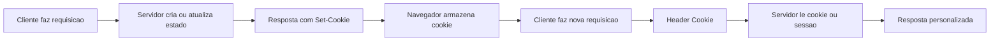

# Encontro 15

## Tema

Cookies, sessão e estado no backend.

## Objetivos

- Compreender por que HTTP é stateless.
- Diferenciar estado no cliente, cookie e sessão no servidor.
- Enviar cookies a partir do NestJS.
- Ler cookies recebidos em novas requisições.
- Configurar `cookie-parser` e `express-session`.
- Usar `credentials: 'include'` no `fetch` quando houver cookies entre origens diferentes.
- Configurar CORS com credenciais de forma explícita.
- Inspecionar cookies no DevTools.
- Testar estado com `curl` usando cookie jar.
- Preparar a base conceitual para autenticação e autorização no encontro 16.

## Setup inicial

Use como base o projeto NestJS dos encontros 13 e 14.

Link: https://github.com/luciano-alexandre/api-backend 

### Pré-requisitos

- projeto NestJS executando em `http://localhost:3000`;
- cliente estático servido em `http://localhost:5500`;
- `ValidationPipe` global configurado;
- navegador com DevTools;
- cliente HTTP opcional (`curl`, Thunder Client, Insomnia ou Postman);
- noções de requisição e resposta HTTP dos encontros anteriores.

### Estrutura usada no encontro

Vamos criar um módulo separado para observar estado:

```text
encontro-15/
├── api-inscricoes/
│   └── src/
│       ├── estado/
│       │   ├── dto/
│       │   ├── estado.controller.ts
│       │   └── estado.module.ts
│       └── types/
│           └── express-session.d.ts
└── cliente-estado/
    ├── index.html
    └── app.js
```

O objetivo do módulo `estado` é didático: gravar preferências em cookie, contar visitas em sessão e observar como o navegador carrega esse estado entre requisições.

## Visão geral

Até aqui, cada requisição foi tratada como uma unidade independente. O cliente enviava todos os dados necessários, a API processava e devolvia uma resposta.

Esse modelo é coerente com HTTP: por padrão, o protocolo não lembra automaticamente quem fez a requisição anterior. Cada chamada chega ao servidor como uma nova mensagem.

Aplicações reais, porém, frequentemente precisam de continuidade:

- lembrar uma preferência de tema;
- manter um carrinho;
- identificar uma sessão iniciada;
- contar tentativas;
- preservar uma etapa de fluxo;
- associar várias requisições ao mesmo usuário.

Cookies e sessões são mecanismos clássicos para criar essa continuidade.

## Pergunta central

Como uma API consegue reconhecer que duas requisições vieram do mesmo navegador sem exigir que todos os dados sejam reenviados manualmente no corpo da requisição?

## Retomada: payload não é o único lugar por onde dados viajam

Nos encontros 13 e 14, o foco esteve no corpo da requisição:

- JSON no encontro 13;
- `multipart/form-data` no encontro 14.

Agora vamos observar outro caminho: headers HTTP.

Quando o servidor envia:

```text
Set-Cookie: tema=escuro; Path=/; HttpOnly
```

O navegador pode armazenar esse valor.

Em uma requisição posterior para o mesmo servidor, o navegador envia:

```text
Cookie: tema=escuro
```

Nesse fluxo, o dado não está no JSON nem no multipart. Ele viaja em headers.

## Conceitos-base do encontro

### Stateless

HTTP é stateless porque uma requisição não carrega automaticamente memória das anteriores.

Exemplo:

```text
GET /inscricoes
GET /inscricoes
GET /inscricoes
```

O servidor recebe três requisições. Sem algum identificador adicional, ele não sabe se vieram do mesmo navegador, de três navegadores diferentes ou de um programa automatizado.

### Cookie

Cookie é um pequeno dado associado a um site e armazenado pelo navegador.

Fluxo básico:

```text
Servidor -> Set-Cookie -> Navegador armazena
Navegador -> Cookie -> Servidor lê
```

Um cookie pode armazenar dados simples, como:

- preferência de tema;
- idioma;
- identificador de sessão;
- marcador temporário.

Cookies não devem armazenar dados sensíveis em texto claro.

### Sessão

Sessão é um estado mantido no servidor e associado a um identificador enviado ao navegador.

Fluxo típico:

```text
Servidor cria sessão 123
Servidor envia cookie sid=123
Navegador envia sid=123 nas próximas requisições
Servidor usa sid=123 para encontrar dados da sessão
```

O cookie carrega o identificador. Os dados principais ficam no servidor.

### Cookie x sessão

| Aspecto | Cookie | Sessão |
|---|---|---|
| Onde o dado fica | navegador | servidor |
| O que viaja na requisição | nome e valor do cookie | cookie com id da sessão |
| Exemplo | `tema=escuro` | `sid=abc123` |
| Risco principal | expor dados no cliente | depender de armazenamento no servidor |
| Uso comum | preferências simples | continuidade de usuário |

Na prática, sessões normalmente usam cookies para transportar o identificador da sessão.

### Atributos importantes de cookie

| Atributo | Papel |
|---|---|
| `HttpOnly` | impede leitura por `document.cookie` |
| `Secure` | envia apenas em HTTPS, exceto particularidades de localhost |
| `SameSite` | controla envio em contextos cross-site |
| `Max-Age` | define duração em segundos |
| `Path` | limita caminhos em que o cookie será enviado |
| `Domain` | define escopo de domínio quando necessário |

Para dados ligados a sessão, `HttpOnly` é uma proteção importante contra leitura por JavaScript em caso de XSS.

## Fluxo completo: cookie e sessão



Leitura do fluxo:

- a primeira requisição pode não ter cookies;
- o servidor envia `Set-Cookie`;
- o navegador armazena o cookie;
- as próximas requisições incluem `Cookie`;
- o backend usa esse dado para recuperar estado.

## Exemplo guiado: preferências e sessão de laboratório

### Passo 1: instalar dependências

No projeto NestJS:

```bash
npm i cookie-parser express-session
npm i -D @types/cookie-parser @types/express-session
```

Essas dependências serão usadas com Express, o adaptador padrão do NestJS.

### Passo 2: configurar cookies, sessão e CORS

Arquivo `src/main.ts`:

```ts
import { ValidationPipe } from '@nestjs/common';
import { NestFactory } from '@nestjs/core';
import * as cookieParser from 'cookie-parser';
import * as session from 'express-session';
import { AppModule } from './app.module';

async function bootstrap() {
  const app = await NestFactory.create(AppModule);

  app.enableCors({
    origin: ['http://localhost:5500', 'http://127.0.0.1:5500'],
    credentials: true,
  });

  app.use(cookieParser('segredo-didatico-de-cookies'));

  app.use(
    session({
      name: 'sid',
      secret: 'segredo-didatico-de-sessao',
      resave: false,
      saveUninitialized: false,
      cookie: {
        httpOnly: true,
        sameSite: 'lax',
        secure: false,
        maxAge: 1000 * 60 * 30,
      },
    }),
  );

  app.useGlobalPipes(
    new ValidationPipe({
      whitelist: true,
      forbidNonWhitelisted: true,
      transform: true,
    }),
  );

  await app.listen(3000);
}
bootstrap();
```

Pontos principais:

- `cookieParser` permite ler cookies recebidos;
- `express-session` cria e mantém sessões;
- `credentials: true` permite cookies em requisições CORS;
- `origin` precisa ser explícito quando há credenciais;
- `secure: false` é usado apenas porque o laboratório roda em HTTP local;
- `saveUninitialized: false` evita criar sessão antes de ela ser modificada.

Em produção:

- use segredo forte vindo de variável de ambiente;
- use HTTPS;
- considere `secure: true`;
- use store externo para sessão;
- não use o armazenamento em memória padrão do `express-session`.

### Passo 3: declarar tipos da sessão

Arquivo `src/types/express-session.d.ts`:

```ts
import 'express-session';

declare module 'express-session' {
  interface SessionData {
    visitas?: number;
    iniciadaEm?: string;
    usuario?: {
      nome: string;
      email?: string;
    };
  }
}
```

Esse arquivo informa ao TypeScript quais propriedades didáticas serão gravadas em `request.session`.

### Passo 4: gerar o módulo de estado

No projeto NestJS:

```bash
npx nest g module estado
npx nest g controller estado
```

Crie também:

```text
src/estado/dto/
```

### Passo 5: criar DTOs

Arquivo `src/estado/dto/salvar-preferencias.dto.ts`:

```ts
import { IsIn } from 'class-validator';

export class SalvarPreferenciasDto {
  @IsIn(['claro', 'escuro', 'sistema'])
  tema: 'claro' | 'escuro' | 'sistema';
}
```

Arquivo `src/estado/dto/identificar-usuario.dto.ts`:

```ts
import { IsEmail, IsNotEmpty, IsOptional, IsString } from 'class-validator';

export class IdentificarUsuarioDto {
  @IsString()
  @IsNotEmpty()
  nome: string;

  @IsOptional()
  @IsEmail()
  email?: string;
}
```

Mesmo em um laboratório de estado, o corpo das requisições continua passando por DTO.

### Passo 6: implementar o controller

Arquivo `src/estado/estado.controller.ts`:

```ts
import {
  Body,
  Controller,
  Get,
  InternalServerErrorException,
  Post,
  Req,
  Res,
  Session,
} from '@nestjs/common';
import type { Request, Response } from 'express';
import type { SessionData } from 'express-session';
import { IdentificarUsuarioDto } from './dto/identificar-usuario.dto';
import { SalvarPreferenciasDto } from './dto/salvar-preferencias.dto';

const UMA_SEMANA = 1000 * 60 * 60 * 24 * 7;

@Controller('estado')
export class EstadoController {
  @Post('preferencias')
  salvarPreferencias(
    @Body() body: SalvarPreferenciasDto,
    @Res({ passthrough: true }) response: Response,
  ) {
    response.cookie('tema', body.tema, {
      httpOnly: true,
      sameSite: 'lax',
      secure: false,
      maxAge: UMA_SEMANA,
      path: '/',
    });

    return {
      mensagem: 'Preferências salvas',
      tema: body.tema,
    };
  }

  @Get('preferencias')
  lerPreferencias(@Req() request: Request) {
    return {
      tema: request.cookies?.tema ?? 'sistema',
    };
  }

  @Post('identificacao')
  identificar(
    @Body() body: IdentificarUsuarioDto,
    @Session() session: SessionData,
  ) {
    session.usuario = {
      nome: body.nome,
      ...(body.email && { email: body.email }),
    };

    session.iniciadaEm ??= new Date().toISOString();

    return {
      mensagem: 'Sessão atualizada',
      usuario: session.usuario,
      iniciadaEm: session.iniciadaEm,
    };
  }

  @Get('sessao')
  verSessao(@Req() request: Request, @Session() session: SessionData) {
    session.visitas = (session.visitas ?? 0) + 1;
    session.iniciadaEm ??= new Date().toISOString();

    return {
      sessionId: request.sessionID,
      visitas: session.visitas,
      iniciadaEm: session.iniciadaEm,
      usuario: session.usuario ?? null,
      tema: request.cookies?.tema ?? null,
    };
  }

  @Post('sair')
  sair(
    @Req() request: Request,
    @Res({ passthrough: true }) response: Response,
  ) {
    return new Promise<{ mensagem: string }>((resolve, reject) => {
      request.session.destroy((erro) => {
        if (erro) {
          reject(
            new InternalServerErrorException(
              'Não foi possível encerrar a sessão',
            ),
          );
          return;
        }

        response.clearCookie('sid', { path: '/' });
        response.clearCookie('tema', { path: '/' });

        resolve({
          mensagem: 'Sessão encerrada',
        });
      });
    });
  }
}
```

Leitura do controller:

1. `POST /estado/preferencias` grava um cookie `tema`.
2. `GET /estado/preferencias` lê o cookie recebido.
3. `POST /estado/identificacao` grava dados na sessão.
4. `GET /estado/sessao` incrementa o contador de visitas da sessão.
5. `POST /estado/sair` destrói a sessão e limpa cookies do laboratório.

O cookie `tema` possui `HttpOnly`, portanto não será lido por `document.cookie`. Ele deve ser observado pelo DevTools ou pelo backend.

### Passo 7: criar o cliente HTML

Arquivo `cliente-estado/index.html`:

```html
<!DOCTYPE html>
<html lang="pt-BR">
  <head>
    <meta charset="UTF-8">
    <meta name="viewport" content="width=device-width, initial-scale=1.0">
    <title>Estado no backend</title>
  </head>
  <body>
    <main>
      <h1>Estado no backend</h1>

      <section>
        <h2>Preferências</h2>

        <form id="form-preferencias">
          <label for="tema">Tema</label>
          <select id="tema" name="tema">
            <option value="sistema">Sistema</option>
            <option value="claro">Claro</option>
            <option value="escuro">Escuro</option>
          </select>

          <button type="submit">Salvar preferência</button>
        </form>
      </section>

      <section>
        <h2>Identificação da sessão</h2>

        <form id="form-identificacao">
          <div>
            <label for="nome">Nome</label>
            <input id="nome" name="nome" type="text" required>
          </div>

          <div>
            <label for="email">E-mail</label>
            <input id="email" name="email" type="email">
          </div>

          <button type="submit">Identificar sessão</button>
        </form>
      </section>

      <section>
        <h2>Ações</h2>

        <button id="btn-ver-sessao" type="button">Ver sessão</button>
        <button id="btn-ler-preferencias" type="button">Ler preferências</button>
        <button id="btn-sair" type="button">Sair</button>
      </section>

      <pre id="resultado" aria-live="polite"></pre>
    </main>

    <script src="app.js"></script>
  </body>
</html>
```

### Passo 8: usar `fetch` com credenciais

Arquivo `cliente-estado/app.js`:

```js
const API_URL = 'http://localhost:3000/estado';

const formPreferencias = document.querySelector('#form-preferencias');
const formIdentificacao = document.querySelector('#form-identificacao');
const btnVerSessao = document.querySelector('#btn-ver-sessao');
const btnLerPreferencias = document.querySelector('#btn-ler-preferencias');
const btnSair = document.querySelector('#btn-sair');
const resultado = document.querySelector('#resultado');

async function chamarApi(caminho, opcoes = {}) {
  const resposta = await fetch(`${API_URL}${caminho}`, {
    credentials: 'include',
    ...opcoes,
    headers: {
      Accept: 'application/json',
      ...(opcoes.headers ?? {}),
    },
  });

  const corpo = await resposta.json().catch(() => null);

  resultado.textContent = JSON.stringify(
    {
      status: resposta.status,
      ok: resposta.ok,
      corpo,
    },
    null,
    2,
  );

  return corpo;
}

formPreferencias.addEventListener('submit', async (event) => {
  event.preventDefault();

  const dados = new FormData(formPreferencias);
  const payload = {
    tema: dados.get('tema'),
  };

  await chamarApi('/preferencias', {
    method: 'POST',
    headers: {
      'Content-Type': 'application/json',
    },
    body: JSON.stringify(payload),
  });
});

formIdentificacao.addEventListener('submit', async (event) => {
  event.preventDefault();

  const dados = new FormData(formIdentificacao);
  const email = String(dados.get('email') ?? '').trim();

  const payload = {
    nome: String(dados.get('nome') ?? '').trim(),
    ...(email && { email }),
  };

  await chamarApi('/identificacao', {
    method: 'POST',
    headers: {
      'Content-Type': 'application/json',
    },
    body: JSON.stringify(payload),
  });
});

btnVerSessao.addEventListener('click', async () => {
  await chamarApi('/sessao');
});

btnLerPreferencias.addEventListener('click', async () => {
  await chamarApi('/preferencias');
});

btnSair.addEventListener('click', async () => {
  await chamarApi('/sair', {
    method: 'POST',
  });
});
```

O ponto essencial é:

```js
credentials: 'include'
```

Sem essa opção, o `fetch` não envia cookies para outra origem e também pode não respeitar cookies definidos pela resposta.

Neste laboratório:

- cliente: `http://localhost:5500`;
- API: `http://localhost:3000`;
- as origens são diferentes por causa da porta;
- por isso, CORS e credenciais precisam estar alinhados.

### Passo 9: servir o cliente

```bash
npx serve cliente-estado -l 5500
```

Acesse:

```text
http://localhost:5500
```

## Inspecionando cookies no DevTools

No navegador:

1. Abra as ferramentas de desenvolvimento.
2. Acesse **Network**.
3. Envie uma preferência.
4. Abra a requisição `POST /estado/preferencias`.
5. Procure o header `Set-Cookie` na resposta.
6. Faça uma nova requisição.
7. Procure o header `Cookie` na requisição.
8. Acesse **Application** ou **Storage**.
9. Abra a seção de cookies.
10. Confira os cookies associados a `localhost`.

Perguntas para orientar a inspeção:

- a resposta trouxe `Set-Cookie`?
- a próxima requisição trouxe `Cookie`?
- o cookie `tema` aparece como `HttpOnly`?
- o cookie `sid` foi criado apenas após mexer na sessão?
- o contador de visitas aumenta?
- o valor de `sessionId` permanece igual?
- o que muda depois de clicar em `Sair`?

## Testando com `curl`

Navegadores gerenciam cookies automaticamente. No `curl`, precisamos pedir explicitamente para salvar e reenviar cookies.

### Criar cookie de preferência

```bash
curl -i -c cookies.txt -b cookies.txt \
  -X POST http://localhost:3000/estado/preferencias \
  -H "Content-Type: application/json" \
  -d '{"tema":"escuro"}'
```

### Ler preferência usando o mesmo cookie jar

```bash
curl -i -c cookies.txt -b cookies.txt \
  http://localhost:3000/estado/preferencias
```

Resultado esperado:

- a API responde `tema: "escuro"`;
- o arquivo `cookies.txt` guarda os cookies recebidos.

### Identificar sessão

```bash
curl -i -c cookies.txt -b cookies.txt \
  -X POST http://localhost:3000/estado/identificacao \
  -H "Content-Type: application/json" \
  -d '{"nome":"Ana Lima","email":"ana@example.com"}'
```

### Ver sessão mais de uma vez

```bash
curl -i -c cookies.txt -b cookies.txt \
  http://localhost:3000/estado/sessao
```

Repita o comando. O contador `visitas` deve aumentar.

### Encerrar sessão

```bash
curl -i -c cookies.txt -b cookies.txt \
  -X POST http://localhost:3000/estado/sair
```

Depois, chame `GET /estado/sessao` novamente e observe que uma nova sessão pode ser criada.

## Estado no cliente x estado no servidor

Existem várias formas de manter continuidade.

| Estratégia | Exemplo | Observação |
|---|---|---|
| Estado no cliente | variável JS, `localStorage` | não viaja automaticamente em toda requisição |
| Cookie simples | `tema=escuro` | viaja automaticamente para o servidor |
| Sessão | `sid` aponta para dados no servidor | útil para fluxos com continuidade |
| Token | JWT ou outro token | será estudado nos encontros de autenticação |

Cookies e sessões não substituem autenticação. Eles apenas criam base para manter estado entre requisições.

## CORS com credenciais

Quando o frontend está em uma origem e a API em outra, o navegador exige alinhamento entre cliente e servidor.

No cliente:

```js
fetch('http://localhost:3000/estado/sessao', {
  credentials: 'include',
});
```

No servidor:

```ts
app.enableCors({
  origin: ['http://localhost:5500', 'http://127.0.0.1:5500'],
  credentials: true,
});
```

Com credenciais, não use:

```ts
app.enableCors({
  origin: '*',
  credentials: true,
});
```

O navegador bloqueia esse cenário porque credenciais exigem origem explícita.

## Segurança básica em cookies e sessão

Cuidados mínimos:

- não guardar senha, documento ou segredo pessoal em cookie simples;
- usar `HttpOnly` para cookies ligados a sessão;
- usar HTTPS em produção;
- usar `Secure` quando houver HTTPS;
- configurar `SameSite` conscientemente;
- usar segredo forte para assinar sessão;
- não usar segredo fixo no código em produção;
- limitar duração da sessão;
- encerrar sessão no logout;
- usar store externo em produção;
- lembrar que cookies podem participar de ataques CSRF.

Este encontro é uma base. Autenticação, autorização, hash de senha, guards e JWT serão tratados nos próximos encontros.

## Erros comuns e como corrigir

### Erro: esquecer `credentials: 'include'`

Sintoma: o servidor envia `Set-Cookie`, mas a próxima requisição não mantém estado.

Correção:

```js
fetch(url, {
  credentials: 'include',
});
```

### Erro: usar CORS com `origin: '*'` e credenciais

Sintoma: o navegador bloqueia a requisição por política de CORS.

Correção:

```ts
app.enableCors({
  origin: ['http://localhost:5500'],
  credentials: true,
});
```

### Erro: tentar ler cookie `HttpOnly` com JavaScript

Sintoma: `document.cookie` não mostra o cookie esperado.

Correção:

- verificar o cookie pelo DevTools;
- ler o cookie no backend;
- manter `HttpOnly` quando o cookie estiver ligado a sessão.

### Erro: esperar que o cookie seja salvo por clientes HTTP automaticamente

Sintoma: no `curl`, a sessão reinicia a cada comando.

Correção:

```bash
curl -c cookies.txt -b cookies.txt http://localhost:3000/estado/sessao
```

### Erro: usar `secure: true` em HTTP local

Sintoma: o cookie não aparece no laboratório local.

Correção:

- em HTTP local, usar `secure: false`;
- em produção com HTTPS, revisar `secure: true`.

### Erro: confundir sessão com autenticação

Sintoma: a aplicação considera qualquer sessão como usuário autenticado.

Correção:

- sessão guarda continuidade;
- autenticação comprova identidade;
- autorização define permissões;
- os próximos encontros vão separar essas responsabilidades.

### Erro: usar MemoryStore em produção

Sintoma: perda de sessão ao reiniciar, problemas de escala ou consumo crescente de memória.

Correção:

- usar MemoryStore apenas no laboratório;
- em produção, usar store externo apropriado.

## Laboratório guiado

### Proposta

Construir um pequeno módulo de estado para observar cookies e sessão em funcionamento no NestJS.

### Etapas

1. Instale `cookie-parser` e `express-session`.
2. Configure CORS com `credentials: true`.
3. Configure `cookieParser` e `session` no `main.ts`.
4. Crie o arquivo de tipos da sessão.
5. Crie o módulo `estado`.
6. Crie DTOs para preferência e identificação.
7. Implemente rotas de preferência, sessão e saída.
8. Crie o cliente HTML.
9. Use `fetch` com `credentials: 'include'`.
10. Inspecione `Set-Cookie` e `Cookie` no DevTools.
11. Teste o mesmo fluxo com `curl` usando `cookies.txt`.

### Variações para investigação

Faça uma alteração por vez e registre o resultado:

- remova `credentials: 'include'` do cliente;
- troque `credentials: true` por `false` no CORS;
- tente usar `origin: '*'` com credenciais;
- remova `HttpOnly` do cookie `tema`;
- altere `saveUninitialized` para `true`;
- apague os cookies pelo DevTools;
- chame os endpoints em aba anônima;
- use `curl` sem `-c` e `-b`;
- clique em `Sair` e observe a sessão seguinte.

Para cada caso, responda:

1. O problema ocorreu no cliente, no CORS, no cookie ou na sessão?
2. O cookie foi salvo pelo navegador?
3. A próxima requisição enviou o header `Cookie`?
4. O backend recebeu a mesma sessão?

## Prática de laboratório (Prática 06)

### Proposta

Implementar um fluxo simples de estado no backend com cookie de preferência e sessão de usuário visitante.

### Requisitos da prática

- instalar `cookie-parser` e `express-session`;
- configurar CORS com origem explícita e credenciais;
- criar módulo `estado`;
- criar DTOs para preferência e identificação;
- criar rota para salvar cookie de tema;
- criar rota para ler cookie de tema;
- criar rota para identificar a sessão;
- criar rota para consultar sessão e incrementar visitas;
- criar rota para encerrar sessão;
- usar `HttpOnly` nos cookies do laboratório;
- usar `fetch` com `credentials: 'include'`;
- testar o fluxo no navegador;
- testar o fluxo com `curl` e cookie jar;
- executar `npm run lint`;
- registrar commits no Git com mensagens semânticas.

### Entrega

Apresentar:

- configuração de `main.ts`;
- código de `estado.controller.ts`;
- DTOs do módulo `estado`;
- trecho do cliente com `credentials: 'include'`;
- evidência do `Set-Cookie` no DevTools;
- evidência do header `Cookie` em requisição posterior;
- evidência de contador de visitas aumentando;
- evidência de logout/saída;
- evidência de execução do `lint`;
- link do repositório GitHub com histórico de commits.

## Checklist de aprendizagem

Ao final, confirme se você consegue:

- explicar o que significa HTTP ser stateless;
- descrever o fluxo `Set-Cookie` e `Cookie`;
- diferenciar cookie simples de sessão;
- configurar `cookie-parser`;
- configurar `express-session`;
- usar `@Req()`, `@Res({ passthrough: true })` e `@Session()`;
- explicar por que `credentials: 'include'` é necessário no `fetch`;
- configurar CORS com credenciais;
- inspecionar cookies no DevTools;
- testar cookies com `curl -c` e `curl -b`;
- listar cuidados básicos de segurança em cookies e sessões;
- explicar por que sessão ainda não é autenticação completa.

## Fechamento e verificação

Demonstre ao final do encontro:

- preferência salva em cookie;
- preferência lida em nova requisição;
- sessão identificada com nome do visitante;
- contador de visitas aumentando;
- cookies visíveis no DevTools;
- teste equivalente com `curl` e `cookies.txt`;
- sessão encerrada pela rota `POST /estado/sair`.

## Critérios de sucesso

Considere a prática concluída quando:

- o navegador armazena cookies enviados pelo NestJS;
- requisições posteriores enviam cookies de volta;
- a sessão mantém dados entre chamadas;
- o CORS está configurado com credenciais e origem explícita;
- o cliente usa `credentials: 'include'`;
- o estudante consegue explicar a diferença entre payload, cookie e sessão;
- a solução prepara a turma para autenticação no encontro 16.

## Síntese do encontro

Você estudou que:

- HTTP não guarda estado automaticamente;
- cookies permitem que o navegador carregue pequenos dados entre requisições;
- sessões mantêm dados no servidor usando um identificador enviado por cookie;
- `Set-Cookie` aparece na resposta e `Cookie` aparece na requisição seguinte;
- cookies `HttpOnly` não devem ser lidos por JavaScript;
- CORS com credenciais exige origem explícita;
- `fetch` precisa de `credentials: 'include'` em chamadas entre origens;
- `express-session` em memória é adequado apenas para laboratório;
- estado de sessão não é o mesmo que autenticação;
- os próximos encontros vão usar essa base para discutir autenticação, autorização e proteção de rotas.
