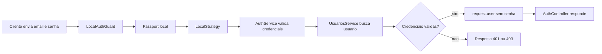

# Encontro 16

## Tema

Fundamentos de autenticação e autorização com autenticação local via Passport.

## Objetivos

- Diferenciar identificação, autenticação e autorização.
- Compreender o papel de credenciais em um fluxo de login.
- Relacionar autenticação local ao envio de e-mail e senha.
- Entender o papel do Passport no NestJS.
- Criar um módulo `auth` separado das regras de usuário.
- Implementar uma estratégia local com `passport-local`.
- Criar um guard de autenticação local.
- Validar credenciais em um service, sem colocar regra de autenticação no controller.
- Retornar o usuário autenticado sem expor a senha.
- Diferenciar erro `401 Unauthorized` de erro `403 Forbidden`.
- Perceber por que autenticar a requisição de login ainda não protege as demais rotas.
- Realizar a Prática 07 com evidências de autenticação local funcionando.

## Setup inicial

Use como base o projeto NestJS evoluído até o encontro 15.

O módulo de cookies e sessão criado no encontro anterior pode continuar no projeto, mas o foco deste encontro será outro: validar credenciais de login usando Passport local. Não será necessário persistir autenticação em sessão neste roteiro.

### Pré-requisitos

- projeto NestJS executando em `http://localhost:3000`;
- `ValidationPipe` global configurado;
- CORS configurado caso exista cliente HTML em origem diferente;
- noções de DTOs, services e controllers;
- noções de cookies e sessão do encontro 15;
- Git configurado no projeto;
- cliente HTTP opcional (`curl`, Thunder Client, Insomnia ou Postman).

### Estrutura usada no encontro

Vamos criar dois módulos: um módulo de usuários didático e um módulo de autenticação.

```text
encontro-16/
└── api-auth/
    └── src/
        ├── auth/
        │   ├── dto/
        │   │   └── login.dto.ts
        │   ├── guards/
        │   │   └── local-auth.guard.ts
        │   ├── strategies/
        │   │   └── local.strategy.ts
        │   ├── auth.controller.ts
        │   ├── auth.module.ts
        │   └── auth.service.ts
        └── usuarios/
            ├── usuarios.module.ts
            └── usuarios.service.ts
```

O módulo `usuarios` será responsável por localizar usuários. O módulo `auth` será responsável por validar credenciais e expor o endpoint de login.

## Organização sugerida dos 90 minutos

1. Retomada de estado, sessão e identidade: 10 min
2. Exposição dialogada sobre autenticação e autorização: 20 min
3. Demonstração do Passport local: 25 min
4. Laboratório guiado da Prática 07: 25 min
5. Fechamento, testes e checkpoint: 10 min

## Visão geral

Nos encontros anteriores, a API recebeu dados de formulários, arquivos e cookies. Também foi possível manter algum estado entre requisições usando sessão. Agora entra uma pergunta mais delicada: como o backend decide se uma pessoa realmente é quem afirma ser?

Autenticação é o processo de comprovar identidade. Em uma aplicação Web comum, isso começa com um login: o cliente envia credenciais, o backend valida essas credenciais e, se estiverem corretas, reconhece aquele usuário.

Autorização é uma etapa diferente. Depois que a identidade foi comprovada, a aplicação precisa decidir quais ações aquele usuário pode executar. Um estudante pode consultar suas próprias inscrições; um administrador pode aprovar ou cancelar inscrições de várias pessoas.

Este encontro condensa dois momentos: a base conceitual de autenticação/autorização e a implementação de autenticação local com Passport. A aula vai construir um login funcional, mas ainda sem JWT, sem persistência em banco e sem hash de senha. Esses pontos serão amadurecidos nos encontros seguintes.

## Pergunta central

Como validar as credenciais de um usuário no NestJS de forma organizada, sem misturar a regra de autenticação com o controller e sem expor dados sensíveis na resposta?

## Retomada: sessão não é autenticação completa

No encontro 15, a sessão permitiu manter dados entre requisições.

Exemplo:

```text
1. Cliente acessa a API.
2. Servidor cria uma sessão.
3. Navegador recebe um cookie com o identificador da sessão.
4. Próximas requisições enviam o cookie.
5. Servidor encontra os dados associados à sessão.
```

Esse fluxo cria continuidade, mas não prova identidade por si só.

Uma sessão pode armazenar:

- contador de visitas;
- tema escolhido;
- etapa de um formulário;
- carrinho temporário;
- usuário autenticado, caso exista um login antes.

O ponto importante é: uma sessão anônima continua sendo anônima. Para associar a sessão a um usuário real do sistema, o backend precisa autenticar credenciais.

## Conceitos-base do encontro

### Identificação

Identificação é a declaração de quem alguém afirma ser.

Exemplo:

```json
{
  "email": "ana@example.com"
}
```

O e-mail identifica uma conta, mas ainda não comprova que a pessoa que enviou a requisição é dona daquela conta.

### Autenticação

Autenticação é a comprovação da identidade.

Exemplo:

```json
{
  "email": "ana@example.com",
  "senha": "123456"
}
```

O backend procura a conta vinculada ao e-mail e compara a credencial recebida com a credencial esperada. Se a validação passar, a aplicação considera aquela requisição autenticada.

### Autorização

Autorização é a decisão sobre o que um usuário autenticado pode fazer.

Exemplos:

- usuário comum pode listar seus próprios dados;
- administrador pode listar todos os usuários;
- professor pode avaliar entregas;
- estudante pode enviar uma entrega, mas não alterar a nota.

Autorização depende de autenticação. Primeiro a API precisa saber quem é o usuário; depois decide se ele pode executar a ação.

### Credencial

Credencial é uma informação usada para comprovar identidade.

Exemplos:

- senha;
- token;
- chave de API;
- certificado;
- código temporário;
- biometria em um fluxo externo.

Neste encontro, a credencial usada será uma senha enviada no corpo do login. No projeto final, senhas nunca devem ser armazenadas em texto puro.

### Principal ou usuário autenticado

Depois que a autenticação passa, a aplicação normalmente carrega uma representação segura do usuário.

Exemplo:

```json
{
  "id": 1,
  "nome": "Ana Lima",
  "email": "ana@example.com",
  "perfil": "admin",
  "ativo": true
}
```

Essa representação não deve incluir a senha.

### Estratégia

Estratégia é a forma concreta de autenticar uma requisição.

Exemplos:

- estratégia local: e-mail e senha;
- estratégia JWT: token enviado no header `Authorization`;
- estratégia OAuth: login delegado a outro provedor;
- estratégia de API key: chave enviada por header.

Neste encontro, será usada a estratégia local.

### Guard

Guard é um componente do NestJS que decide se uma requisição pode continuar.

No contexto de autenticação, o guard chama uma estratégia e interrompe a requisição quando as credenciais são inválidas.

Exemplo conceitual:

```text
Requisição -> Guard -> Estratégia -> Service -> Controller
```

Se a validação falhar, a requisição não chega ao método do controller.

### Passport

Passport é uma biblioteca de autenticação muito usada no ecossistema Node.js.

No NestJS, a integração com Passport permite:

- definir estratégias de autenticação;
- reutilizar guards;
- preencher `request.user` quando a autenticação passa;
- separar o mecanismo de autenticação do controller.

Neste encontro, o Passport será usado para autenticação local.

### Autenticação local

Autenticação local é o login feito com credenciais armazenadas pela própria aplicação, normalmente e-mail e senha.

O nome "local" aparece porque a validação não é delegada para um provedor externo, como Google, GitHub ou outro serviço de identidade.

Fluxo esperado:

```text
Cliente envia e-mail e senha
Backend procura usuário
Backend compara a senha
Backend rejeita ou aceita a autenticação
```

## Diferença entre login, sessão e token

| Conceito | Papel | Exemplo |
|---|---|---|
| Login | valida credenciais | `POST /auth/login` |
| Sessão | mantém estado no servidor | cookie `sid` associado a dados da sessão |
| Token | carrega prova de autenticação entre requisições | JWT enviado em `Authorization: Bearer ...` |

Neste encontro:

- o login local será implementado;
- a requisição de login será autenticada;
- ainda não haverá token JWT;
- ainda não haverá proteção de rotas privadas;
- ainda não haverá hash real de senha.

Nos próximos encontros:

- JWT será usado para autenticar várias requisições;
- guards protegerão rotas;
- hash substituirá a senha em texto puro;
- papéis de acesso serão usados em autorização.

## Fluxo completo: Passport local no NestJS



Leitura do fluxo:

- o cliente envia `email` e `senha`;
- o `LocalAuthGuard` ativa o Passport;
- o Passport usa a `LocalStrategy`;
- a estratégia chama o `AuthService`;
- o `AuthService` busca o usuário e valida credenciais;
- se passar, o Passport coloca o usuário em `request.user`;
- o controller devolve uma resposta sem expor senha.

## Contrato de login

O corpo esperado para o login será:

```json
{
  "email": "ana@example.com",
  "senha": "123456"
}
```

Regras do contrato:

- `email` deve identificar uma conta existente;
- `senha` deve corresponder à credencial da conta;
- a resposta de sucesso não deve devolver a senha;
- credenciais inválidas devem retornar `401`;
- usuário conhecido, mas inativo, deve retornar `403`.

## Exemplo guiado: login local com Passport

### Passo 1: instalar dependências

No projeto NestJS:

```bash
npm i @nestjs/passport passport passport-local
npm i -D @types/passport-local
```

`@nestjs/passport` integra Passport ao NestJS. `passport-local` fornece a estratégia de e-mail e senha.

### Passo 2: gerar os módulos

No projeto:

```bash
npx nest g module usuarios
npx nest g service usuarios
npx nest g module auth
npx nest g service auth
npx nest g controller auth
```

Crie também as pastas:

```text
src/auth/dto/
src/auth/guards/
src/auth/strategies/
```

### Passo 3: criar o service de usuários

Arquivo `src/usuarios/usuarios.service.ts`:

```ts
import { Injectable } from '@nestjs/common';

export type PerfilUsuario = 'admin' | 'estudante';

export type Usuario = {
  id: number;
  nome: string;
  email: string;
  senha: string;
  perfil: PerfilUsuario;
  ativo: boolean;
};

export type UsuarioSemSenha = Omit<Usuario, 'senha'>;

@Injectable()
export class UsuariosService {
  private readonly usuarios: Usuario[] = [
    {
      id: 1,
      nome: 'Ana Lima',
      email: 'ana@example.com',
      senha: '123456',
      perfil: 'admin',
      ativo: true,
    },
    {
      id: 2,
      nome: 'Bruno Costa',
      email: 'bruno@example.com',
      senha: 'abcdef',
      perfil: 'estudante',
      ativo: true,
    },
    {
      id: 3,
      nome: 'Carla Souza',
      email: 'carla@example.com',
      senha: 'inativa',
      perfil: 'estudante',
      ativo: false,
    },
  ];

  buscarPorEmail(email: string): Usuario | null {
    const emailNormalizado = email.trim().toLowerCase();

    return (
      this.usuarios.find((usuario) => usuario.email === emailNormalizado) ??
      null
    );
  }

  removerSenha(usuario: Usuario): UsuarioSemSenha {
    const { senha, ...usuarioSemSenha } = usuario;
    return usuarioSemSenha;
  }
}
```

Pontos principais:

- o vetor em memória é apenas didático;
- a senha em texto puro será substituída por hash em encontro posterior;
- `removerSenha` evita expor credencial na resposta;
- `perfil` já prepara a discussão de autorização.

### Passo 4: exportar o service de usuários

Arquivo `src/usuarios/usuarios.module.ts`:

```ts
import { Module } from '@nestjs/common';
import { UsuariosService } from './usuarios.service';

@Module({
  providers: [UsuariosService],
  exports: [UsuariosService],
})
export class UsuariosModule {}
```

O módulo `auth` precisará acessar `UsuariosService`. Por isso, o service deve ser exportado.

### Passo 5: criar o DTO de login

Arquivo `src/auth/dto/login.dto.ts`:

```ts
import { IsEmail, IsNotEmpty, IsString, MinLength } from 'class-validator';

export class LoginDto {
  @IsEmail()
  email: string;

  @IsString()
  @IsNotEmpty()
  @MinLength(6)
  senha: string;
}
```

Esse DTO registra o contrato esperado no corpo de login. Ele também será útil para comparar o fluxo manual com o fluxo via Passport.

### Passo 6: implementar o `AuthService`

Arquivo `src/auth/auth.service.ts`:

```ts
import {
  ForbiddenException,
  Injectable,
  UnauthorizedException,
} from '@nestjs/common';
import { UsuariosService, UsuarioSemSenha } from '../usuarios/usuarios.service';

@Injectable()
export class AuthService {
  constructor(private readonly usuariosService: UsuariosService) {}

  async validarUsuario(
    email: string,
    senha: string,
  ): Promise<UsuarioSemSenha> {
    if (!email || !senha) {
      throw new UnauthorizedException('Credenciais inválidas');
    }

    const usuario = this.usuariosService.buscarPorEmail(email);

    if (!usuario) {
      throw new UnauthorizedException('Credenciais inválidas');
    }

    if (!usuario.ativo) {
      throw new ForbiddenException('Usuário inativo');
    }

    if (usuario.senha !== senha) {
      throw new UnauthorizedException('Credenciais inválidas');
    }

    return this.usuariosService.removerSenha(usuario);
  }
}
```

Leitura do service:

- credenciais ausentes retornam `401`;
- e-mail inexistente retorna `401`;
- senha incorreta retorna `401`;
- usuário inativo retorna `403`;
- a resposta de sucesso remove a senha.

Em uma aplicação real, não compare senha em texto puro. O encontro sobre hash substituirá esse trecho por uma comparação segura.

### Passo 7: implementar a estratégia local

Arquivo `src/auth/strategies/local.strategy.ts`:

```ts
import { Injectable } from '@nestjs/common';
import { PassportStrategy } from '@nestjs/passport';
import { Strategy } from 'passport-local';
import { AuthService } from '../auth.service';

@Injectable()
export class LocalStrategy extends PassportStrategy(Strategy) {
  constructor(private readonly authService: AuthService) {
    super({
      usernameField: 'email',
      passwordField: 'senha',
    });
  }

  async validate(email: string, senha: string) {
    return this.authService.validarUsuario(email, senha);
  }
}
```

Por padrão, `passport-local` espera os campos `username` e `password`.

Como o contrato do nosso login usa `email` e `senha`, a estratégia precisa informar:

```ts
super({
  usernameField: 'email',
  passwordField: 'senha',
});
```

O método `validate` é chamado pelo Passport. O valor retornado por ele será colocado em `request.user`.

### Passo 8: criar o guard local

Arquivo `src/auth/guards/local-auth.guard.ts`:

```ts
import { Injectable } from '@nestjs/common';
import { AuthGuard } from '@nestjs/passport';

@Injectable()
export class LocalAuthGuard extends AuthGuard('local') {}
```

Esse guard ativa a estratégia local em uma rota específica.

### Passo 9: implementar o controller de autenticação

Arquivo `src/auth/auth.controller.ts`:

```ts
import { Body, Controller, Post, Req, UseGuards } from '@nestjs/common';
import type { Request } from 'express';
import { LoginDto } from './dto/login.dto';
import { LocalAuthGuard } from './guards/local-auth.guard';
import { AuthService } from './auth.service';
import type { PerfilUsuario } from '../usuarios/usuarios.service';

type UsuarioAutenticado = {
  id: number;
  nome: string;
  email: string;
  perfil: PerfilUsuario;
  ativo: boolean;
};

type RequisicaoComUsuario = Request & {
  user: UsuarioAutenticado;
};

@Controller('auth')
export class AuthController {
  constructor(private readonly authService: AuthService) {}

  @Post('verificar-login')
  async verificarLogin(@Body() body: LoginDto) {
    const usuario = await this.authService.validarUsuario(
      body.email,
      body.senha,
    );

    return {
      mensagem: 'Credenciais válidas via service',
      usuario,
    };
  }

  @UseGuards(LocalAuthGuard)
  @Post('login')
  login(@Req() request: RequisicaoComUsuario) {
    return {
      mensagem: 'Login realizado com Passport local',
      usuario: request.user,
    };
  }
}
```

O controller possui duas rotas didáticas:

| Rota | Finalidade |
|---|---|
| `POST /auth/verificar-login` | mostra validação direta com DTO e service |
| `POST /auth/login` | mostra autenticação local via Passport |

Na prática, o endpoint principal é `POST /auth/login`.

### Atenção ao ciclo de vida do NestJS

Guards executam antes dos pipes de parâmetros do controller.

Por isso, na rota protegida por `LocalAuthGuard`, o Passport processa as credenciais antes de o método do controller ser chamado. O DTO continua útil para documentar o contrato e para rotas didáticas, mas a estratégia e o service ainda precisam tratar credenciais ausentes ou inválidas.

### Passo 10: configurar o módulo de autenticação

Arquivo `src/auth/auth.module.ts`:

```ts
import { Module } from '@nestjs/common';
import { PassportModule } from '@nestjs/passport';
import { UsuariosModule } from '../usuarios/usuarios.module';
import { AuthController } from './auth.controller';
import { AuthService } from './auth.service';
import { LocalStrategy } from './strategies/local.strategy';

@Module({
  imports: [PassportModule, UsuariosModule],
  controllers: [AuthController],
  providers: [AuthService, LocalStrategy],
})
export class AuthModule {}
```

Pontos principais:

- `PassportModule` habilita a integração com Passport;
- `UsuariosModule` fornece o service de busca de usuários;
- `LocalStrategy` precisa estar nos providers para o NestJS instanciá-la.

### Passo 11: importar `AuthModule` no módulo principal

Arquivo `src/app.module.ts`:

```ts
import { Module } from '@nestjs/common';
import { AuthModule } from './auth/auth.module';

@Module({
  imports: [AuthModule],
})
export class AppModule {}
```

Se o projeto já possuir outros módulos, mantenha-os no array `imports`.

### Passo 12: testar login válido

Com a API em execução:

```bash
curl -i -X POST http://localhost:3000/auth/login \
  -H 'Content-Type: application/json' \
  -d '{"email":"ana@example.com","senha":"123456"}'
```

Resposta esperada:

```json
{
  "mensagem": "Login realizado com Passport local",
  "usuario": {
    "id": 1,
    "nome": "Ana Lima",
    "email": "ana@example.com",
    "perfil": "admin",
    "ativo": true
  }
}
```

Observe que a senha não aparece.

### Passo 13: testar senha incorreta

```bash
curl -i -X POST http://localhost:3000/auth/login \
  -H 'Content-Type: application/json' \
  -d '{"email":"ana@example.com","senha":"errada"}'
```

Resposta esperada:

```text
HTTP/1.1 401 Unauthorized
```

`401` indica que a autenticação falhou.

### Passo 14: testar usuário inativo

```bash
curl -i -X POST http://localhost:3000/auth/login \
  -H 'Content-Type: application/json' \
  -d '{"email":"carla@example.com","senha":"inativa"}'
```

Resposta esperada:

```text
HTTP/1.1 403 Forbidden
```

`403` indica que o usuário foi reconhecido, mas não tem permissão para continuar naquela condição.

### Passo 15: testar contrato via rota didática

```bash
curl -i -X POST http://localhost:3000/auth/verificar-login \
  -H 'Content-Type: application/json' \
  -d '{"email":"texto-invalido","senha":"123"}'
```

Com `ValidationPipe` global configurado, a resposta deve ser `400 Bad Request`.

Essa rota ajuda a observar a diferença entre:

- erro de contrato do payload;
- erro de autenticação;
- erro de autorização.

## Cliente HTML mínimo

Caso queira testar pelo navegador, crie um cliente simples.

Arquivo `cliente-auth/index.html`:

```html
<!DOCTYPE html>
<html lang="pt-BR">
  <head>
    <meta charset="UTF-8">
    <meta name="viewport" content="width=device-width, initial-scale=1.0">
    <title>Login local</title>
  </head>
  <body>
    <main>
      <h1>Login local</h1>

      <form id="form-login">
        <div>
          <label for="email">E-mail</label>
          <input id="email" name="email" type="email" required>
        </div>

        <div>
          <label for="senha">Senha</label>
          <input id="senha" name="senha" type="password" required>
        </div>

        <button type="submit">Entrar</button>
      </form>

      <pre id="saida"></pre>
    </main>

    <script src="./app.js"></script>
  </body>
</html>
```

Arquivo `cliente-auth/app.js`:

```js
const form = document.querySelector('#form-login');
const saida = document.querySelector('#saida');

form.addEventListener('submit', async (event) => {
  event.preventDefault();

  const dadosFormulario = new FormData(form);
  const payload = Object.fromEntries(dadosFormulario.entries());

  try {
    const response = await fetch('http://localhost:3000/auth/login', {
      method: 'POST',
      headers: {
        'Content-Type': 'application/json',
      },
      body: JSON.stringify(payload),
    });

    const corpo = await response.json();

    saida.textContent = JSON.stringify(
      {
        status: response.status,
        ok: response.ok,
        corpo,
      },
      null,
      2,
    );
  } catch (erro) {
    saida.textContent = JSON.stringify(
      {
        mensagem: 'Falha de rede ou CORS',
        detalhe: erro.message,
      },
      null,
      2,
    );
  }
});
```

Esse cliente apenas envia as credenciais e mostra a resposta. Ele ainda não mantém o usuário logado em chamadas futuras.

## O que ainda falta para proteger rotas

Depois do login local, pode parecer que a aplicação já está autenticada por completo. Ainda não está.

O `POST /auth/login` autentica apenas aquela requisição.

Para proteger chamadas posteriores, a API precisa de algum mecanismo que acompanhe as próximas requisições. Existem duas formas comuns:

| Caminho | Ideia |
|---|---|
| Sessão autenticada | servidor grava usuário na sessão e o navegador envia o cookie de sessão |
| JWT | servidor emite token e o cliente envia o token no header `Authorization` |

Na sequência da disciplina, a trilha usará JWT para proteger rotas.

## Autorização a partir do usuário autenticado

O usuário retornado pelo login contém um `perfil`:

```json
{
  "id": 1,
  "nome": "Ana Lima",
  "email": "ana@example.com",
  "perfil": "admin",
  "ativo": true
}
```

Esse campo prepara a autorização, mas ainda não deve ser usado apenas a partir do corpo enviado pelo cliente.

Regra importante:

- o cliente não deve decidir o próprio perfil;
- o backend deve obter o perfil a partir do usuário autenticado;
- guards e decorators podem aplicar regras de autorização;
- roles serão implementadas depois que a autenticação por JWT estiver funcionando.

## Diferença entre `401` e `403`

| Status | Quando usar | Exemplo |
|---|---|---|
| `401 Unauthorized` | autenticação ausente ou inválida | senha incorreta |
| `403 Forbidden` | usuário autenticado/reconhecido, mas sem permissão | usuário inativo ou sem papel necessário |

No laboratório:

- e-mail inexistente retorna `401`;
- senha errada retorna `401`;
- usuário inativo retorna `403`.

Essa distinção ajuda o cliente a reagir melhor e ajuda a API a manter respostas coerentes.

## Cuidados de segurança já neste encontro

Mesmo em um laboratório didático, algumas regras precisam ser observadas:

- não retornar senha na resposta;
- não informar se o e-mail existe quando a senha estiver errada;
- não registrar senha em logs;
- não aceitar `perfil` vindo do cliente no login;
- não colocar regra de autenticação no controller;
- não tratar autenticação como simples busca por e-mail;
- não considerar o login local como proteção automática das demais rotas.

Cuidados que entrarão nos próximos encontros:

- hash de senha;
- JWT;
- expiração de token;
- guards para rotas protegidas;
- autorização por papéis;
- variáveis de ambiente para segredos.

## Erros comuns e como corrigir

### Erro: usar `username` no cliente quando a estratégia espera `email`

Sintoma: a requisição retorna `401` mesmo com credenciais corretas.

Correção:

```ts
super({
  usernameField: 'email',
  passwordField: 'senha',
});
```

E no corpo:

```json
{
  "email": "ana@example.com",
  "senha": "123456"
}
```

### Erro: esquecer de registrar `LocalStrategy` nos providers

Sintoma: o guard local não encontra a estratégia.

Correção:

```ts
@Module({
  providers: [AuthService, LocalStrategy],
})
export class AuthModule {}
```

### Erro: esquecer de importar `PassportModule`

Sintoma: comportamento inesperado ao usar `AuthGuard('local')`.

Correção:

```ts
@Module({
  imports: [PassportModule, UsuariosModule],
})
export class AuthModule {}
```

### Erro: devolver o objeto completo do usuário

Sintoma: a resposta de login inclui a senha.

Correção:

```ts
const { senha, ...usuarioSemSenha } = usuario;
return usuarioSemSenha;
```

### Erro: colocar a validação de senha no controller

Sintoma: o controller passa a concentrar regra de autenticação.

Correção:

- controller recebe a requisição;
- guard aciona a estratégia;
- estratégia chama o service;
- service aplica a regra de validação.

### Erro: confundir usuário autenticado com usuário autorizado

Sintoma: qualquer usuário logado consegue executar ações administrativas.

Correção:

- autenticação confirma identidade;
- autorização verifica permissão;
- roles devem ser verificadas em guard específico.

### Erro: acreditar que Passport local cria token automaticamente

Sintoma: o login funciona, mas a próxima rota não reconhece o usuário.

Correção:

- Passport local valida credenciais;
- token ou sessão precisa ser criado depois;
- JWT será implementado no próximo encontro.

### Erro: esperar DTO antes do guard

Sintoma: a rota com `LocalAuthGuard` retorna `401` antes de mensagens do `ValidationPipe`.

Correção:

- lembrar que guards executam antes dos pipes do método;
- validar entradas críticas também no `AuthService`;
- usar rota didática com DTO para observar validação de contrato.

### Erro: usar senha em texto puro em projeto real

Sintoma: qualquer acesso ao armazenamento revela senhas.

Correção:

- usar hash seguro de senha;
- nunca versionar dados reais de credenciais;
- substituir a comparação direta no encontro de hash.

## Laboratório guiado

### Proposta

Construir um fluxo de login local com Passport em uma API NestJS.

### Etapas

1. Instale `@nestjs/passport`, `passport` e `passport-local`.
2. Gere os módulos `usuarios` e `auth`.
3. Crie `UsuariosService` com usuários em memória.
4. Exporte `UsuariosService` em `UsuariosModule`.
5. Crie `LoginDto`.
6. Implemente `AuthService.validarUsuario`.
7. Crie `LocalStrategy`.
8. Crie `LocalAuthGuard`.
9. Configure `AuthModule` com `PassportModule`, `UsuariosModule` e `LocalStrategy`.
10. Crie a rota `POST /auth/login`.
11. Teste login válido.
12. Teste senha incorreta.
13. Teste usuário inativo.
14. Confirme que a senha não aparece na resposta.
15. Registre commits no Git.

### Variações para investigação

Faça uma alteração por vez e registre o resultado:

- envie `username` no lugar de `email`;
- envie `password` no lugar de `senha`;
- remova `usernameField` da estratégia;
- remova `LocalStrategy` dos providers;
- remova `PassportModule` dos imports;
- retorne o usuário completo no service e observe o risco;
- tente enviar um campo `perfil` no corpo do login;
- chame a rota sem senha;
- teste e-mail inexistente;
- teste usuário inativo.

Para cada caso, responda:

1. A falha aconteceu no contrato do payload, na estratégia, no service ou na regra de segurança?
2. Qual status HTTP foi retornado?
3. A requisição chegou ao método do controller?
4. A resposta expôs algum dado que não deveria?

## Prática de laboratório (Prática 07)

### Proposta

Implementar autenticação local com Passport em uma API NestJS, usando usuários em memória e separação entre módulo de usuários, módulo de autenticação, estratégia e guard.

### Requisitos da prática

- criar módulo `usuarios`;
- criar módulo `auth`;
- implementar `UsuariosService` com pelo menos três usuários;
- incluir pelo menos um usuário `admin`, um `estudante` ativo e um usuário inativo;
- criar `LoginDto`;
- implementar `AuthService.validarUsuario`;
- lançar `401` para credenciais inválidas;
- lançar `403` para usuário inativo;
- remover senha antes de retornar usuário;
- configurar `LocalStrategy` com `usernameField: 'email'` e `passwordField: 'senha'`;
- criar `LocalAuthGuard`;
- criar rota `POST /auth/login` com `@UseGuards(LocalAuthGuard)`;
- testar sucesso e falhas por cliente HTTP;
- executar `npm run lint`;
- registrar commits no Git com mensagens semânticas.

### Entrega

Apresentar:

- código de `UsuariosService`;
- código de `AuthService`;
- código de `LocalStrategy`;
- código de `LocalAuthGuard`;
- código de `AuthController`;
- evidência de login válido;
- evidência de senha incorreta retornando `401`;
- evidência de usuário inativo retornando `403`;
- evidência de resposta sem senha;
- evidência de execução do `lint`;
- link do repositório GitHub com histórico de commits.

## Checklist de aprendizagem

Ao final, confirme se você consegue:

- diferenciar identificação, autenticação e autorização;
- explicar o que é uma credencial;
- explicar o que é autenticação local;
- descrever o papel do Passport no NestJS;
- explicar o que uma strategy faz;
- explicar o que um guard faz;
- implementar `LocalStrategy`;
- configurar `usernameField` e `passwordField`;
- explicar por que `request.user` aparece após autenticação válida;
- remover senha da resposta;
- diferenciar `401` e `403`;
- explicar por que login local ainda não protege chamadas futuras;
- indicar o que será resolvido com JWT no próximo encontro.

## Fechamento e verificação

Demonstre ao final do encontro:

- API executando sem erro;
- `POST /auth/login` com usuário válido;
- resposta contendo usuário sem senha;
- `POST /auth/login` com senha incorreta retornando `401`;
- `POST /auth/login` com usuário inativo retornando `403`;
- explicação breve do fluxo `Guard -> Strategy -> AuthService -> UsuariosService`;
- commit da prática no repositório.

## Critérios de sucesso

Considere a prática concluída quando:

- o módulo de autenticação está separado do módulo de usuários;
- o Passport local autentica usando `email` e `senha`;
- o controller não contém comparação de senha;
- credenciais inválidas não chegam como sucesso;
- a resposta de login não expõe senha;
- a diferença entre autenticação e autorização está clara;
- a turma entende que JWT será necessário para proteger rotas futuras.

## Síntese do encontro

Você estudou que:

- identificação declara quem o usuário afirma ser;
- autenticação comprova identidade;
- autorização decide permissões;
- Passport organiza estratégias de autenticação no NestJS;
- a estratégia local usa credenciais como e-mail e senha;
- o guard ativa a estratégia antes do controller;
- `AuthService` concentra a regra de validação das credenciais;
- `request.user` recebe o usuário retornado pela estratégia;
- senhas não devem aparecer nas respostas;
- `401` e `403` representam falhas diferentes;
- login local autentica a requisição atual, mas ainda não mantém autenticação nas próximas chamadas;
- o próximo passo será usar JWT, guards e rotas protegidas.
